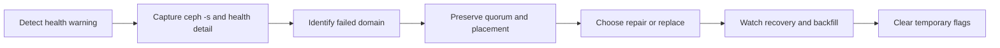

# Ceph Operations and Recovery

Ceph recovery work should preserve data first, then restore redundancy, then restore performance. The fastest-looking action is not always the safest one when PGs are degraded, OSDs are near full, or the cluster is already moving data.



## First Health Pass

```bash
ceph -s
ceph health detail
ceph versions
ceph mon stat
ceph mgr stat
ceph osd stat
ceph osd tree
ceph osd df tree
ceph pg stat
ceph pg dump_stuck
```

Read `ceph health detail` before taking action. `HEALTH_WARN` can mean an expected maintenance flag, but it can also mean clock skew, full OSDs, inactive PGs, scrub errors, or daemons that are down.

<aside class="runbook-panel">
  <strong>Runbook shape:</strong> capture health evidence, preserve MON quorum, identify the failed domain, set only necessary maintenance flags, replace or repair the failed layer, watch recovery, then remove temporary flags.
</aside>

## OSD Failure Response

1. Identify the OSD, host, device path, and by-id serial.
2. Check whether the OSD is down, out, full, slow, or flapping.
3. Confirm whether PGs are degraded, undersized, inactive, or backfilling.
4. Verify backups or replicas for critical clients before risky repair.
5. Replace failed hardware or redeploy the OSD through the orchestrator.
6. Watch recovery until PGs return to `active+clean`.

```bash
ceph osd find <osd-id>
ceph osd metadata <osd-id>
ceph device ls
ceph device info <devid>
ceph orch device ls
ceph orch daemon restart osd.<id>
ceph orch osd rm <id>
```

Avoid repeatedly marking OSDs in and out while the root cause is unknown. Flapping can create extra peering and recovery churn.

## Recovery and Backfill

Recovery restores missing replicas or chunks after failures. Backfill moves data to satisfy the current CRUSH placement after topology or weight changes. Both consume disk, CPU, and network.

Key questions:

- Is recovery making progress or stuck?
- Is a full or nearfull OSD blocking backfill?
- Is recovery throttled intentionally?
- Are clients suffering because recovery is too aggressive?
- Is the cluster at risk because recovery is too slow?

Recovery tuning decision matrix:

| Situation | Prefer | Avoid |
| --- | --- | --- |
| Client latency is critical and redundancy risk is low | Lower recovery/backfill concurrency temporarily and monitor degraded time. | Disabling recovery indefinitely. |
| Multiple OSDs down or PGs undersized | Restore redundancy first, even if clients slow down. | Prioritizing performance while data loss risk is rising. |
| Backfill blocked by nearfull OSDs | Add capacity, reweight carefully, or free space before forcing movement. | Marking more OSDs out and increasing pressure. |
| Flapping device or host | Stabilize hardware/network before repeated in/out changes. | Repeatedly restarting daemons without root-cause evidence. |
| Planned host maintenance | Set narrow `noout`, drain or stop one failure domain at a time, remove flags after. | Broad flags left in place after the window. |

```bash
ceph -w
ceph osd perf
ceph osd blocked-by
ceph tell osd.* dump_recovery_reservations
ceph config get osd osd_max_backfills
ceph config get osd osd_recovery_max_active
```

## Scrub and Inconsistency

Scrub checks object metadata. Deep scrub reads data and checks checksums. If Ceph reports inconsistent PGs, identify scope before repair.

```bash
ceph health detail
ceph pg <pgid> query
ceph pg deep-scrub <pgid>
rados list-inconsistent-pg <pool>
rados list-inconsistent-obj <pgid>
ceph pg repair <pgid>
```

`ceph pg repair` is not a generic first step. Repair can choose an authoritative copy based on available information, but operators should understand what is inconsistent and whether backups or application-level validation are needed.

## Maintenance Flags

Flags are useful during controlled work and dangerous when forgotten.

| Flag | Typical Use |
| --- | --- |
| `noout` | Prevent OSDs from being marked out during short maintenance. |
| `norebalance` | Stop rebalancing while changing topology carefully. |
| `nobackfill` | Temporarily stop backfill pressure. |
| `norecover` | Temporarily stop recovery pressure. |
| `noscrub` / `nodeep-scrub` | Avoid scrub load during sensitive windows. |

```bash
ceph osd set noout
ceph osd unset noout
ceph osd dump | grep flags
```

## Full Cluster Risks

Ceph needs slack space for recovery. A pool can fail writes because an OSD or CRUSH subtree is full even when raw cluster capacity appears available.

Watch:

- `nearfull`, `backfillfull`, and `full` health checks,
- skew in `ceph osd df tree`,
- misplaced objects that cannot move,
- pools with quotas or bad target ratios,
- device class capacity, not only total capacity.

## Study Cards

<div class="study-card-grid">
  
  
  
  
  
</div>

## References

- [Ceph health checks](https://docs.ceph.com/en/latest/rados/operations/health-checks/)
- [Ceph monitoring](https://docs.ceph.com/en/latest/rados/operations/monitoring/)
- [Ceph control commands](https://docs.ceph.com/en/latest/rados/operations/control/)
- [Ceph PG repair](https://docs.ceph.com/en/latest/rados/operations/pg-repair/)
- [Ceph troubleshooting OSDs](https://docs.ceph.com/en/latest/rados/troubleshooting/troubleshooting-osd/)
