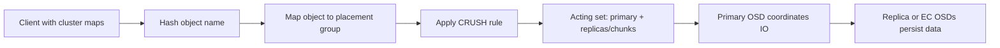
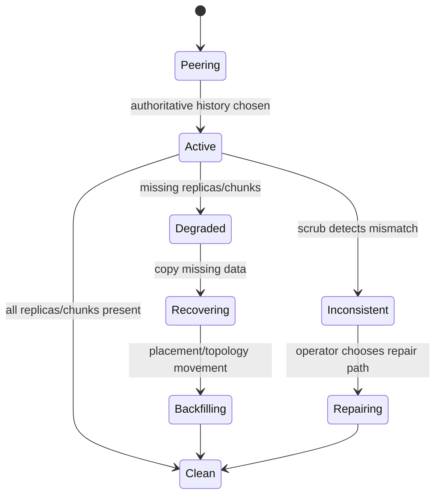

# Ceph RADOS, CRUSH, and Placement

RADOS is the storage substrate underneath RBD, CephFS, and RGW. Clients write objects into pools. Pools are split into placement groups, and CRUSH maps each placement group to an ordered acting set of OSDs.

## Placement Model

| Concept | Meaning |
| --- | --- |
| Object | The unit stored in RADOS. Higher-level interfaces split data into objects. |
| Pool | Administrative boundary for replication, erasure coding, quotas, CRUSH rule, and PG count. |
| Placement group | A shard of a pool that groups many objects for placement, peering, recovery, and scrub state. |
| CRUSH rule | Topology-aware rule that chooses OSDs across hosts, racks, device classes, or zones. |
| Acting set | Ordered OSD set currently responsible for a PG. The first OSD is the primary. |

The important operational point is that a client does not ask a central controller where every object lives. It receives maps, calculates placement, and talks to the primary OSD for the target PG.



Placement evidence:

| Evidence | What It Proves |
| --- | --- |
| `ceph pg map <pgid>` | Which OSDs currently own a PG. |
| `ceph pg <pgid> query` | Acting set, up set, state, blocked operations, and recovery detail. |
| `ceph osd crush tree` | Whether CRUSH topology matches real failure domains. |
| `ceph osd df tree` | Capacity skew that can prevent clean placement or backfill. |

## Commands

```bash
ceph osd lspools
ceph osd pool ls detail
ceph osd pool get <pool> all
ceph osd crush tree
ceph osd crush rule ls
ceph osd crush rule dump <rule>
ceph pg dump pgs_brief
ceph pg map <pool>.<object-or-pgid>
ceph pg <pgid> query
```

## PG Count and Autoscaling

Too few PGs can concentrate work and recovery. Too many PGs add memory, peering, and monitor overhead. Modern clusters often use the PG autoscaler, but operators still need to understand the inputs:

- pool target size or expected ratio,
- number of OSDs in the CRUSH rule,
- replication size or erasure-code profile,
- whether the pool is active or mostly empty,
- whether device classes split capacity into separate OSD populations.

Useful checks:

```bash
ceph osd pool autoscale-status
ceph osd pool set <pool> pg_autoscale_mode on
ceph osd pool set <pool> target_size_ratio 0.25
ceph osd pool set <pool> target_size_bytes 10T
```

Do not change PG counts casually on a busy production cluster. PG changes can trigger data movement, peering, and load spikes.

## CRUSH Failure Domains

Replication only helps if copies land across real failure boundaries. A replicated pool with size 3 should usually use `failure-domain host` at minimum. Multi-rack or multi-zone designs may use rack or datacenter buckets, but only when the network and latency profile can support the extra distance.

Common mistakes:

- using an OSD failure domain when one host loss can remove all copies,
- mixing HDD and SSD OSDs without a device-class rule,
- adding hosts unevenly and creating fullness skew,
- changing CRUSH rules without checking affected pools,
- assuming CRUSH protects against application-level deletion or corruption.

## PG States

| State | Meaning |
| --- | --- |
| `active+clean` | PG is available and fully replicated or coded. |
| `degraded` | Some replicas or chunks are missing, but the PG may still serve IO. |
| `undersized` | PG has fewer acting OSDs than the pool size requires. |
| `peering` | OSDs are agreeing on authoritative PG history before serving normally. |
| `backfilling` | Ceph is copying data to satisfy placement after topology or OSD changes. |
| `stale` | Monitors have not heard a recent PG update from the acting set. |
| `inconsistent` | Scrub found object metadata or data disagreement. |

PG peering and recovery lifecycle:



Treat `active` and `clean` separately. `active` means the PG can serve IO; `clean` means placement and redundancy match the pool policy.

## Placement Troubleshooting

1. Start with `ceph -s` and identify degraded, misplaced, or stuck PGs.
2. Use `ceph pg <pgid> query` to see acting set, up set, blocked operations, and recovery state.
3. Check whether any OSD in the acting set is down, full, slow, or flapping.
4. Compare pool CRUSH rule with `ceph osd crush tree`.
5. Check whether backfill is blocked by full ratios or recovery throttles.

```bash
ceph -s
ceph health detail
ceph pg dump_stuck inactive
ceph pg dump_stuck unclean
ceph osd blocked-by
ceph osd df tree
ceph osd perf
```

## Study Cards

<div class="study-card-grid">
  
  
  
  
  
</div>

## References

- [Ceph architecture](https://docs.ceph.com/en/latest/architecture/)
- [Ceph data placement](https://docs.ceph.com/en/latest/rados/operations/data-placement/)
- [Ceph placement groups](https://docs.ceph.com/en/latest/rados/operations/placement-groups/)
- [Ceph CRUSH maps](https://docs.ceph.com/en/latest/rados/operations/crush-map/)
- [Ceph PG autoscaler](https://docs.ceph.com/en/latest/rados/operations/placement-groups/#autoscaling-placement-groups)
