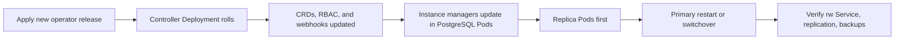

# CloudNativePG

CloudNativePG is a Kubernetes operator for PostgreSQL. It introduces a `Cluster` custom resource and uses Kubernetes reconciliation to operate PostgreSQL instances, replicas, services, failover, rolling updates, and backup integration.

Do not think of it as "PostgreSQL magically becomes stateless." It is still PostgreSQL with WAL, storage, replication, and restore requirements. The operator automates common lifecycle work around those realities.

CloudNativePG changes quickly, especially around backup plugins, major upgrades, and supported Kubernetes/PostgreSQL versions. Treat version-specific install, upgrade, and backup behavior as release-note driven; this page was reviewed against the 1.28 and 1.29 documentation in May 2026.

<aside class="version-callout">
  <strong>Version-sensitive:</strong> CNPG operator upgrades, backup plugin behavior, PostgreSQL image support, and instance-manager rollout semantics are release-note driven.
</aside>

## Core Model

A typical CloudNativePG cluster has:

- one primary PostgreSQL instance,
- zero or more hot standby replicas,
- one Pod per instance,
- PVC-backed storage for each instance,
- Services for read-write and read-only access,
- operator-managed failover and reconciliation.

Common service pattern:

| Service | Target |
| --- | --- |
| `cluster-rw` | Current primary for reads and writes. |
| `cluster-ro` | Hot standby replicas for read-only traffic. |
| `cluster-r` | Any instance for read-only-capable traffic, depending on configuration. |

Application connection strings should use the operator-managed Services, not hard-coded Pod names.

## Why Operators Matter

PostgreSQL needs actions that depend on database state:

- bootstrap a primary,
- create replicas from base backups,
- stream WAL,
- promote a replica,
- reconfigure the former primary,
- expose the current primary consistently,
- coordinate rolling updates,
- run backups and restores.

A generic StatefulSet cannot safely encode all of that logic by itself. The operator watches the desired `Cluster` resource and actual database state, then performs PostgreSQL-aware reconciliation.

## Operator Deployment and Scaling

CloudNativePG itself runs as a Kubernetes `Deployment`, usually in `cnpg-system`. With the direct manifest or `cnpg` plugin install, the default Deployment name is `cnpg-controller-manager`; Helm installs can use a different release-derived name.

The default operator Deployment has one replica. That is usually enough for small and medium installations because Kubernetes will reschedule the Pod if the node fails. For operator-level high availability, scale the Deployment to more than one replica; CloudNativePG supports leader election, so only the elected leader actively reconciles while the other replicas are warm standbys.

```bash
kubectl -n cnpg-system get deploy,pod,svc
kubectl -n cnpg-system describe deploy cnpg-controller-manager
kubectl -n cnpg-system scale deploy cnpg-controller-manager --replicas=2
kubectl -n cnpg-system rollout status deploy cnpg-controller-manager
kubectl -n cnpg-system logs deploy/cnpg-controller-manager --tail=100
kubectl get validatingwebhookconfiguration,mutatingwebhookconfiguration | grep -i cnpg
```

Scaling the operator is mostly about availability of reconciliation and webhooks, not making multiple replicas reconcile the same objects in parallel. If reconciliation latency is the problem, first check API server throttling, webhook reachability, operator CPU and memory, PostgreSQL cluster count, and event volume. Add resource requests/limits, topology spread, node affinity, and tolerations so the operator does not depend on the same nodes or failure domains as the PostgreSQL clusters it manages.

Scope also matters. By default, the operator watches all namespaces. `WATCH_NAMESPACE` can restrict it to one or more namespaces, and the `cnpg` plugin can generate manifests for a specific watch namespace. If you shard responsibility across multiple operator installs, make watch sets non-overlapping. Two operator deployments reconciling the same `Cluster` objects is an ownership bug, not a scale-out strategy.

Operator configuration lives in the operator namespace in a `ConfigMap` or `Secret` named `cnpg-controller-manager-config`. Notable fleet settings include:

| Setting | Use |
| --- | --- |
| `WATCH_NAMESPACE` | Limits which namespaces the operator watches. |
| `CLUSTERS_ROLLOUT_DELAY` | Adds delay between rolling different PostgreSQL clusters after operator upgrade. |
| `INSTANCES_ROLLOUT_DELAY` | Adds delay between rolling instances within one PostgreSQL cluster. |
| `ENABLE_INSTANCE_MANAGER_INPLACE_UPDATES` | Updates the instance manager without restarting PostgreSQL, avoiding the normal switchover/restart path. |
| `DRAIN_TAINTS` | Tells CNPG which node taints indicate node drain or disruption workflows. |

After changing operator configuration, restart the operator Deployment so it reloads the ConfigMap or Secret. Configuration changes affect future reconciliation behavior; do not assume every existing generated object is rewritten immediately.

## Operator Upgrades

An operator upgrade is not only a controller Pod rollout. CloudNativePG documents it as two steps:

<aside class="runbook-panel">
  <strong>Runbook shape:</strong> read release notes, decide supervised versus unsupervised primary handling, spread fleet rollouts when needed, upgrade the controller, watch instance-manager updates, then validate writer routing, replication, backups, and WAL archiving.
</aside>



1. Upgrade the controller and related Kubernetes resources such as CRDs, RBAC, webhooks, and the Deployment.
2. Upgrade the instance manager running inside each PostgreSQL Pod.

For direct manifest installs, the first step is usually applying the newer release manifest. For Helm or OLM installs, use that package manager's upgrade flow. Always read the release notes first: some CNPG versions require extra steps, and the project recommends keeping current through releases rather than skipping long chains of versions.

Operational upgrade sequence:

1. Confirm Kubernetes version support, release notes, CRD changes, webhook reachability, backups, and cluster health.
2. Set `primaryUpdateStrategy: supervised` on sensitive clusters if a primary switchover must wait for an explicit human action.
3. Configure `CLUSTERS_ROLLOUT_DELAY` and `INSTANCES_ROLLOUT_DELAY` for large fleets so every PostgreSQL cluster does not roll at once.
4. Apply or upgrade the operator manifest, Helm release, or OLM subscription.
5. Wait for the operator Deployment rollout and watch operator logs.
6. Watch PostgreSQL clusters update their instance manager.
7. Verify each cluster's `-rw` Service, replication, backups, WAL archiving, and application reconnect behavior.

By default, when the upgraded controller updates the instance manager, CNPG rolls PostgreSQL instances one at a time and finishes by handling the primary according to `primaryUpdateStrategy`. With the default `unsupervised` strategy, an operator upgrade can trigger an automatic switchover and a brief application reconnect. A single-instance PostgreSQL cluster cannot switchover, so expect a restart.

In-place instance-manager updates can avoid PostgreSQL restart or switchover by replacing the instance-manager process while adopting the already-running postmaster. This reduces availability impact, but it intentionally changes the Pod after startup and means the Pod spec does not fully describe the live instance-manager version. Use it only when that tradeoff is understood and tested.

## Storage Design

CloudNativePG recommends a shared-nothing architecture. Each PostgreSQL instance should have its own storage and ideally run on a different Kubernetes worker node and availability zone.

Operational implications:

- Use anti-affinity or topology spread to avoid placing all instances on one node.
- Understand the StorageClass reclaim policy.
- Prefer storage with predictable latency.
- Do not put primary and replicas on the same failure domain.
- Test node failure and volume attachment behavior.

## Failover and Switchover

Failover is unplanned: the primary is unhealthy, and the operator promotes a suitable replica. Switchover is planned: you intentionally move primary role to another instance, usually for maintenance.

Key tradeoff:

- Lower RTO favors faster promotion.
- Lower RPO favors ensuring the promoted replica has all committed WAL.

Synchronous replication can reduce data-loss risk but adds write latency and can reduce availability if not designed carefully.

## Backups and PITR

CloudNativePG supports physical backup workflows and WAL archiving. Current documentation describes backup methods including plugin-based backup, volume snapshots, and legacy Barman object-store integration. Starting with the 1.26 era, native backup/recovery capabilities have been progressively moving toward CNPG-I plugins, with the Barman Cloud Plugin as the official object-store path.

Backup rules:

- Have scheduled base backups.
- Archive WAL continuously.
- Monitor archive failures.
- Test restore into a new cluster.
- Know the RPO/RTO target.
- Back up from a standby when possible to reduce primary IO impact.

## Rolling Updates

The operator can roll through instances, usually updating replicas first and handling the primary last through restart or switchover strategy. Still check:

- whether the change is an operator upgrade, PostgreSQL image update, config change, or Kubernetes/node maintenance event,
- PostgreSQL image compatibility,
- extension compatibility,
- operator version notes,
- instance-manager update mode,
- `primaryUpdateStrategy`,
- rollout spread settings,
- backup freshness,
- application connection pooling behavior,
- PodDisruptionBudgets and node capacity.

Major PostgreSQL upgrades are a separate database lifecycle problem. CNPG supports offline in-place major upgrades, offline logical import, and online logical-replication-based approaches depending on version and topology. The offline in-place path is operator-managed `pg_upgrade`, not zero downtime: the cluster is shut down while the primary PVC group is upgraded and replicas are recreated afterward. For low-downtime major upgrades, use a blue/green design with logical replication and a controlled final cutover. See [PostgreSQL Zero-Downtime Upgrades on Kubernetes](../zero-downtime-upgrades/) for the detailed runbook.

## Minimal Cluster Shape

```yaml
apiVersion: postgresql.cnpg.io/v1
kind: Cluster
metadata:
  name: app-db
spec:
  instances: 3
  storage:
    size: 100Gi
```

This is intentionally minimal. Production clusters need explicit resources, affinity, backup configuration, monitoring, image version policy, and restore runbooks.

## Troubleshooting

```bash
kubectl get clusters.postgresql.cnpg.io
kubectl describe cluster app-db
kubectl get pods,pvc,svc -l cnpg.io/cluster=app-db
kubectl logs deployment/cnpg-controller-manager -n cnpg-system
kubectl cnpg status app-db
```

Check in this order:

1. `Cluster` conditions.
2. Operator logs.
3. Pod readiness and PostgreSQL logs.
4. PVC binding and volume attachment.
5. WAL archiving status.
6. Replication lag.
7. Service endpoints for `-rw` and `-ro`.

## Study Cards

<div class="study-card-grid">
  
  
  
  
  
  
  
</div>

## References

- [CloudNativePG architecture](https://cloudnative-pg.io/docs/1.28/architecture/)
- [CloudNativePG cloud native overview](https://cloudnative-pg.io/info/cloud-native/)
- [CloudNativePG backup documentation](https://cloudnative-pg.io/docs/1.28/backup/)
- [CloudNativePG installation and upgrades](https://cloudnative-pg.io/docs/1.29/installation_upgrade/)
- [CloudNativePG operator configuration](https://cloudnative-pg.io/docs/1.29/operator_conf/)
- [CloudNativePG PostgreSQL upgrades](https://cloudnative-pg.io/docs/1.29/postgres_upgrades/)
- [CloudNativePG rolling updates](https://cloudnative-pg.io/docs/1.29/rolling_update/)
- [CloudNativePG supported releases](https://cloudnative-pg.io/docs/1.28/supported_releases/)
- [Barman Cloud Plugin introduction](https://cloudnative-pg.io/plugin-barman-cloud/docs/intro/)
