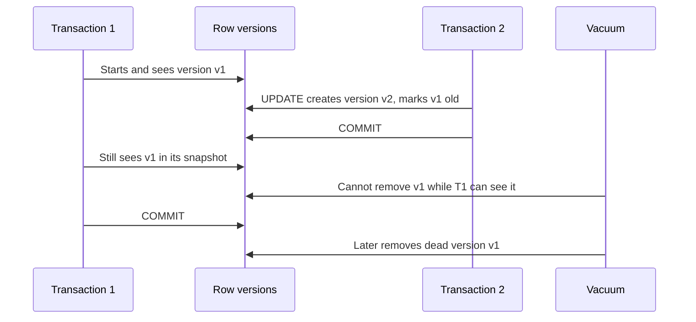

# PostgreSQL

PostgreSQL is a process-based relational database. It is durable because changes are logged before data pages are relied on. It is concurrent because readers and writers usually avoid blocking each other through MVCC. It is fast when the planner has good statistics and the physical design matches the query workload.

For concrete PostgreSQL query-plan, index, transaction, and operational inspection examples, see [Database and Search Examples](/docs/databases/practical-examples/).

## Architecture

Important processes and memory areas:

| Part | Role |
| --- | --- |
| Postmaster | Parent server process. Accepts connections and supervises child processes. |
| Backend process | One process per client connection in the classic model. |
| Shared buffers | PostgreSQL's shared page cache. |
| WAL writer | Flushes write-ahead log records. |
| Checkpointer | Writes dirty data pages at checkpoints. |
| Background writer | Smooths dirty page writes outside checkpoints. |
| Autovacuum launcher/workers | Vacuum dead tuples and refresh planner statistics. |
| WAL sender/receiver | Streaming replication processes. |

PostgreSQL stores data in pages. Queries read pages into shared buffers. Changes create WAL records before dirty data pages become the durable source of truth.

## Critical Subtopics

| Topic | Why It Matters |
| --- | --- |
| [PostgreSQL Operations, HA, Replication, and Recovery](operations-ha/) | Covers managed HA, failover, physical and logical replication, sharding, base backups, PITR, WAL retention, high CPU, high RAM, and incident checks. |
| [PostgreSQL Zero-Downtime Upgrades on Kubernetes](zero-downtime-upgrades/) | Covers minor and major upgrade strategies with CloudNativePG, logical replication, PgBouncer draining, `pg_upgrade`, rollback, and Kubernetes guardrails. |
| [PgBouncer](pgbouncer/) | Explains connection pooling, transaction/session/statement pooling, sizing, HA placement, failover behavior, admin commands, prepared statement caveats, and failure modes. |
| [CloudNativePG](cloudnativepg/) | Covers running PostgreSQL in Kubernetes with operator-managed clusters, services, failover, backups, and restore cautions. |

## MVCC

MVCC means rows can have multiple visible versions. A transaction sees a snapshot, not a global lock on the whole table. This lets readers and writers proceed concurrently in many cases.

Operational implications:

- Updates create new row versions; old versions become dead tuples after no active transaction can see them.
- Dead tuples consume space until vacuum removes them.
- Long-running transactions prevent cleanup and can cause bloat.
- Indexes can also accumulate dead entries.
- Sequence increments are visible immediately and are not rolled back like ordinary table changes.

### MVCC Snapshot Timeline



This is why a single idle transaction can create table and index bloat on a busy table. The blocker may be a read-only session, a forgotten migration transaction, a replica query, or an application connection left `idle in transaction`.

## Isolation Levels

PostgreSQL accepts the standard isolation names, but internally implements three distinct behaviors because `Read Uncommitted` behaves like `Read Committed`.

| Level | Use |
| --- | --- |
| Read Committed | Default. Each statement sees a fresh committed snapshot. |
| Repeatable Read | One transaction sees a stable snapshot. |
| Serializable | PostgreSQL uses Serializable Snapshot Isolation to prevent anomalies by aborting unsafe concurrent patterns. |

If a transaction in Serializable fails with a serialization error, retry the transaction. That is part of the contract.

Isolation examples:

| Pattern | Read Committed | Repeatable Read | Serializable |
| --- | --- | --- | --- |
| Same SELECT repeated after another commit | May see new committed rows. | Sees the original transaction snapshot. | Sees a serializable snapshot or aborts unsafe pattern. |
| Two transactions update same row | One waits, then rechecks row. | Conflict handling can abort one transaction. | Unsafe dependency can abort one transaction. |
| Write skew across multiple rows | Possible unless constrained or locked deliberately. | Snapshot can still allow dangerous write skew. | PostgreSQL can abort with serialization failure. |
| App retry requirement | Usually statement-level errors only. | Retry transaction on serialization-style conflicts. | Retry entire transaction on SQLSTATE `40001`. |

Operational rule: isolation does not replace constraints. Use unique constraints, foreign keys, exclusion constraints, `SELECT ... FOR UPDATE`, advisory locks, or serializable retries when correctness depends on cross-row invariants.

## WAL

Write-Ahead Logging is the durability backbone. PostgreSQL logs the intent to change data before relying on changed data files. WAL enables crash recovery, streaming replication, physical backups, and point-in-time recovery.

Terms:

- **LSN:** Log Sequence Number, a position in WAL.
- **Checkpoint:** point where dirty pages are flushed enough that recovery can start from a known location.
- **WAL segment:** file under `pg_wal`.
- **Replication slot:** retains WAL needed by a consumer.
- **Timeline:** changes after recovery or promotion create a new history branch.

Watch for WAL retention problems. A broken replica, abandoned replication slot, or failed archiving can fill disks.

## Query Planning and EXPLAIN

`EXPLAIN` shows the plan the optimizer chooses. `EXPLAIN ANALYZE` runs the query and reports actual timing and row counts. Use `BUFFERS` to see shared/local/temp block activity.

```bash
psql -d <database>
EXPLAIN (ANALYZE, BUFFERS) SELECT * FROM table_name;
VACUUM (ANALYZE) table_name;
```

Read plans by comparing estimates to actuals:

- Bad row estimates often mean stale stats, correlated columns, or missing extended statistics.
- Sequential scans are not automatically bad; they can be best for large portions of a table.
- Nested loops are good for small outer inputs and indexed inner lookups; terrible when estimates are wrong.
- Hash joins need memory; spilled hashes or sorts can show up as temp IO.

## Indexes

Common index types:

| Type | Use |
| --- | --- |
| B-tree | Equality, ranges, ordering; default choice. |
| GIN | Composite values such as arrays, JSONB, full text. |
| GiST | Geometric, range, and extensible indexing use cases. |
| BRIN | Very large naturally ordered tables. |
| Hash | Equality, less commonly needed than B-tree. |

Index tradeoffs:

- Every index costs write overhead.
- Unused indexes slow writes and consume cache.
- Multicolumn index order matters.
- Partial indexes are powerful when predicates match common query filters.
- Expression indexes only help when queries use matching expressions.

Index design examples:

| Query Shape | Useful Index Pattern | Trap |
| --- | --- | --- |
| `WHERE tenant_id = ? AND created_at >= ? ORDER BY created_at DESC` | `(tenant_id, created_at DESC)` | Reversing column order may not filter by tenant efficiently. |
| `WHERE deleted_at IS NULL AND email = ?` | Partial index on `(email) WHERE deleted_at IS NULL` | Query predicate must match the partial-index predicate. |
| `WHERE lower(email) = lower(?)` | Expression index on `lower(email)` | Plain index on `email` will not help that expression. |
| JSONB containment | GIN index on JSONB column or expression. | GIN adds write cost and may not help every JSON operator. |
| Large append-only time-series table | BRIN on timestamp plus partitioning where appropriate. | BRIN is approximate and depends on physical locality. |

Before adding an index in production, check whether the query is frequent, whether it already has a better plan with fresh statistics, and whether the write overhead is acceptable. Use `CREATE INDEX CONCURRENTLY` for large live tables, and remember it can fail and leave an invalid index that must be cleaned up.

## Vacuum and Autovacuum

Vacuum is routine maintenance, not an emergency-only tool. It:

- removes dead tuples,
- updates visibility map information,
- helps prevent transaction ID wraparound,
- can update planner statistics when run with analyze.

Autovacuum must be tuned for write-heavy tables. Defaults are often conservative for high-churn workloads.

Important missing mental model: vacuum usually makes dead tuple space reusable inside PostgreSQL; it does not necessarily shrink the table file on disk. `VACUUM FULL` rewrites the table and takes stronger locks, so it belongs in a planned maintenance decision, not as a reflex during an incident.

Long transactions and idle-in-transaction sessions can keep old row versions visible, blocking cleanup even if autovacuum is running. Watch transaction age, `pg_stat_activity`, dead tuple counts, and wraparound warnings together.

## Backups and Recovery

There are two broad backup families:

- **Logical:** `pg_dump`, useful for portability and object-level restores.
- **Physical:** base backup plus WAL archiving, required for point-in-time recovery and physical replicas.

`pg_basebackup` can take a base backup from a running cluster over the replication protocol. For PITR, you need a base backup plus the WAL stream from that backup to the target recovery time.

Test restores. An untested backup is an assumption. `pg_verifybackup` can verify a manifest-backed physical base backup, but it is still not a substitute for restoring and validating an actual database. For logical backups, remember that `pg_dump` is per-database; cluster-global roles and tablespaces need `pg_dumpall --globals-only` or another managed source of truth.

## Replication

Physical streaming replication sends WAL to standbys. Standbys can serve read-only queries. Synchronous replication can reduce data-loss windows but increases write latency and operational coupling.

Important views:

```sql
SELECT * FROM pg_stat_replication;
SELECT * FROM pg_replication_slots;
SELECT now() - pg_last_xact_replay_timestamp() AS replica_lag;
```

PostgreSQL partitioning is not the same as sharding. Partitioning splits one logical table inside a cluster. Sharding distributes data across clusters or nodes and needs routing, shard maps, backup coordination, and cross-shard failure handling. For the operational details, see [PostgreSQL Operations, HA, Replication, and Recovery](operations-ha/).

## Operations Checklist

- Set connection limits and use pooling where needed.
- Track slow queries with `pg_stat_statements`.
- Watch bloat and long transactions.
- Alert on WAL disk usage and failed archiving.
- Alert on replication lag and inactive slots.
- Keep statistics fresh.
- Test major upgrades separately; physical replication does not cross arbitrary major versions as an upgrade plan.
- For deeper runbooks, see [PostgreSQL Operations, HA, Replication, and Recovery](operations-ha/), [PostgreSQL Zero-Downtime Upgrades on Kubernetes](zero-downtime-upgrades/), and [PgBouncer](pgbouncer/).

## CloudNativePG

For running PostgreSQL on Kubernetes, see [CloudNativePG](cloudnativepg/). The operator manages Pods, Services, failover, rolling updates, and backup integration, but it does not remove the need to understand PostgreSQL storage, WAL, and restore behavior.

## Study Cards

<div class="study-card-grid">
  
  
  
  
  
</div>

## Practice Deck



## References

- [PostgreSQL 18: MVCC introduction](https://www.postgresql.org/docs/18/mvcc-intro.html)
- [PostgreSQL 18: Transaction isolation](https://www.postgresql.org/docs/current/transaction-iso.html)
- [PostgreSQL 18: Write-Ahead Logging](https://www.postgresql.org/docs/18/wal-intro.html)
- [PostgreSQL 18: EXPLAIN](https://www.postgresql.org/docs/18/sql-explain.html)
- [PostgreSQL 18: Routine vacuuming](https://www.postgresql.org/docs/18/routine-vacuuming.html)
- [PostgreSQL 18: pg_basebackup](https://www.postgresql.org/docs/18/app-pgbasebackup.html)
- [PgBouncer documentation](https://www.pgbouncer.org/)
