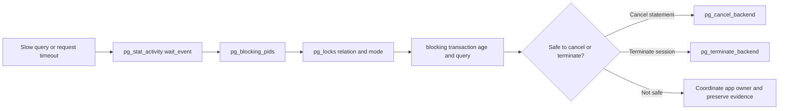

# PostgreSQL Operations, HA, Replication, and Recovery

PostgreSQL availability is built from database mechanics plus an external management layer. PostgreSQL knows how to write WAL, stream WAL, recover from WAL, serve hot standbys, and promote a standby. A production HA system also needs leader election, fencing, connection routing, backup orchestration, monitoring, restore testing, and human-safe failover procedures.

## First Checks

```bash
psql -d <database> -c "SELECT pid, state, wait_event_type, wait_event, now() - query_start AS age, query FROM pg_stat_activity ORDER BY query_start NULLS LAST LIMIT 20;"
psql -d <database> -c "SELECT * FROM pg_stat_replication;"
psql -d <database> -c "SELECT slot_name, active, restart_lsn, wal_status FROM pg_replication_slots;"
psql -d <database> -c "SELECT * FROM pg_stat_archiver;"
psql -d <database> -c "SELECT checkpoints_timed, checkpoints_req, buffers_checkpoint FROM pg_stat_checkpointer;"
psql -d <database> -c "SELECT wal_records, wal_fpi, wal_bytes FROM pg_stat_wal;"
psql -d <database> -c "SELECT pg_is_in_recovery(), pg_last_wal_receive_lsn(), pg_last_wal_replay_lsn(), now() - pg_last_xact_replay_timestamp() AS replay_delay;"
psql -d <database> -c "SELECT subname, subenabled, subfailover FROM pg_subscription;"
```

These checks separate live sessions, standby state, WAL retention, archive health, checkpoint pressure, and WAL generation. Pair them with host metrics for CPU, memory, IO, filesystem fullness, and cgroup limits.

## Managed HA Model

PostgreSQL does not become highly available just because it has a replica. A managed HA design needs clear ownership for:

| Concern | What Owns It |
| --- | --- |
| WAL generation and replay | PostgreSQL primary and standby processes. |
| Synchronous or asynchronous commit policy | PostgreSQL settings such as `synchronous_commit` and `synchronous_standby_names`. |
| Primary identity | HA manager, Kubernetes operator, cloud control plane, or runbook. |
| Promotion | `pg_ctl promote`, `pg_promote()`, or an HA controller calling the equivalent. |
| Fencing old primary | Infrastructure automation, storage fencing, Kubernetes deletion, or manual procedure. |
| Client routing | DNS, VIP, load balancer, PgBouncer, Kubernetes Service, or cloud endpoint. |
| Backup and restore | Backup tooling plus tested recovery runbooks. |

The dangerous failure is split brain: two writable primaries accepting divergent writes. Promotion must be paired with a plan to stop or fence the old primary before it can accept writes again. After promotion, PostgreSQL creates a new timeline, and remaining standbys must follow the right timeline or be rebuilt.

Think in RPO and RTO:

- **RPO:** how much committed data can be lost.
- **RTO:** how long the service can be unavailable.
- **Asynchronous replication:** better write availability and latency, possible data loss on failover.
- **Synchronous replication:** lower data-loss risk, higher write latency and possible write unavailability when required standbys are missing.

Synchronous replication is not one setting with one meaning. `synchronous_commit` controls how far a commit waits: local WAL flush, standby receipt, standby flush, or standby apply. Waiting for `remote_apply` gives stronger read-after-write behavior from synchronous standbys than waiting only for receipt, but it costs more latency. Quorum synchronous replication can require any selected number of standbys rather than one named standby. Design these settings around business RPO/RTO, not around the word "synchronous" by itself.

## HA Failover

Failover is a state transition, not just a command. The system must decide that the old primary is no longer allowed to accept writes, promote exactly one standby, route clients to it, and make the remaining replicas follow the new timeline.

Failover sequence:

1. Detect primary failure with more than one signal: database checks, host checks, storage checks, replication state, and client impact.
2. Fence the old primary. Stop PostgreSQL, remove write access, power off the node, detach storage, delete the Pod, or otherwise prove it cannot accept writes.
3. Choose the promotion candidate by replay position, health, availability zone, synchronous state, and operational policy.
4. Promote the candidate with the HA manager, `pg_ctl promote`, or `SELECT pg_promote();`.
5. Wait for the promoted server to leave recovery and accept writes.
6. Move client routing: VIP, DNS, load balancer, PgBouncer target, Kubernetes Service, or cloud endpoint.
7. Repoint or rebuild other standbys so they follow the promoted primary's timeline.
8. Validate application writes, replication, backup archiving, monitoring, and connection pool behavior.
9. Decide whether the old primary can be rewound with `pg_rewind` or must be rebuilt from a fresh base backup.

Failover hazards:

| Hazard | Why It Matters | Guardrail |
| --- | --- | --- |
| Split brain | Two primaries can accept divergent writes. | Fence before or atomically with promotion. |
| Stale promotion | A lagging standby may miss acknowledged commits. | Compare LSNs and synchronous state before promotion. |
| False positive failure detection | Network partition can make a healthy primary look dead. | Use quorum/consensus and conservative timeouts. |
| Client stale routing | Apps may continue writing to the old endpoint. | Use one writer endpoint and drain poolers. |
| Timeline confusion | Standbys may follow the old timeline after promotion. | Use `recovery_target_timeline = 'latest'` and rebuild when needed. |
| Lost archiving | New primary may not archive WAL correctly. | Validate `archive_command` and `pg_stat_archiver` immediately. |

Planned switchover is different from emergency failover. In a switchover, stop or drain writes, let the candidate catch up, promote cleanly, move routing, and demote or rewind the old primary. Emergency failover prioritizes restoring service, but it still needs fencing and a written decision about acceptable data loss.

Useful checks around promotion:

```sql
SELECT pg_is_in_recovery();
SELECT pg_last_wal_receive_lsn(), pg_last_wal_replay_lsn();
SELECT now() - pg_last_xact_replay_timestamp() AS replay_delay;
SELECT pg_promote(wait => true);
SELECT timeline_id FROM pg_control_checkpoint();
```

## Replication

Physical streaming replication sends WAL from primary to standby. A hot standby can serve read-only queries while replaying WAL, but it is still a copy of the primary's physical cluster, not an independent writable database.

Key pieces:

| Piece | Role |
| --- | --- |
| `wal_level` | Must be high enough for replication or logical decoding. |
| `primary_conninfo` | Standby connection string to the primary. |
| `standby.signal` | Marks a data directory as a standby on startup. |
| WAL sender | Primary-side process streaming WAL. |
| WAL receiver | Standby-side process receiving WAL. |
| Replication slot | Retains WAL until a standby or logical consumer has consumed it. |
| `wal_keep_size` | Keeps recent WAL around without a slot, but does not know what a replica actually consumed. |

Physical replication properties:

- It replicates the whole cluster at the storage/WAL level, not selected tables.
- Primary and standby must be compatible at the binary storage level, so physical replication is not a general major-version upgrade method.
- Standbys are read-only unless promoted.
- Cascading replication can reduce primary fan-out by streaming from a standby to downstream standbys.
- Physical replication slots protect standbys from missing WAL, but an inactive slot can retain WAL until disk fills unless guarded by monitoring and `max_slot_wal_keep_size`.

Replication lag has multiple meanings:

- send lag: primary has not sent WAL yet,
- write or flush lag: standby received WAL but has not persisted it,
- replay lag: standby has not applied WAL yet,
- visibility lag: read-only queries on standby see older data.

Use `pg_stat_replication` on the primary, `pg_stat_wal_receiver` on the standby, and LSN differences to locate the lag boundary. Large `sent_lsn` gaps often point at primary pressure, network delay, or standby IO/replay limits.

Logical replication is different. It publishes row changes from selected tables and subscriptions apply them elsewhere. It is useful for migrations, selective replication, version transitions, reporting copies, partial fan-out, and some shard-movement workflows, but it has different DDL, sequence, conflict, and identity constraints than physical replication.

Logical replication model:

| Piece | Role |
| --- | --- |
| Publication | Set of tables and operations exported by the publisher. |
| Subscription | Subscriber-side object that connects to a publication and applies changes. |
| Replica identity | Row identity used to update or delete rows on the subscriber, usually a primary key. |
| Initial table sync | Snapshot copy of existing rows before streaming new changes. |
| Apply worker | Subscriber worker that applies received logical changes. |
| Logical slot | Publisher-side WAL retention point for a subscription or decoder. |

Logical replication caveats:

- DDL is not automatically replicated in the same way as table data. Schema changes need an explicit rollout plan.
- Sequences need separate handling because sequence state is not the same as ordinary table rows.
- Tables generally need primary keys or appropriate replica identity for efficient updates and deletes.
- Conflicts can happen if the subscriber is writable or if multiple sources write overlapping rows.
- Initial table copy can be large and needs capacity for table sync workers, WAL retention, and subscriber writes.
- Logical slots can retain catalog tuples and WAL; stale slots are both storage and vacuum risks.

Logical failover is a newer operational detail worth planning explicitly. Logical replication slots can be configured for failover so they synchronize to physical standbys. Before promoting a standby that should preserve logical subscribers, verify that the required logical slots exist on the standby and are ready, because slot synchronization is asynchronous.

Replication design examples:

| Goal | Shape | Notes |
| --- | --- | --- |
| Low-latency HA | Primary plus one or more streaming standbys. | Add an HA manager for fencing, promotion, and routing. |
| Lower RPO | Synchronous standby or quorum synchronous standbys. | Writes may block when required standbys are unavailable. |
| Read scaling | Hot standbys for read-only traffic. | Reads may be stale and can conflict with WAL replay. |
| Regional DR | Async standby in another region plus WAL archive. | Accept a larger RPO/RTO unless using costly synchronous links. |
| Migration or selective copy | Logical replication publication/subscription. | Plan DDL, sequence sync, conflict handling, and cutover. |
| Downstream analytics | Logical subscription or physical replica. | Logical gives table-level selection; physical gives full-cluster copy. |

Replication incident workflow:

1. Check whether the primary is producing WAL: `pg_stat_wal`, write load, checkpoints, and `pg_wal` usage.
2. Check sender state on the primary: `pg_stat_replication`, `sent_lsn`, `write_lsn`, `flush_lsn`, `replay_lsn`.
3. Check receiver state on the standby: `pg_stat_wal_receiver`, `pg_last_wal_receive_lsn()`, `pg_last_wal_replay_lsn()`.
4. Check replication slots: inactive slots, `restart_lsn`, `wal_status`, `safe_wal_size`, `catalog_xmin`, and invalidation reason.
5. Check network and standby IO before assuming PostgreSQL settings are wrong.
6. If a standby fell too far behind and required WAL is gone, rebuild it from a new base backup instead of trying to skip missing WAL.

## Sharding

Sharding splits data across multiple PostgreSQL clusters or nodes so one logical application dataset is physically distributed. Native PostgreSQL gives you building blocks for partitioning, foreign tables, logical replication, and routing, but it does not provide transparent automatic distributed SQL sharding by itself. If you need that, use a purpose-built extension or distributed database layer and design around its failure modes.

Do not confuse these terms:

| Term | Meaning | Failure Domain |
| --- | --- | --- |
| Partitioning | One PostgreSQL cluster splits one logical table into child tables by range, list, or hash. | Still one cluster unless partitions are foreign tables. |
| Read replica | Full physical copy of a primary used for reads or failover. | Same data everywhere, not sharded writes. |
| Logical replication | Row-change stream between publisher and subscriber tables. | Can move selected tables or rows, but routing is external. |
| FDW federation | Queries read or write foreign tables hosted on other PostgreSQL servers. | Remote servers remain independent failure domains. |
| Application sharding | Application chooses shard by tenant, account, region, hash, or another key. | App owns routing, fan-out, and cross-shard behavior. |
| Distributed extension | Extension or platform coordinates shards and query routing. | Extension/platform owns many behaviors PostgreSQL core does not. |

Shard key choice is the main design decision. A good shard key keeps common transactions on one shard, spreads writes evenly, and matches tenant or data-ownership boundaries. A bad shard key creates hot shards, cross-shard joins, global uniqueness problems, and painful resharding.

Sharding design questions:

- What is the shard key: tenant, organization, user, account, region, time, hash, or composite key?
- Can the most important transactions execute on one shard?
- What must be globally unique, and can IDs be generated without a central bottleneck?
- Which queries need fan-out across shards, and how slow or stale can those results be?
- How are schema migrations rolled across shards without breaking application compatibility?
- How are backups, PITR, restores, and legal deletes performed for one shard or one tenant?
- How are shard moves, split/merge operations, and rebalancing tested?
- What happens when one shard is down but others are healthy?

Common PostgreSQL sharding patterns:

| Pattern | How It Works | Tradeoff |
| --- | --- | --- |
| Tenant-per-database | Each tenant gets a database or cluster. | Strong isolation, simple per-tenant restore, more operational objects. |
| Tenant-key hash shards | Application maps tenant/account IDs to shard clusters. | Good scale-out, but cross-tenant queries need fan-out. |
| Range/time shards | Data is placed by time or ID range. | Works for time-series and archival movement; can create hot latest shard. |
| Partitioned table plus FDW partitions | Local parent table routes to foreign partitions on remote servers. | Uses PostgreSQL primitives, but operations and performance are manual. |
| Logical replication shard move | Copy shard data to new location, replicate changes, then cut routing over. | Useful for rebalancing, but cutover and conflict handling need rigor. |

Sharding operational rules:

- Keep a shard map with versioning. The application and operations team must know which shard owns each key.
- Prefer idempotent retry behavior. Cross-shard partial failures are normal in distributed systems.
- Avoid cross-shard transactions unless the platform explicitly supports the semantics you need and you have tested failure cases.
- Use per-shard backups plus shard-map backups. A restore without the correct shard map can put tenants on the wrong data.
- Monitor each shard separately and also monitor fleet-level skew: largest shard, hottest shard, slowest shard, and most lagged replica.
- Plan resharding before it is urgent. Emergency shard splits are much harder than routine, rehearsed movement.
- Keep schema versions compatible during rolling migrations. Application code may talk to shards at different migration points.

## Backups and Restore

Replicas are not backups. They can faithfully replicate deletion, corruption, bad migrations, and application bugs. A backup strategy should include:

| Type | Use | Restore Shape |
| --- | --- | --- |
| Logical dump | Portability, object-level movement, smaller systems, selective restore. | `pg_restore` or `psql` into a target database. |
| Physical base backup | Whole-cluster recovery and replica bootstrap. | Restore data directory plus required WAL. |
| WAL archive | PITR and recovery beyond the latest base backup. | `restore_command` feeds WAL during recovery. |

For PITR, you need a base backup and every WAL segment from that backup through the recovery target. Missing one required WAL segment breaks the chain. `archive_command` or `archive_library` must be monitored as a production write path, because failed archiving can silently destroy recovery objectives and fill `pg_wal`.

Logical dump boundaries matter. `pg_dump` backs up one database, not the whole cluster. Cluster-global objects such as roles and tablespaces require `pg_dumpall --globals-only` or equivalent infrastructure-as-code. A logical dump is useful, but it is not PITR and it cannot replace physical backups for whole-cluster recovery objectives.

Physical backup verification is also not the same as restore testing. `pg_basebackup` can create a backup manifest, and `pg_verifybackup` can check a plain-format base backup against that manifest. That catches many file-level problems, but the PostgreSQL documentation still warns that only a real restore proves the backup can be used by a running server and application.

Restore drills should prove:

1. You can find the intended base backup.
2. You can retrieve every required WAL segment.
3. You can recover to a named time, LSN, restore point, or latest consistent state.
4. Applications can authenticate and use the restored database.
5. The restored database is not accidentally connected to production integrations.

## WAL and Checkpoints

WAL is the write-ahead log used for crash recovery, replication, and PITR. Data pages can be written later because WAL records describe the changes needed to recover.

Operational WAL checks:

- `pg_wal` filesystem usage,
- failed or slow archiving in `pg_stat_archiver`,
- inactive replication slots retaining old WAL,
- WAL generation spikes in `pg_stat_wal`,
- checkpoint frequency in `pg_stat_checkpointer`,
- replica replay lag and recovery conflicts.

Frequent requested checkpoints can mean `max_wal_size` is too low for the write workload. Very infrequent checkpoints can increase crash recovery time. Full-page writes, bulk changes, index builds, vacuum behavior, and checkpoint timing all affect WAL volume.

## High CPU

High PostgreSQL CPU is usually one of these shapes:

| Symptom | Likely Cause | First Evidence |
| --- | --- | --- |
| Many active sessions | Connection storm, missing pooler, app retry loop. | `pg_stat_activity`, process count, PgBouncer queue. |
| One or few hot queries | Bad plan, missing index, stale stats, expensive function. | `pg_stat_statements`, `EXPLAIN (ANALYZE, BUFFERS)`. |
| CPU with lock waits | Sessions spin less than they wait; bottleneck is concurrency. | `wait_event_type`, blocking PID graph. |
| High system CPU | IO, kernel, context switching, networking, encryption. | `pidstat`, `perf`, `iostat`, TLS settings. |
| Autovacuum CPU | Dead tuple cleanup or analyze on high-churn tables. | autovacuum logs, `pg_stat_progress_vacuum`. |
| Parallel workers | A few queries use many workers. | `leader_pid`, `backend_type`, query plan. |

Start with active sessions and wait events before tuning. If the server is CPU-bound on useful work, reduce work: better indexes, better predicates, fixed row estimates, less chatty queries, cached results, or more efficient schema design. If CPU is from connection churn, PgBouncer usually helps more than raising `max_connections`.

## Locks, Timeouts, and Long Transactions

Lock waits can look like CPU, memory, or application latency incidents. Use `pg_stat_activity`, `pg_locks`, and `pg_blocking_pids()` to separate "doing work" from "waiting for another transaction."

Lock wait evidence path:



```sql
SELECT blocked.pid AS blocked_pid,
       blocked.query AS blocked_query,
       pg_blocking_pids(blocked.pid) AS blocking_pids,
       blocked.wait_event_type,
       blocked.wait_event
FROM pg_stat_activity AS blocked
WHERE cardinality(pg_blocking_pids(blocked.pid)) > 0;
```

Important guardrails:

- `statement_timeout` limits runaway statements when set at an appropriate role, database, or application level.
- `lock_timeout` fails fast when a statement waits too long to acquire a lock.
- `idle_in_transaction_session_timeout` terminates sessions that sit idle inside a transaction, which can otherwise hold locks and prevent vacuum cleanup.
- `transaction_timeout` limits total transaction duration, but be careful with middleware and connection poolers.

Do not set every timeout globally without testing. Poolers, migration tools, maintenance jobs, and long analytical queries may need different limits.

Lock triage guardrails:

| Action | Use When | Risk |
| --- | --- | --- |
| `pg_cancel_backend(pid)` | A statement is blocking but the session can stay connected. | Transaction may remain open depending on client behavior. |
| `pg_terminate_backend(pid)` | Session is abandoned, idle in transaction, or emergency requires rollback. | Rolls back the transaction and can surprise applications. |
| Lower `lock_timeout` | Migrations or online DDL should fail instead of waiting forever. | Too low can break legitimate workload spikes. |
| Add `idle_in_transaction_session_timeout` | Apps leave transactions open after work. | Poorly written apps may see disconnects until fixed. |
| Add index or constraint concurrently | Need safer online schema change. | Still takes locks at phases; monitor and rehearse. |

## High RAM

PostgreSQL memory is not one pool. Important consumers include:

| Consumer | Notes |
| --- | --- |
| `shared_buffers` | Shared page cache inside PostgreSQL. |
| OS page cache | Still important; PostgreSQL also relies on the kernel cache. |
| Backend process memory | Each connection has process overhead and private memory. |
| `work_mem` | Per sort/hash/materialize operation, not per server. One query can use it many times. |
| `maintenance_work_mem` | Used by maintenance operations such as vacuum and index builds. |
| WAL buffers and shared memory | Smaller than query memory but still part of the instance footprint. |
| Extensions and prepared statements | Can add per-backend or shared memory pressure. |

The common mistake is setting `work_mem` as if it were global. A value that is safe for five sessions can be dangerous for hundreds of sessions running multi-sort queries. High RAM incidents often combine too many backends, high `work_mem`, temp tables, hash joins, prepared statement caches, and container memory limits.

High RAM workflow:

1. Check whether memory is PostgreSQL RSS, OS cache, tmpfs, kernel slab, or cgroup accounting.
2. Count active and idle backends.
3. Look for temp file creation and spilled sorts/hashes.
4. Check `work_mem`, `maintenance_work_mem`, `shared_buffers`, and connection counts together.
5. Inspect long transactions and idle-in-transaction sessions that hold resources and block vacuum.
6. Use PgBouncer or app pool limits to cap backend count before raising memory settings.

## Study Cards

<div class="study-card-grid">
  
  
  
  
  
  
  
  
  
</div>

## References

- [PostgreSQL High Availability, Load Balancing, and Replication](https://www.postgresql.org/docs/current/high-availability.html)
- [PostgreSQL Log-Shipping Standby Servers](https://www.postgresql.org/docs/current/warm-standby.html)
- [PostgreSQL Replication Configuration](https://www.postgresql.org/docs/current/runtime-config-replication.html)
- [PostgreSQL Backup and Restore](https://www.postgresql.org/docs/current/backup.html)
- [PostgreSQL Continuous Archiving and PITR](https://www.postgresql.org/docs/current/continuous-archiving.html)
- [PostgreSQL Resource Consumption](https://www.postgresql.org/docs/current/runtime-config-resource.html)
- [PostgreSQL Write Ahead Log Configuration](https://www.postgresql.org/docs/current/runtime-config-wal.html)
- [PostgreSQL Monitoring Statistics](https://www.postgresql.org/docs/current/monitoring-stats.html)
- [PostgreSQL pg_stat_statements](https://www.postgresql.org/docs/current/pgstatstatements.html)
- [PostgreSQL Logical Replication](https://www.postgresql.org/docs/current/logical-replication.html)
- [PostgreSQL Logical Replication Failover](https://www.postgresql.org/docs/current/logical-replication-failover.html)
- [PostgreSQL Table Partitioning](https://www.postgresql.org/docs/current/ddl-partitioning.html)
- [postgres_fdw](https://www.postgresql.org/docs/current/postgres-fdw.html)
