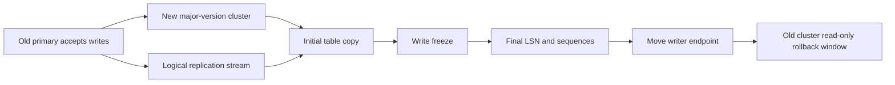

# PostgreSQL Zero-Downtime Upgrades on Kubernetes

PostgreSQL upgrades are not one operation. Minor releases usually mean replacing binaries within the same major version. Major releases change system catalogs and sometimes storage assumptions, so they need a migration path. Kubernetes adds scheduling, Services, probes, PodDisruptionBudgets, PVCs, and operators, but it does not remove PostgreSQL's upgrade rules.

Use "zero downtime" carefully. A minor upgrade with replicas can often keep the application available while Pods roll. A major upgrade with logical replication can keep the old system writable for most of the migration and reduce cutover to seconds or minutes, but there is still a controlled writer freeze while final lag, sequences, connections, and routing are settled. `pg_upgrade` is fast, but it is an offline in-place operation.

This page was reviewed against current PostgreSQL 18 documentation and CloudNativePG 1.28/1.29 documentation in May 2026. Always verify the exact CNPG release notes, PostgreSQL release notes, extension support, and container image notes before production.

<aside class="version-callout">
  <strong>Version-sensitive:</strong> PostgreSQL major-version behavior, CNPG major-upgrade support, logical replication features, and extension compatibility must be checked for the exact source and target versions.
</aside>

## First Checks

```bash
kubectl get clusters.postgresql.cnpg.io,pods,pvc,svc -A
kubectl cnpg status <cluster> -n <namespace>
kubectl get pdb -A
kubectl get events -n <namespace> --sort-by=.lastTimestamp
psql -d <database> -c "SHOW server_version;"
psql -d <database> -c "SELECT * FROM pg_stat_replication;"
psql -d <database> -c "SELECT slot_name, active, restart_lsn, wal_status, safe_wal_size FROM pg_replication_slots;"
psql -d <database> -c "SELECT subname, subenabled, subfailover FROM pg_subscription;"
psql -d <database> -c "SELECT schemaname, sequencename, last_value FROM pg_sequences ORDER BY 1, 2 LIMIT 20;"
```

These checks identify the operator view, Kubernetes disruption constraints, current PostgreSQL version, replication health, slot retention risk, subscription state, and sequence state before an upgrade plan touches production.

## Upgrade Types

| Upgrade Type | Typical Method | Availability Shape | Main Risk |
| --- | --- | --- | --- |
| PostgreSQL minor version | Replace image or binaries within the same major version. | Rolling or restart-based; usually low impact with HA. | Primary restart, connection churn, extension package mismatch. |
| Operator upgrade | Replace CNPG controller and instance manager. | May trigger instance-manager update, rolling update, or switchover depending on version and config. | Surprise primary restart or switchover from release-note changes. |
| Major version with `pg_upgrade` | Stop old cluster, run `pg_upgrade`, start new version. | Offline; fast but not zero downtime. | Failed upgrade, extension incompatibility, replica rebuild. |
| Major version with dump/restore | Build new cluster and restore logical backup. | Offline for final source-of-truth transition. | Long restore time, missing globals, missed writes after dump starts. |
| Major version with logical replication | Blue/green cluster, publication/subscription, final write freeze, cutover. | Near-zero or low downtime when rehearsed. | DDL drift, sequences, replica identity, large tables, lag, app compatibility. |

The best upgrade path depends on data size, write rate, extension use, acceptable cutover pause, rollback requirement, and whether applications can tolerate a brief read-only or maintenance mode.

## CloudNativePG Minor Updates

For minor PostgreSQL image changes, CNPG performs a rolling update. Replicas are updated first, one at a time, and the primary is handled last. The primary step can be an automated restart or a switchover, controlled by the cluster's primary update settings.

Common shape:

1. Read CNPG and PostgreSQL release notes.
2. Confirm backups, WAL archiving, replica health, and restore drills.
3. Confirm enough node capacity for one PostgreSQL Pod to be unavailable.
4. Set or verify `primaryUpdateStrategy` and `primaryUpdateMethod`.
5. Update `spec.imageName` or the referenced image catalog for the same PostgreSQL major version.
6. Watch replicas roll, then watch the primary restart or switchover.
7. Verify the `-rw` Service endpoint, application errors, replication, archiving, and backup jobs.

Example policy knobs:

```yaml
apiVersion: postgresql.cnpg.io/v1
kind: Cluster
metadata:
  name: app-db
spec:
  imageName: ghcr.io/cloudnative-pg/postgresql:18.3-minimal-trixie
  primaryUpdateStrategy: unsupervised
  primaryUpdateMethod: switchover
```

`switchover` usually gives a cleaner writer move than restarting the current primary in place, because an already-running replica can become primary. It still creates a short connection disruption. Applications should connect through the CNPG `-rw` Service or a pooler that targets that Service, not through Pod DNS.

Use `supervised` when the business wants the final primary move to happen during a human-controlled window. Use `unsupervised` only when the workload, pooler behavior, retry behavior, and RPO/RTO policy are already proven.

## CloudNativePG Major Upgrades

CNPG supports several major-upgrade patterns, and they are not equivalent.

| CNPG Pattern | What Happens | Downtime Profile | When It Fits |
| --- | --- | --- | --- |
| Offline in-place major upgrade | CNPG shuts down the cluster, runs `pg_upgrade` against the primary PVC group, removes replica PVC groups, starts the upgraded primary, and reclones replicas. | Offline. Fast for data movement, but the writer is down. | Smaller downtime budgets, simple topology, strong desire to keep the same cluster identity. |
| Offline logical import | A new CNPG cluster imports with `pg_dump`/`pg_restore`. Writes after import starts are not included. | Offline for final truth handoff unless the source is already stopped. | Cross-environment moves, smaller datasets, clean rebuilds. |
| Online logical import or native logical replication | A new CNPG cluster subscribes to changes from the old source, catches up, then traffic is cut over. | Low downtime; final write freeze is still needed. | Major version upgrades with tight availability requirements. |
| Restore to new cluster | Build target from physical backup/PITR where compatible. | Recovery-time dependent; not a cross-major physical upgrade by itself. | DR drills and same-major recovery, not a general zero-downtime major upgrade. |

Do not treat CNPG's offline in-place major upgrade as zero downtime. It is operator-managed `pg_upgrade`: valuable, declarative, and often faster than dump/restore, but all cluster Pods are stopped during the critical phase. Logical replication is the usual path when the target is "application keeps running while the new major version catches up."

## Normal PostgreSQL Major Upgrade Paths

Outside CNPG, the same PostgreSQL mechanics apply whether PostgreSQL runs on VMs, bare metal, StatefulSets, Patroni, Stolon, or another HA layer.

`pg_upgrade` path:

1. Rehearse on a production-sized copy.
2. Install new binaries and compatible extension packages.
3. Stop writes and stop PostgreSQL.
4. Run `pg_upgrade --check`.
5. Run `pg_upgrade`, often with link or clone mode when the filesystem and risk model allow it.
6. Start the new primary.
7. Run generated analyze and extension update scripts.
8. Rebuild or re-seed physical standbys.
9. Validate application behavior and backups.

Logical replication path:

1. Build a new target cluster on the desired major version.
2. Apply schema, roles, extensions, grants, and required settings.
3. Create publications on the old primary and subscriptions on the new target.
4. Let initial table synchronization complete.
5. Keep DDL compatible on both sides until cutover.
6. Monitor logical slot WAL retention, apply lag, table sync workers, conflicts, and target write capacity.
7. Enter a short write freeze or application maintenance mode.
8. Wait for subscriber replay to reach the publisher's final LSN.
9. Synchronize sequences and any non-replicated objects.
10. Pause or drain poolers, move the writer endpoint, and resume traffic on the target.
11. Keep the old cluster read-only until rollback is no longer needed.

Physical streaming replication is not a general major-version upgrade method because replicas replay physical WAL from a compatible server version and storage format. For major upgrades with minimal downtime, use logical replication or a product-specific online upgrade feature that is built on equivalent semantics.

## Blue/Green Logical Replication Runbook

The blue/green pattern keeps the old cluster as the writer while a new cluster catches up.

<aside class="runbook-panel">
  <strong>Runbook shape:</strong> build the target cluster, copy schema, start logical replication, wait for catch-up, freeze writes, sync final LSN and sequences, move the writer endpoint, and keep the old cluster read-only for rollback.
</aside>



| Phase | Old Cluster | New Cluster | Key Checks |
| --- | --- | --- | --- |
| Prepare | Continues serving production. | Created with target PostgreSQL major version. | Extensions available, schema compatible, roles/grants present. |
| Backfill | Publishes tables. | Copies initial table data. | Table sync progress, WAL growth, target IO, replica identity. |
| Catch up | Streams changes. | Applies changes. | Apply lag near zero, conflicts absent, app tests pass against target. |
| Freeze | Writes paused or app read-only. | Replays final changes. | Final LSN reached, sequences synchronized. |
| Cutover | Becomes read-only fallback. | Becomes writer. | Endpoint moved, pooler drained, smoke writes pass. |
| Stabilize | Retained for rollback window. | Serves production. | Backups, archiving, monitoring, failover, vacuum/analyze. |

Logical replication caveats that commonly break "zero downtime" claims:

- DDL is not automatically handled like ordinary table data. Plan schema changes so both old and new versions can run safely.
- Sequence values are not ordinary replicated row changes. Bump sequences on the target before writes resume there.
- Updates and deletes need primary keys or a suitable replica identity.
- Large tables can take long initial snapshots and retain WAL on the publisher while catching up.
- Extensions, collations, custom types, triggers, generated columns, partitioning, row security, and identity columns need rehearsal.
- Subscribers should usually be treated as not writable until cutover to avoid conflicts.
- Long transactions on the publisher can delay logical decoding and vacuum cleanup.

Useful SQL during cutover:

```sql
-- On the old primary, capture the target position after writes are frozen.
SELECT pg_current_wal_lsn();

-- On the new target, check subscription state and replay progress.
SELECT subname, subenabled FROM pg_subscription;
SELECT * FROM pg_stat_subscription;

-- On the old primary, check logical slots and WAL retention.
SELECT slot_name, active, restart_lsn, confirmed_flush_lsn, wal_status, safe_wal_size
FROM pg_replication_slots;

-- On the new target, advance sequences after final sync.
SELECT format(
  'SELECT setval(%L, COALESCE((SELECT max(%I) FROM %I.%I), 1), true);',
  schemaname || '.' || sequencename,
  replace(sequencename, '_seq', ''),
  schemaname,
  replace(sequencename, '_id_seq', '')
)
FROM pg_sequences;
```

Do not blindly run generated sequence SQL from a naming assumption. Use application-owned metadata, `pg_get_serial_sequence`, identity-column catalogs, or explicit migration scripts so every sequence is tied to the correct table and column.

## PgBouncer and Connection Draining

Poolers are often what make cutover look clean to applications. They can also hide stale connections and break transaction assumptions.

Recommended shape:

1. Applications connect to PgBouncer, PgBouncer connects to the current writer endpoint.
2. Before cutover, reduce application write concurrency and stop background workers that create noisy writes.
3. Use PgBouncer admin commands such as `PAUSE`, `SUSPEND`, `RECONNECT`, and `RESUME` according to the chosen pool mode and client tolerance.
4. Move PgBouncer's server target from old writer to new writer, or move the DNS/Service target beneath PgBouncer.
5. Resume clients only after target smoke checks succeed.

Transaction pooling is useful for capacity, but it can break session state assumptions during normal operation and during cutover. Session pooling is more compatible but may require stricter drain logic because long-lived clients hold server connections longer.

## Kubernetes Guardrails

For any PostgreSQL-on-Kubernetes upgrade, verify the platform before the database:

| Guardrail | Why It Matters |
| --- | --- |
| PodDisruptionBudget | Prevents voluntary disruptions from removing too many instances during a rollout. |
| Anti-affinity or topology spread | Keeps primary and replicas out of one node or zone failure domain. |
| PVC and StorageClass behavior | Determines whether Pods can reschedule, volumes can attach, and storage can expand. |
| Readiness probes | Keep Services from routing to instances that are not ready for their role. |
| One writer Service | Prevents clients from discovering Pods directly and bypassing promotion or cutover logic. |
| Backup and WAL archive | Provides rollback and recovery when upgrade tooling fails. |
| NetworkPolicy | Must allow replication, pooler, monitoring, backup, and application paths during both blue and green phases. |

Avoid simultaneous infrastructure and database changes. A Kubernetes minor upgrade, CNI change, storage migration, CNPG operator upgrade, PostgreSQL major upgrade, and application release should not all share one blast radius.

## Rollback Planning

Rollback differs by method:

| Method | Rollback Shape |
| --- | --- |
| Minor rolling update | Roll image back if the data directory remains compatible and release notes allow it. |
| Offline `pg_upgrade` | Restore from backup or keep a filesystem-level pre-upgrade copy. Link mode complicates rollback because old and new clusters share files. |
| Offline dump/restore | Keep the old cluster unchanged until the new cluster is accepted. |
| Logical blue/green | Keep old cluster read-only and available. To roll back after writes occur on the new cluster, you need reverse replication, dual-write reconciliation, or an accepted data-loss decision. |

The cleanest rollback is before new writes land on the upgraded cluster. After cutover, rollback is a data movement problem, not just an endpoint switch.

## Verification Checklist

Before upgrade:

- Restore test completed from the backup path you would use during rollback.
- Extension versions and upgrade scripts checked.
- Application test suite passed against the target major version.
- Replication lag and logical slot WAL retention alerts active.
- Pooler drain and reconnect procedure rehearsed.
- Sequence synchronization script reviewed by table owners.
- Runbook has an abort point before cutover and a no-return point after cutover.

During upgrade:

- CNPG `Cluster` conditions or HA manager state are healthy.
- The writer endpoint has exactly one writable target.
- Replication or subscription lag is trending down.
- WAL archive is still succeeding.
- Application errors and retry rates are watched during every routing move.

After upgrade:

- Run smoke writes, reads, migrations, and background workers.
- Run `ANALYZE` or the `pg_upgrade` generated statistics script when applicable.
- Validate backups and WAL archiving on the new primary.
- Rebuild physical standbys from the upgraded primary if needed.
- Keep old cluster protected from accidental writes until decommission.

## Study Cards

<div class="study-card-grid">
  
  
  
  
  
</div>

## Practice Deck



## References

- [CloudNativePG 1.29: PostgreSQL upgrades](https://cloudnative-pg.io/docs/1.29/postgres_upgrades/)
- [CloudNativePG 1.28: Rolling updates](https://cloudnative-pg.io/docs/1.28/rolling_update/)
- [CloudNativePG 1.28: Importing Postgres databases](https://cloudnative-pg.io/docs/1.28/database_import/)
- [CloudNativePG 1.28: Operator capability levels](https://cloudnative-pg.io/docs/1.28/operator_capability_levels/)
- [PostgreSQL 18: Upgrading a PostgreSQL Cluster](https://www.postgresql.org/docs/current/upgrading.html)
- [PostgreSQL 18: pg_upgrade](https://www.postgresql.org/docs/current/pgupgrade.html)
- [PostgreSQL 18: Logical replication upgrade](https://www.postgresql.org/docs/current/logical-replication-upgrade.html)
- [PostgreSQL 18: Logical replication](https://www.postgresql.org/docs/current/logical-replication.html)
