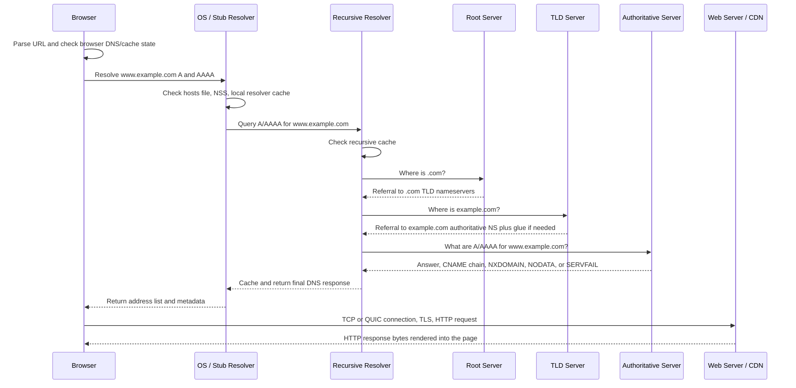

# DNS

DNS is a distributed, cached database for names. The protocol looks simple until caching, delegation, CNAME chains, split-horizon zones, DNSSEC, search paths, response codes, EDNS, UDP/TCP transport, and resolver behavior interact. Ops people need to understand the full path from application lookup to authoritative answer.

Authoritative zone snippets and resolver-debugging commands are embedded in the DNS topic pages: use [Resolution and Caching](resolution-caching/) for resolver paths and intermittent lookups, [Authoritative DNS and Zones](authoritative-zones/) for zone-file patterns, and [Records, Responses, and Transport](records-transport-operations/) for response-code and UDP/TCP behavior.

## The Actors

| Actor | Role |
| --- | --- |
| Stub resolver | Library or local resolver on the client host. It asks a recursive resolver. |
| Recursive resolver | Does the work of chasing the answer and caching results. |
| Root servers | Refer resolvers to TLD servers such as `.com` or `.org`. |
| TLD servers | Refer resolvers to authoritative nameservers for a registered domain. |
| Authoritative nameserver | Serves records for a zone. This is where the truth for that zone lives. |

Most clients do not talk to root or authoritative servers directly. They ask a recursive resolver, often from DHCP, systemd-resolved, a corporate DNS service, or a public resolver.

## Critical Subtopics

| Topic | Why It Matters |
| --- | --- |
| [Resolution and Caching](resolution-caching/) | Explains resolver paths, local caches, recursive caches, TTLs, negative answers, search domains, and `ndots`. |
| [Authoritative DNS and Zones](authoritative-zones/) | Explains source-of-truth zone data, delegation, NS/SOA records, glue, apex constraints, and wildcard behavior. |
| [DNSSEC and DNS Privacy](dnssec-privacy/) | Separates signed-data validation from encrypted resolver transport and covers common validation failures. |
| [DNS Records, Responses, and Transport](records-transport-operations/) | Covers record types, NOERROR/NXDOMAIN/SERVFAIL/REFUSED, NODATA, EDNS, UDP/TCP 53, truncation, reverse DNS, and mail records. |
| [Domain Controllers and Directory DNS](domain-controllers/) | Covers AD DS domain controller discovery through SRV records, `_msdcs`, Kerberos, LDAP, Global Catalog, replication, and time sync. |

## Walkthrough: Resolving `www.example.com`

1. The application calls resolver APIs such as `getaddrinfo`.
2. The OS checks local sources: hosts file, local cache, resolver daemon, and configured name service order.
3. The stub resolver asks its configured recursive resolver for A and/or AAAA records.
4. If not cached, the recursive resolver asks a root server where to find `.com`.
5. The root server returns a referral to `.com` TLD nameservers.
6. The resolver asks a `.com` server where to find `example.com`.
7. The TLD server returns the domain's authoritative NS records, often with glue A/AAAA records when needed.
8. The resolver asks an authoritative server for `www.example.com`.
9. The authoritative server returns an answer, CNAME, NXDOMAIN, NODATA, or referral.
10. The recursive resolver caches the result for the TTL and returns it to the client.

DNS "propagation" is usually cache expiration. There is no global push of new records to every resolver.

## Browser Enter-to-Answer Walkthrough

When a user types `https://www.example.com/products` in the address bar and presses Enter, DNS is only one part of the page load, but it is the part that turns the hostname into one or more IP addresses the browser can connect to.



The path in detail:

| Step | What Happens | Evidence |
| --- | --- | --- |
| 1. URL interpretation | The browser decides whether the input is a URL or search query, normalizes the scheme, extracts the hostname, and may apply HSTS before network traffic starts. | Browser devtools network timing, HSTS settings, address bar behavior. |
| 2. Browser cache checks | The browser may reuse an existing connection, HTTP/2 or HTTP/3 session, DNS cache entry, service worker response, preconnect, or speculative DNS result. | Devtools connection reuse, browser DNS internals, net-export logs. |
| 3. Application resolver call | If the browser needs fresh addresses, it asks its resolver stack for A and AAAA records. Some browsers may use the OS resolver; some may use configured DNS over HTTPS policy. | Browser DNS settings, `netlog`, `resolvectl query`, packet capture. |
| 4. OS local sources | The OS resolver path checks local files, NSS modules, local cache, systemd-resolved, dnsmasq, nscd, VPN DNS, or enterprise resolver policy. | `/etc/hosts`, `/etc/nsswitch.conf`, `/etc/resolv.conf`, `resolvectl status`, `getent hosts`. |
| 5. Stub to recursive resolver | The client sends DNS questions to the configured recursive resolver, often learned through DHCP, VPN, NetworkManager, systemd-resolved, Kubernetes, or manual config. | `tcpdump -nn -i any 'port 53'`, `dig @<resolver> www.example.com A`. |
| 6. Recursive cache check | The recursive resolver returns a cached positive or negative answer if it is still valid; otherwise it walks the DNS hierarchy. | Resolver logs, answer TTL, cache metrics. |
| 7. Root referral | The resolver asks a root server for the TLD and receives a referral to `.com` nameservers. | `dig +trace www.example.com`. |
| 8. TLD referral | The resolver asks a `.com` server and receives authoritative nameservers for `example.com`, plus glue A/AAAA records when nameserver names are inside the child zone. | `dig NS example.com`, trace output, registrar delegation. |
| 9. Authoritative answer | The resolver asks an authoritative server for `www.example.com` A and AAAA. The answer may include final addresses, a CNAME chain, NODATA, NXDOMAIN, SERVFAIL, or DNSSEC-related failure. | `dig @<auth-ns> www.example.com A +norecurse`, SOA/NS checks. |
| 10. Return to client | The recursive resolver caches the result using TTL rules, returns it to the stub resolver, and the OS/browser receives address candidates. | TTL in `dig`, browser timing, resolver cache state. |
| 11. Address selection | The browser chooses an address family and target, often racing IPv6 and IPv4 with Happy Eyeballs. DNS is done enough for connection setup, but address choice can still change user-visible behavior. | Devtools remote address, `ss`, packet capture, IPv4/IPv6 route checks. |
| 12. Browser request and response | The browser opens TCP and TLS for HTTPS, or QUIC for HTTP/3, sends the HTTP request with Host/SNI/ALPN information, receives response bytes, and renders the page. | Devtools waterfall, TLS details, server logs, packet capture. |

### OS and Stub Resolver Details

The browser does not always emit a raw DNS packet itself. On a normal Linux desktop or server, it usually asks an application resolver API to resolve the hostname. That path may involve libc `getaddrinfo`, browser-internal DNS code, systemd-resolved, NetworkManager, a VPN client, or a configured DNS-over-HTTPS mode. The important operational point is that the resolver path is policy, not just protocol.

Before DNS leaves the machine, local layers can answer or rewrite the lookup:

| Layer | What It Can Do | Failure Pattern |
| --- | --- | --- |
| Browser resolver state | Reuse a DNS cache entry, preconnect result, speculative lookup, service worker response, or existing HTTP/2/HTTP/3 connection. | No visible DNS query even though the page loads or fails. |
| `/etc/hosts` and local files | Return a static address before DNS is queried. | `getent hosts` differs from `dig`; one host goes to an old IP. |
| NSS order | Choose whether `files`, `dns`, `resolve`, `myhostname`, LDAP, or another module handles names first. | Application lookup differs from DNS tools. |
| systemd-resolved or local stub | Listen on `127.0.0.53`, cache answers, route domains to per-link DNS servers, and apply DNSSEC or DoT policy when configured. | `/etc/resolv.conf` shows only the stub while real upstreams are elsewhere. |
| VPN or enterprise DNS | Override resolvers, add search domains, or route private zones to specific DNS servers. | Works on VPN, fails off VPN, or public resolver gives a different answer. |
| Kubernetes Pod resolver | Uses Pod `/etc/resolv.conf`, search domains, `ndots`, CoreDNS, and possibly NodeLocal DNSCache. | Node can resolve while Pod cannot, or short names expand unexpectedly. |

The stub resolver usually does not walk root, TLD, and authoritative servers itself. It prepares a DNS question, applies local policy, and sends the question to a recursive resolver with recursion requested. On Linux, the exact behavior depends on the application and name-service stack:

| Decision Point | Practical Detail | Debug Signal |
| --- | --- | --- |
| API path | `getaddrinfo()` may ask for both IPv4 and IPv6 candidates and may return addresses ordered by local address-selection policy. | `strace -e trace=network`, app logs, `getent ahosts`. |
| NSS order | `hosts: files resolve dns` can use `/etc/hosts` or systemd-resolved before classic DNS. | `getent hosts` differs from `dig`. |
| Search expansion | Names without a trailing dot can be tried with search suffixes depending on `search` and `ndots`. | Queries for `api.default.svc.cluster.local` before `api.example.com`. |
| Local stub listener | `/etc/resolv.conf` may point to `127.0.0.53` while upstream DNS servers live in systemd-resolved per-link state. | `resolvectl status` shows real upstreams. |
| Per-link routing | VPNs and systemd-resolved can send `corp.example.com` to one resolver and public names to another. | Only specific suffixes fail or split-horizon answers differ by interface. |
| Application cache | JVMs, browsers, language runtimes, and connection pools can cache DNS or keep old connections after DNS changes. | Restarting only the process changes behavior. |

Stub resolver behavior checklist:

| Behavior | Why It Matters | How To Prove It |
| --- | --- | --- |
| Name normalization | A trailing dot makes a name absolute; without it, search suffixes and `ndots` can create several queries before the intended name is tried. | Compare `getent hosts api.example.com` with `getent hosts api.example.com.` and watch `tcpdump`. |
| Query type fanout | One application call may create A and AAAA lookups, sometimes in parallel and sometimes serialized depending on resolver options and runtime behavior. | Use `getent ahosts`, browser net logs, or packet capture to see both families. |
| Address sorting | The OS can reorder returned addresses based on local source addresses, IPv6 policy, and RFC 6724-style address selection. | Compare `dig` order with `getent ahosts` order and the address the client actually connects to. |
| Retry multiplication | `nameserver` count, `search` list length, `ndots`, `timeout`, and `attempts` multiply worst-case latency when resolvers drop packets. | Count expanded queries and estimate `nameservers * attempts * timeout * candidate names`. |
| Local negative cache | A local stub or runtime may remember NXDOMAIN or NODATA before the recursive resolver is queried again. | Flush the local cache or query the configured recursive resolver directly. |
| Split DNS routing | Per-link or VPN policy can route some suffixes to private resolvers and everything else to public or default resolvers. | Check `resolvectl domain`, `resolvectl dns`, VPN client DNS state, and packet destinations. |

The return value can be less direct than "name to one IP." A successful lookup may return multiple IPv4 and IPv6 addresses, a canonical name after CNAME processing, or an ordered candidate list that the application races or retries. A failed lookup may be reported as a name-not-known error, temporary failure, no address for that family, timeout, or a generic application connection failure. Translate the application error back into resolver evidence before assuming the zone is wrong.

Common resolver-file clues:

| File or Setting | What To Check |
| --- | --- |
| `/etc/resolv.conf` | Nameserver IPs, search suffixes, `options ndots`, timeout, attempts, rotate, and whether the file is a symlink. |
| `/etc/nsswitch.conf` | Whether `files`, `dns`, `resolve`, `mdns`, LDAP, or another source handles host lookups. |
| `resolvectl domain` | Per-link routing domains such as `~corp.example.com` that are invisible in simple DNS tool output. |
| `resolvectl dns` | Actual upstream recursive resolvers selected by systemd-resolved. |
| Container `/etc/resolv.conf` | Kubernetes or container-runtime generated search suffixes and nameserver targets. |

Useful checks:

```bash
getent hosts www.example.com
getent ahosts www.example.com
cat /etc/nsswitch.conf
readlink -f /etc/resolv.conf
cat /etc/resolv.conf
resolvectl status
resolvectl query www.example.com
tcpdump -nn -i any 'port 53'
```

`getent hosts` follows the local application-style path better than `dig`. `dig` is better for asking a specific DNS server a specific DNS question. If `getent` and `dig` disagree, focus on local resolver policy before blaming authoritative DNS.

Interpret mismatches this way:

| Observation | Most Likely Place To Look |
| --- | --- |
| `getent` returns an address but `dig` does not | `/etc/hosts`, NSS modules, local resolver cache, or non-DNS name service. |
| `dig @127.0.0.53` works but `dig @<upstream>` fails | Local stub has cache, routing, DNSSEC, or forwarding behavior that differs from direct upstream testing. |
| `dig @1.1.1.1` works but `getent` fails | Local resolver, VPN DNS, corporate policy, search expansion, or blocked path to configured resolvers. |
| Browser works but terminal lookup fails | Browser DoH, browser DNS cache, existing connection reuse, service worker, or proxy behavior. |
| Terminal lookup works but app fails | Runtime DNS cache, container resolver config, chroot namespace, proxy settings, or stale connection pool. |

### Recursive Resolver Cache-Miss Traversal

The recursive resolver is the worker that turns "I need `www.example.com`" into one or more records. The client normally sends one question to the recursive resolver, and the recursive resolver performs the hierarchy walk on the client's behalf.

On a cache miss, a recursive resolver usually does this:

1. Check whether it already has usable cached data for the exact name, CNAME target, NS set, glue, negative answer, or DNSSEC validation material.
2. Start from a priming root-hints view of the root nameservers if it has no closer cached delegation.
3. Ask a root server for the TLD delegation, such as `.com`.
4. Cache the root referral and TLD nameserver data according to TTLs.
5. Ask a TLD server for the domain delegation, such as `example.com`.
6. Cache the domain NS set and any in-bailiwick glue records.
7. Ask one authoritative server for the requested record type, commonly A and AAAA for browser connection setup.
8. Follow CNAMEs if the answer aliases to another name, possibly crossing into another zone with another delegation path.
9. Validate DNSSEC if validation is enabled and the zone is signed.
10. Cache the positive answer, CNAME chain, NODATA, NXDOMAIN, or failure metadata according to protocol and resolver policy.
11. Return the answer, partial answer, or failure to the client stub.

The resolver does not ask every root server or every TLD server. It selects one or more candidates, retries if needed, marks bad servers temporarily, and prefers servers that respond quickly. Modern resolvers also use EDNS, may minimize query names for privacy through query name minimization, may validate DNSSEC, and may serve stale cached answers during upstream trouble if configured.

Cache misses are not only about final A/AAAA records. The resolver can have cached the `.com` delegation but not `example.com`, or cached the `example.com` NS set but not `www.example.com`. That is why repeated queries can get faster even before the final record is cached.

The traversal starts from the closest cached delegation, not always from the root. If the resolver already knows the NS set for `example.com`, a cache miss for `api.example.com` can go straight to an `example.com` authoritative server. If it only knows `.com`, it asks a `.com` TLD server. If it has no usable delegation data, it falls back to root hints and root priming.

Detailed cache-miss path:

| Stage | Resolver Question | Result To Cache | Common Failure |
| --- | --- | --- | --- |
| Closest cached delegation | "What is the nearest zone cut I already trust for this name?" | Existing NS set, glue, and server performance history. | Stale delegation keeps sending queries to an old provider. |
| Root or parent referral | "Which servers handle the next label down?" | NS records, optional glue, and sometimes DS records for DNSSEC. | UDP loss, blocked TCP fallback, or DNSSEC validation failure. |
| Authoritative query | "What is this exact owner name and type?" | Positive answer, CNAME, NODATA, NXDOMAIN, or SOA-backed negative state. | Lame server, stale zone, wrong view, or missing record type. |
| CNAME restart | "Where does the canonical target live?" | Alias link plus target-side delegation and final records. | CDN or SaaS target zone fails while the original zone looks correct. |
| Validation and return | "Can the data be trusted and returned under local policy?" | Validated answer, validation failure, or serve-stale state. | Validating resolvers return SERVFAIL while direct authoritative queries appear fine. |

Record type matters. A cached A answer does not necessarily satisfy an AAAA query, an MX query, or a DNSKEY query. A cached CNAME can help multiple query types because the alias is reusable, but the final target records still have their own TTLs and failure modes.

Cache state is layered:

| Cached Item | What It Avoids Next Time | Example Effect |
| --- | --- | --- |
| Root priming data | Looking up root nameserver addresses from hints again. | Resolver can immediately ask a root server. |
| TLD NS set | Re-asking root for `.com`. | First `example.com` lookup warms later `.com` lookups. |
| Domain NS set | Re-asking TLD for `example.com`. | Many names inside the domain resolve faster after one miss. |
| Glue address | Resolving an in-bailiwick nameserver address before contacting it. | Resolver can reach `ns1.example.com` without a loop. |
| CNAME link | Repeating the alias step. | `www.example.com` to CDN target is reused until TTL expiry. |
| Negative answer | Re-asking for a nonexistent name or type. | A just-created record may still appear absent. |
| DNSSEC material | Re-fetching DNSKEY, DS, and denial-of-existence records. | Validation can be faster but can also preserve a failure until cache expiry. |

The DNS response sections explain where the resolver is in the walk:

| Section | During Referral | During Final Answer |
| --- | --- | --- |
| Answer | Usually empty for a pure referral. | Contains A/AAAA, CNAME, MX, TXT, or other requested data. |
| Authority | Contains NS records for the next closer zone. | May contain SOA for negative answers or authority metadata. |
| Additional | May contain glue addresses for referred nameservers. | May contain related records, subject to bailiwick and resolver policy. |

Flags matter too. A stub usually sets `RD` to request recursion. A recursive resolver answering the client usually sets `RA` if recursion is available. Authoritative responses set `AA` when the server is authoritative for the answer. Referrals from root and TLD servers are normally non-recursive responses with authority data pointing closer to the target.

When a CNAME crosses a zone boundary, the recursive resolver may finish one authoritative lookup and then start another traversal for the CNAME target. For example, `www.example.com CNAME example.cdn-provider.net` can require the resolver to walk or use cached delegation for `cdn-provider.net` before it can return final A/AAAA records.

Operationally, a cache miss is healthy when each step gets either a closer referral or an authoritative terminal response. A timeout, referral loop, lame delegation, bogus DNSSEC proof, or unusable glue stops forward progress and usually surfaces to the client as timeout or SERVFAIL.

### Root, TLD, and Authoritative Referrals

DNS hierarchy traversal is referral based. A parent usually does not give the final web-server address. It tells the resolver which nameservers are closer to the answer.

| Hop | What The Resolver Asks | What Comes Back | What It Means |
| --- | --- | --- | --- |
| Root | "Who handles `.com`?" | NS records for `.com` TLD servers and address glue for those TLD server names. | The root delegates the TLD; it does not know `www.example.com`'s final address. |
| TLD | "Who handles `example.com`?" | NS records for `example.com`, and glue if the authoritative server names are inside `example.com`. | The TLD delegates the registered domain. |
| Authoritative | "What is `www.example.com` A/AAAA?" | Final address records, CNAME records, NODATA, NXDOMAIN, referral, or failure. | This is zone truth for that owner name and type. |

Referral anatomy:

| Referral Part | Meaning | Operational Risk |
| --- | --- | --- |
| Parent NS records | The parent's delegation for the child zone. | Registrar or parent-zone data can point at old DNS providers. |
| Child apex NS records | The child zone's own view of its nameservers. | Parent and child NS sets can drift and confuse audits. |
| Glue A/AAAA | Parent-provided addresses for in-bailiwick nameserver names. | Wrong glue can send resolvers to the wrong host before child data is reachable. |
| Bailiwick | Trust boundary for additional data in DNS responses. | Resolvers should reject unrelated additional records that could poison cache. |
| SOA | Zone authority metadata and negative-cache timing. | Wrong serials or stale SOA data reveal unsynchronized authoritative servers. |
| DS records | Parent-side DNSSEC link to a signed child zone. | A stale DS can break only validating resolvers. |

Glue matters when a delegated nameserver is in-bailiwick. If `example.com` is served by `ns1.example.com`, the resolver needs an address for `ns1.example.com` before it can ask it anything. The parent can include glue A/AAAA records to break that loop. If the nameserver is out-of-bailiwick, such as `ns1.dns-provider.net`, the resolver resolves that nameserver name through its own normal path.

Parent-child delegation consistency is the audit target. The parent delegation is what public recursive resolvers follow first, while the child apex NS records are what the zone itself says about its nameservers. They do not have to be byte-for-byte identical in every advanced setup, but unexplained drift is an incident clue during DNS provider migrations.

Additional-section glue is useful but limited. It is only trusted when it is in bailiwick for the delegation being returned; the additional section is not a source of arbitrary truth. If a `.com` response includes unrelated addresses for another domain, a resolver should ignore them for cache purposes.

Important referral failure modes:

| Failure | What Breaks |
| --- | --- |
| Parent NS set points to old nameservers | Some resolvers follow stale delegation and never reach the new provider. |
| Missing or wrong glue | In-bailiwick authoritative nameservers can become unreachable. |
| Lame delegation | Parent points to a server that is not authoritative for the child zone. |
| Inconsistent authoritative servers | Different authoritative nameservers serve different serials or answers. |
| DNSSEC DS/DNSKEY mismatch | Validating resolvers return SERVFAIL while non-validating resolvers may answer. |
| Firewall blocks TCP/UDP 53 to authoritative servers | Resolver times out or marks servers unhealthy. |
| Anycast or geo DNS inconsistency | Different resolver locations reach different authoritative instances and get different behavior. |

Referral troubleshooting should compare four views: the registrar or parent-zone delegation, direct TLD responses, each authoritative server's SOA and NS answers, and the recursive resolver's cached view. If those do not line up, fix the layer that is wrong instead of repeatedly flushing client caches.

Use these commands to separate referral layers:

```bash
dig +trace www.example.com
dig NS com.
dig NS example.com
dig @<tld-server> example.com NS +norecurse
dig @<authoritative-ns> www.example.com A +norecurse
dig @<authoritative-ns> www.example.com SOA +norecurse
```

To inspect the layers without relying only on `+trace`, query each hop explicitly:

```bash
dig @a.root-servers.net com. NS +norecurse
dig @<com-tld-server> example.com NS +norecurse
dig @<authoritative-ns> example.com SOA +norecurse
dig @<authoritative-ns> www.example.com A +norecurse
dig @<authoritative-ns> www.example.com AAAA +norecurse
```

Read the output by section:

| Output Pattern | Meaning |
| --- | --- |
| Empty answer plus NS records in authority | Referral, not final data. |
| NS records plus glue in additional | Parent provided enough address data to reach in-bailiwick nameservers. |
| `aa` flag on authoritative answer | The server claims authority for that zone data. |
| `ra` missing on root, TLD, or authoritative server | Normal; these servers usually do not provide recursion to clients. |
| `REFUSED` from authoritative target | You may be asking the wrong server, using blocked source IPs, or hitting policy. |
| SOA serial differs across authoritative nameservers | Zone transfer, provider replication, or deployment drift. |

Lame delegation checks:

```bash
for ns in $(dig +short NS example.com); do
  dig @"$ns" example.com SOA +norecurse +time=2 +tries=1
done
```

A healthy authoritative server should return an SOA for its zone with the authoritative-answer flag. A server that times out, refuses, or answers without authority is not a reliable target for the parent delegation.

If the TLD delegation is wrong, editing only the authoritative zone will not fix the public path. If the authoritative zone is wrong, changing resolver settings will only hide the problem for one resolver view.

For a cached answer, steps 7 through 9 may not happen at all. For a reused browser connection, no DNS query may happen for that Enter press. For split-horizon DNS, the answer depends on which resolver view the client used. For DNS over HTTPS, the DNS query may appear as HTTPS traffic to the DoH resolver rather than visible UDP/TCP 53 traffic.

Return path matters too. The authoritative answer returns from authoritative server to recursive resolver, then from recursive resolver to the client stub, then into the browser. Only after the browser has a usable address does the web request leave for the origin, CDN, proxy, or load balancer. A DNS success therefore means "the browser got address data"; it does not prove the TCP, TLS, HTTP, CDN, or application path is healthy.

Operational checks for this exact path:

```bash
date -Is
getent hosts www.example.com
dig www.example.com A
dig www.example.com AAAA
dig +trace www.example.com
dig NS example.com
dig @<authoritative-ns> www.example.com A +norecurse
curl -vk --resolve www.example.com:443:<address> https://www.example.com/products
```

Use `getent` to test the local application-style resolver path, `dig +trace` to see delegation, authoritative queries to test zone truth, and `curl --resolve` to reuse the browser's intended hostname while forcing a specific address for TCP/TLS/HTTP validation.

## Records Operators Should Know

| Record | Purpose | Gotcha |
| --- | --- | --- |
| A / AAAA | Name to IPv4 / IPv6 address. | Dual-stack clients may prefer IPv6 if AAAA works badly. |
| CNAME | Alias to another canonical name. | A CNAME cannot coexist with most other records at the same owner name. |
| NS | Delegates a zone to nameservers. | Parent and child NS sets can drift. |
| SOA | Zone metadata and negative-cache TTL source. | The SOA matters for NXDOMAIN/NODATA caching. |
| MX | Mail exchanger. | Points to names, not raw IPs. |
| TXT | Arbitrary text, often verification and SPF. | Quoting and splitting can surprise automation. |
| SRV | Service discovery with priority, weight, port, target. | Target is a hostname; Active Directory uses SRV records heavily for domain controller, Kerberos, LDAP, and Global Catalog discovery. |
| PTR | Reverse DNS. | Lives under `in-addr.arpa` or `ip6.arpa`, delegated separately. |
| CAA | Restricts which CAs may issue certificates. | Misconfiguration can block certificate issuance. |

## TTL and Caching

TTL is how long a resolver may cache a record. Lowering a TTL after clients have already cached the old higher TTL does not make those clients forget early. Lower TTL before a planned migration, wait out the old TTL, then change the record.

Negative answers are cached too. RFC 2308 defines negative caching behavior. If you query a name before it exists, recursive resolvers can cache that negative result, so creating the record afterward may still appear broken until the negative TTL expires.

## CNAME Chains

CNAMEs are common for SaaS, CDNs, and cloud load balancers. Each link in a chain can have a separate TTL and failure mode. A query for A records can return a CNAME and then require more lookups to reach final A/AAAA records.

Operational advice:

- Keep chains short.
- Avoid CNAMEs at zone apex unless your provider implements flattening or ALIAS-style behavior.
- Remember that the authoritative server for the original name and the target name may be different.

## Delegation and Glue

Delegation happens at a zone boundary. The parent publishes NS records for the child zone. If a nameserver is inside the zone it serves, the parent also needs glue address records so resolvers can reach it.

Example: if `example.com` is served by `ns1.example.com`, the `.com` zone needs glue for `ns1.example.com`. Without glue, resolution can become circular.

## Split-Horizon DNS

Split-horizon DNS returns different answers depending on the client, network, or resolver path. It is common for private services and hybrid cloud. It also creates confusion:

- `dig` from a laptop and from a Pod may get different answers.
- Public resolvers may see public data while corporate resolvers see private data.
- Conditional forwarding must be tested from the actual network path that applications use.

## DNSSEC

DNSSEC signs DNS data so validating resolvers can detect tampering. It does not encrypt DNS. Common failure modes are expired signatures, DS/DNSKEY mismatch during migration, and forgetting to update DS records at the registrar.

## Kubernetes DNS Tie-In

Kubernetes Service discovery is DNS-heavy. CoreDNS watches Services and EndpointSlices and serves names such as:

```text
service.namespace.svc.cluster.local
```

If Pods use a search list and `ndots`, a lookup for an external name may first try several cluster-local suffixes. This can add latency and load to CoreDNS.

## Debugging Method

1. Query the same resolver the application uses.
2. Query authoritative servers directly.
3. Check A and AAAA.
4. Check CNAME chains.
5. Check TTLs and negative cache possibilities.
6. Check delegation from the parent.
7. Check DNSSEC validation if only validating resolvers fail.
8. Check search paths and `/etc/resolv.conf` in containers.
9. Check response code, EDNS size, and UDP versus TCP behavior for large or signed answers.

## Commands

```bash
dig example.com A
dig example.com AAAA
dig +trace example.com
dig @1.1.1.1 example.com
dig NS example.com
dig SOA example.com
dig +dnssec example.com
```

## Study Cards

<div class="study-card-grid">
  
  
  
  
  
  
  
  
</div>

## Practice Deck



## References

- [RFC 1034: Domain Names - Concepts and Facilities](https://www.rfc-editor.org/rfc/rfc1034)
- [RFC 1035: Domain Names - Implementation and Specification](https://www.rfc-editor.org/rfc/rfc1035)
- [RFC 2308: Negative Caching of DNS Queries](https://www.rfc-editor.org/rfc/rfc2308)
- [RFC 4033: DNS Security Introduction and Requirements](https://www.rfc-editor.org/rfc/rfc4033)
- [RFC 6891: Extension Mechanisms for DNS](https://www.rfc-editor.org/rfc/rfc6891)
- [Cloudflare: How DNS works](https://www.cloudflare.com/learning/dns/what-is-dns/)
