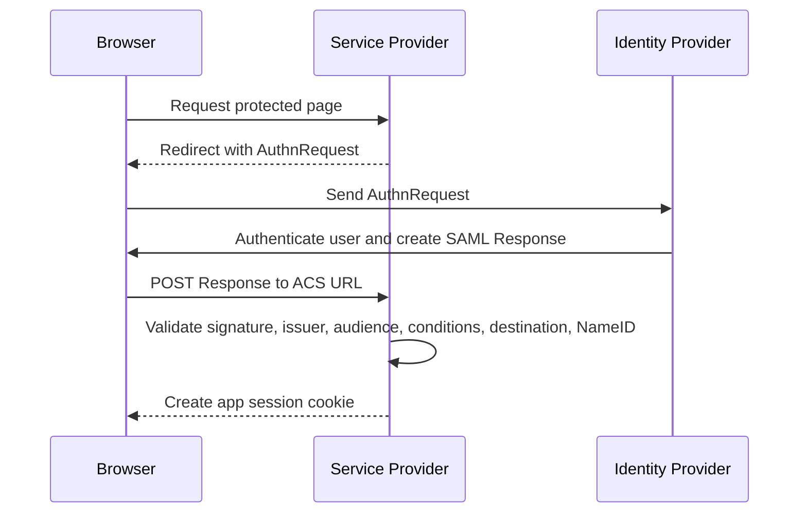
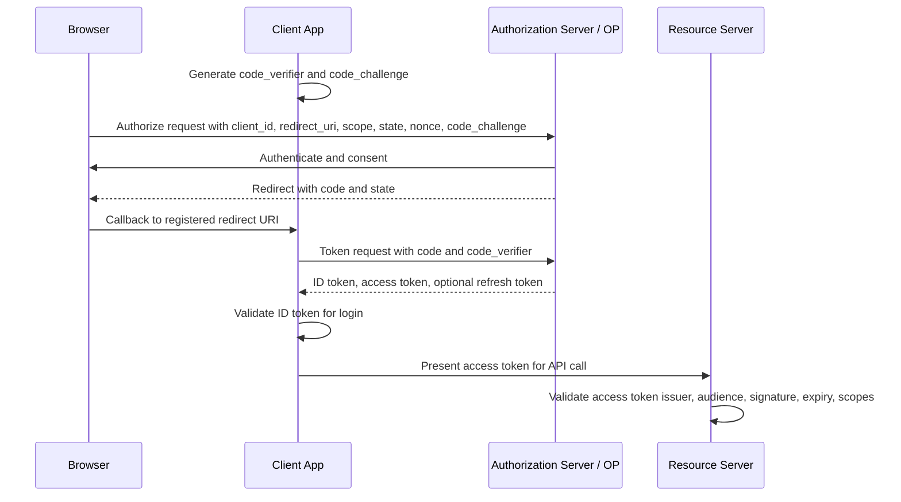
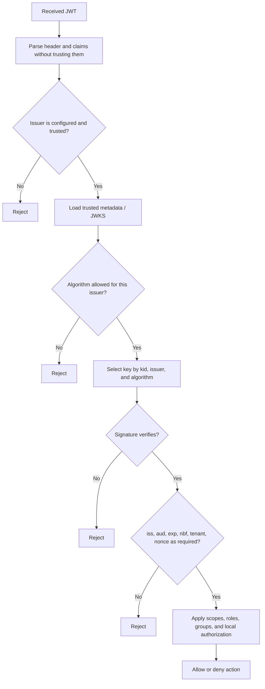
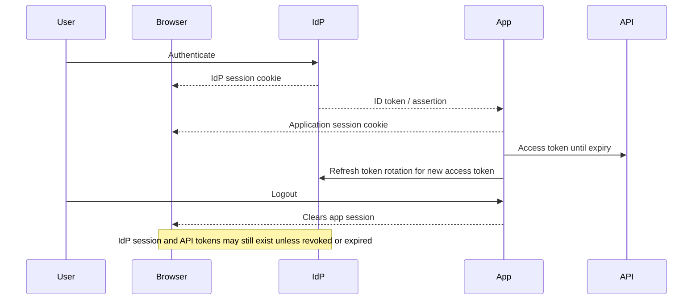

# IdP, SAML, JWT, OAuth, and OIDC

Modern SSO is a trust system. One system authenticates the user, another system consumes a signed assertion or token, and an application decides what the user can do. Most incidents come from mixing up authentication, authorization, token type, audience, redirect endpoint, or trust metadata.

## Command Examples

```bash
curl -sS https://<idp-domain>/.well-known/openid-configuration
curl -sS https://<idp-domain>/.well-known/jwks.json
openssl x509 -in <saml-signing-cert.pem> -noout -subject -issuer -dates -fingerprint -sha256
python3 -m json.tool <token-payload.json>
```

Example output and meaning:

| Command | Example output | What it does |
| --- | --- | --- |
| `curl -sS https://<idp-domain>/.well-known/openid-configuration` | `HTTP status, headers, timing, JSON payload, or TLS/proxy error.` | Separates reachability, TLS, proxy, and application behavior. |
| `curl -sS https://<idp-domain>/.well-known/jwks.json` | `HTTP status, headers, timing, JSON payload, or TLS/proxy error.` | Separates reachability, TLS, proxy, and application behavior. |
| `openssl x509 -in <saml-signing-cert.pem> -noout -subject -issuer -dates -fingerprint -sha256` | `Certificate subject, issuer, SANs, expiry, protocol, and verify result.` | Proves certificate identity, chain, and TLS negotiation details. |

## Authentication vs Authorization

| Question | Common Component | Common Artifact |
| --- | --- | --- |
| Who is this user? | IdP, OpenID Provider, enterprise directory. | SAML assertion, OIDC ID token, session cookie. |
| Can this client call this API? | OAuth authorization server and resource server. | Access token with scopes, audience, and expiry. |
| What can this user do in this app? | Application, policy engine, RBAC/ABAC system. | Local roles, groups, claims, entitlements, ACLs. |

OAuth is primarily an authorization framework. OpenID Connect adds an identity layer on top of OAuth 2.0. SAML is a federation protocol commonly used for browser SSO. JWT is a token format, not an authorization framework by itself.

## Identity Provider

An Identity Provider (IdP) authenticates a principal and issues identity data to another system. That system might be a SAML Service Provider, an OIDC Relying Party, or a custom application consuming tokens.

IdP responsibilities commonly include:

- user authentication and MFA policy,
- session lifetime and reauthentication rules,
- group or attribute release,
- signing keys and certificate rotation,
- application registration,
- redirect URI or ACS URL allow lists,
- audit logs for authentication and token issuance.

An IdP does not automatically grant application permissions. Applications still need their own authorization model, because the IdP may only prove identity and release attributes.

## Sessions, Cookies, and Tokens

Browser SSO usually has more than one credential at the same time:

| Artifact | Holder | Purpose |
| --- | --- | --- |
| IdP session cookie | Browser and IdP domain. | Lets the IdP remember the authenticated user across apps. |
| Application session cookie | Browser and application domain. | Lets the app remember its local login state. |
| ID token | OIDC client. | Proves an authentication event to the client. |
| Access token | API client and resource server. | Authorizes API calls for a specific audience and scope. |
| Refresh token | Client or secure token store. | Obtains new access tokens without another full login. |

Logging out of one layer may not log out of the others. An application can clear its session cookie while the IdP session still silently authenticates the next login request. Conversely, an API access token may remain valid until expiry even after the browser session ends unless revocation or introspection is enforced.

Session and token design choices:

- keep access tokens short lived,
- rotate refresh tokens when the platform supports it,
- store browser tokens where JavaScript exposure is minimized,
- mark cookies `Secure`, `HttpOnly`, and `SameSite` where possible,
- define what "logout" means for app session, IdP session, and API tokens,
- avoid putting bearer tokens in URLs, logs, traces, or support screenshots.

## SAML

SAML 2.0 is XML-based federation. The main browser SSO roles are:

| Role | Job |
| --- | --- |
| Principal | Usually the human user. |
| Identity Provider | Authenticates the user and issues assertions. |
| Service Provider | Consumes assertions and creates the application session. |

Important SAML objects:

- Assertion: signed statement about authentication, subject, attributes, and conditions.
- Response: protocol message that carries the assertion to the SP.
- AuthnRequest: SP request asking the IdP to authenticate the user.
- ACS URL: Assertion Consumer Service endpoint where the IdP posts the response.
- Entity ID: stable identifier for the IdP or SP in metadata.
- NameID: subject identifier format and value.
- Metadata: XML describing endpoints, signing certificates, identifiers, and supported bindings.

SAML failures are often metadata failures. If the SP entity ID, ACS URL, signing certificate, clock, or NameID format does not match what the IdP expects, login can fail before the application sees a user.

### SAML Browser SSO Flow



SAML validation evidence:

| Check | Failure Signal |
| --- | --- |
| ACS URL and destination match | IdP posts to wrong endpoint or SP rejects destination. |
| Entity ID / audience match | Assertion was issued for another SP. |
| Signing certificate trusted | Certificate rollover or metadata drift breaks validation. |
| `NotBefore` / `NotOnOrAfter` valid | Clock skew causes intermittent failures. |
| NameID and attributes present | Login works but account mapping or authorization fails. |
| InResponseTo checked for SP-initiated flow | Replay or IdP-initiated assumptions can weaken correlation. |

## OAuth 2.0

OAuth 2.0 defines roles:

| Role | Meaning |
| --- | --- |
| Resource owner | User or principal that owns protected resources. |
| Client | Application requesting access. |
| Authorization server | Issues tokens after authorization. |
| Resource server | API that accepts and validates access tokens. |

The authorization code flow with PKCE is the common default for browser-based and native applications. The client sends the user to the authorization server, receives an authorization code on the redirect URI, exchanges that code for tokens, and then presents an access token to the API.

### OAuth/OIDC Authorization Code with PKCE



PKCE binds the authorization code to the client that started the flow. `state` protects request correlation and CSRF. `nonce` binds the OIDC ID token to the authentication request. These fields solve different problems and should not be treated as interchangeable.

Operational details:

- Redirect URIs must be exact and pre-registered.
- Scopes describe requested access, but APIs still need local enforcement.
- Access tokens are for resource servers, not for proving login to the client.
- Refresh tokens need careful storage, rotation, revocation, and theft detection.
- A refresh token is a high-value credential because it can mint new access tokens after the original access token expires.
- A Bearer token can be used by whoever possesses it, so storage, transport, logs, and browser exposure matter.
- Client credentials flow is for machine-to-machine access, not human login.
- New systems should avoid implicit flow and resource owner password credentials unless a specific legacy constraint forces them.

## OpenID Connect

OpenID Connect (OIDC) adds authentication and identity data to OAuth 2.0. The OpenID Provider issues an ID token to the client. The client validates it and uses it to establish who authenticated.

Important OIDC pieces:

- ID token: JWT carrying identity claims for the client.
- Access token: token for an API or resource server.
- UserInfo endpoint: optional way to fetch additional user claims.
- Discovery document: `.well-known/openid-configuration` metadata for endpoints and supported settings.
- JWKS: JSON Web Key Set used to publish public keys for token verification.
- `nonce`: binds an authentication response to a client request and helps prevent replay.

Do not send an ID token to an API as proof of API authorization unless that API is explicitly designed to accept that token and audience. Most APIs should validate access tokens.

## JWT

JSON Web Token (JWT) is a compact claims format. A signed JWT is commonly a JWS with three base64url parts:

| Part | Contents |
| --- | --- |
| Header | Token type, signing algorithm, and often `kid`. |
| Payload | Claims such as issuer, subject, audience, expiry, and custom data. |
| Signature | Cryptographic signature over header and payload. |

Common claims:

| Claim | Meaning |
| --- | --- |
| `iss` | Issuer. |
| `sub` | Subject. |
| `aud` | Intended audience. |
| `exp` | Expiration time. |
| `nbf` | Not valid before. |
| `iat` | Issued at. |
| `jti` | Token identifier, useful for replay or revocation systems. |

JWT validation checklist:

1. Parse the token without trusting the claims yet.
2. Select the verification key from trusted issuer metadata, often by `kid`.
3. Allow only expected algorithms; do not accept arbitrary `alg` values from the token.
4. Verify the signature.
5. Verify `iss`, `aud`, `exp`, `nbf`, and acceptable clock skew.
6. Enforce scopes, roles, groups, or entitlements locally.
7. Decide revocation behavior for long-lived sessions or high-risk actions.

Decoding a JWT is not validation. Anyone can base64url-decode the header and payload.

### JWT Validation Decision Tree



Common token confusion:

| Mistake | Why It Is Risky |
| --- | --- |
| API accepts an ID token | ID token audience is usually the client, not the API. |
| Client treats access token as login proof | Access token may be opaque or intended only for the resource server. |
| Verifier trusts `kid` before issuer | Attackers can point at a key ID from an untrusted issuer or tenant. |
| Verifier allows `alg` from token policy | Algorithm confusion can bypass intended verification rules. |
| Groups are trusted without mapping | IdP claim names and formats may not match application authorization policy. |

## Key Rotation and JWKS

OIDC and JWT systems often publish verification keys through JWKS. Rotation is normal and should not be an incident.

Safe validation behavior:

- trust keys only from configured issuers,
- cache JWKS for a bounded time,
- use `kid` to select a candidate key but still verify issuer and algorithm policy,
- handle overlapping old and new keys during rotation,
- fail closed if the issuer metadata cannot be trusted,
- alert on unknown `kid` spikes because they may indicate rotation, config drift, or forged tokens.

SAML has the same operational problem with signing certificates in metadata. Certificate rollover should be planned with overlap so Service Providers can trust old and new signing material during the transition.

### Session and Token Lifetime Timeline



Logout and incident-response questions:

| Question | Why It Matters |
| --- | --- |
| Does app logout clear only the app cookie? | Users may silently reauthenticate through the IdP session. |
| Are refresh tokens rotated and reuse-detected? | Stolen refresh tokens can mint access after password changes. |
| Can high-risk tokens be revoked or introspected? | Short expiry may not be enough during account compromise. |
| Are API tokens proof-bound or bearer? | Bearer tokens are usable by whoever possesses them. |
| Do logs redact tokens and assertions? | Support bundles and traces often leak credentials. |

## Which One Do I Use?

| Need | Common Choice |
| --- | --- |
| Enterprise browser SSO to SaaS or internal apps | SAML or OIDC. |
| Modern application login | OIDC authorization code flow with PKCE. |
| API delegated access | OAuth 2.0 access tokens. |
| Machine-to-machine API access | OAuth client credentials, mTLS, workload identity, or signed service tokens. |
| Portable claims token | JWT when receivers can validate issuer, keys, audience, and lifetime. |

## Common Mistakes

- Calling OAuth "login" without OIDC and then treating an access token as identity.
- Accepting a JWT after decoding it but before verifying signature and claims.
- Reusing one token audience across many APIs.
- Storing long-lived bearer tokens where browser JavaScript, logs, or support tools can expose them.
- Missing SAML certificate rollover and breaking every SP at once.
- Confusing SAML IdP-initiated convenience with complete request correlation.
- Trusting groups or roles from an IdP without checking whether the application expected those exact claim names and formats.
- Ignoring clock sync; SAML and JWT validation are time-sensitive.

## Debugging Flow

1. Identify the protocol: SAML, OAuth, OIDC, or a custom JWT flow.
2. Identify the failing hop: redirect, login, assertion/token issuance, token exchange, callback, session creation, or API call.
3. Check issuer, audience, redirect URI or ACS URL, signing key, and time validity.
4. Separate ID tokens from access tokens.
5. For SAML, compare IdP and SP metadata: entity ID, ACS URL, bindings, NameID format, and signing certificate.
6. For OIDC/OAuth, inspect discovery metadata, JWKS, client registration, scopes, response type, grant type, and PKCE settings.
7. Check local application authorization after token validation succeeds.

## Study Cards

<div class="study-card-grid">
  
  
  
  
  
  
  
  
</div>

## References

- [OAuth 2.0 Authorization Framework, RFC 6749](https://www.rfc-editor.org/rfc/rfc6749)
- [OAuth 2.0 Bearer Token Usage, RFC 6750](https://www.rfc-editor.org/rfc/rfc6750)
- [JSON Web Token, RFC 7519](https://www.rfc-editor.org/rfc/rfc7519)
- [JSON Web Signature, RFC 7515](https://www.rfc-editor.org/rfc/rfc7515)
- [JSON Web Key, RFC 7517](https://www.rfc-editor.org/rfc/rfc7517)
- [OpenID Connect Core 1.0](https://openid.net/specs/openid-connect-core-1_0-18.html)
- [OASIS SAML 2.0 Technical Overview](https://docs.oasis-open.org/security/saml/Post2.0/sstc-saml-tech-overview-2.0.html)
