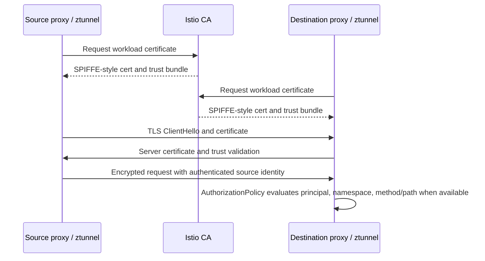

# Istio Security, mTLS, and Policy

Istio security combines workload identity, certificate distribution, mutual TLS, request authentication, and authorization policy. Keep those layers separate when designing or debugging access.

## Security Layers

| Layer | Resource or Mechanism | Purpose |
| --- | --- | --- |
| Workload identity | SPIFFE-style service identity | Names the workload principal. |
| mTLS | `PeerAuthentication` and auto mTLS | Encrypts and authenticates service-to-service traffic. |
| Authorization | `AuthorizationPolicy` | Allows or denies requests based on source, operation, and conditions. |
| End-user authentication | `RequestAuthentication` | Validates JWTs and exposes claims to policy. |
| Gateway TLS | Gateway listeners and credentials | Presents edge certificates and controls termination or passthrough. |

## mTLS Modes

`PeerAuthentication` can be scoped mesh-wide, namespace-wide, workload-specific, or port-specific. Strict mode requires mTLS. Permissive mode accepts both plaintext and mTLS during migration. Disable mode turns mTLS off for the selected scope.

```bash
kubectl get peerauthentication --all-namespaces
istioctl authn tls-check <pod>.<namespace>
istioctl proxy-config secret <pod> -n <namespace>
istioctl proxy-config cluster <pod> -n <namespace> --fqdn <service>.<namespace>.svc.cluster.local
```

Most accidental mTLS outages are scope mismatches: one side requires mTLS while the other side sends plaintext or originates TLS incorrectly.

### mTLS Handshake and Identity Path



Policy boundary matrix:

| Enforcement Point | Can See | Cannot Reliably See |
| --- | --- | --- |
| ztunnel L4 | Source/destination workload identity, IP, port, mTLS state. | HTTP path, method, headers. |
| Waypoint L7 | HTTP host/path/method/headers and richer policy context. | Traffic that bypasses the waypoint. |
| Sidecar Envoy | Local workload traffic, L4/L7 attributes depending on protocol parsing. | Traffic not captured by the sidecar. |
| Ingress gateway | External TLS/SNI/HTTP boundary and route attachment. | Internal workload identity unless traffic is reauthenticated downstream. |

## AuthorizationPolicy

AuthorizationPolicy evaluation depends on action, selector or target reference, source identity, namespace, path, method, host, port, and request attributes.

Common traps:

- policy attaches to the wrong workload or namespace,
- ambient L4 policy is expected to enforce HTTP fields without a waypoint,
- path matching differs from application routing,
- source principal is not what the operator expected,
- deny policy has broader scope than intended,
- JWT claims are referenced before RequestAuthentication validates them.

```bash
kubectl get authorizationpolicy --all-namespaces
kubectl describe authorizationpolicy <policy> -n <namespace>
istioctl analyze --all-namespaces
istioctl proxy-config listeners <pod> -n <namespace>
```

## JWT and RequestAuthentication

RequestAuthentication validates tokens from configured issuers and JWKS locations. It authenticates the token; it does not by itself allow or deny traffic. Use AuthorizationPolicy to require principals, issuers, audiences, or claims.

Check:

- issuer exactly matches the token,
- JWKS URL is reachable by Istio,
- audiences match the application expectation,
- gateway versus workload attachment is intentional,
- policy behavior for missing tokens is explicit.

## Ambient Policy Split

In ambient mode, ztunnel handles L4 identity, mTLS, and L4 authorization. Waypoints handle L7 policy such as HTTP path, method, headers, and richer telemetry. If a policy uses L7 attributes, confirm traffic goes through a waypoint that owns that enforcement point.

```bash
istioctl ztunnel-config workloads -n <namespace>
istioctl waypoint list -A
kubectl get waypoint -A 2>/dev/null || kubectl get gateway -A
```

## Security Debugging Runbook

1. Identify the exact source workload, destination workload, and path through sidecar, ambient, waypoint, or gateway.
2. Check PeerAuthentication scope and effective mTLS.
3. Inspect proxy certificates and trust domain.
4. List AuthorizationPolicy resources that can attach to the destination.
5. Confirm whether JWT validation is required and whether missing tokens are denied.
6. Use access logs and response flags to distinguish TLS failure, denied policy, and application 403.

## Study Cards

<div class="study-card-grid">
  
  
  
  
  
</div>

## References

- [Istio security concepts](https://istio.io/latest/docs/concepts/security/)
- [PeerAuthentication reference](https://istio.io/latest/docs/reference/config/security/peer_authentication/)
- [AuthorizationPolicy reference](https://istio.io/latest/docs/reference/config/security/authorization-policy/)
- [RequestAuthentication reference](https://istio.io/latest/docs/reference/config/security/request_authentication/)
- [Istio authorization tasks](https://istio.io/latest/docs/tasks/security/authorization/)
