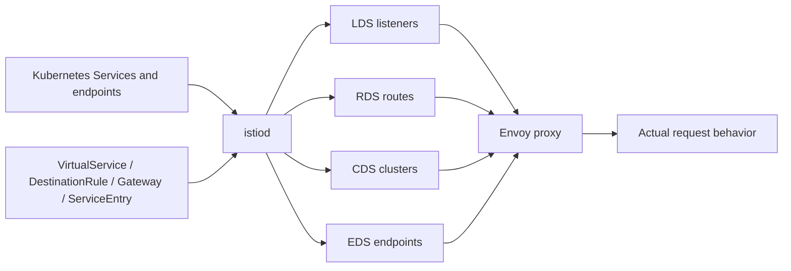

# Istio Traffic Management

Istio traffic management starts after Kubernetes has selected services and endpoints. Kubernetes provides service discovery and endpoint membership. Istio programs proxies with listeners, routes, clusters, endpoints, TLS settings, load balancing, retries, and policy-aware traffic behavior.

## Core Resources

| Resource | Role |
| --- | --- |
| `VirtualService` | Defines host matching, route rules, weights, redirects, retries, timeouts, and fault injection. |
| `DestinationRule` | Defines traffic policy for a destination, including subsets, TLS mode, load balancing, and outlier detection. |
| `Gateway` | Binds external or internal listener ports, hosts, and TLS settings to gateway workloads. |
| `ServiceEntry` | Adds external or non-Kubernetes services to the mesh registry. |
| `Sidecar` | Limits sidecar proxy config scope and egress visibility in sidecar mode. |

## Route Evaluation

Routes are evaluated by host and match order. A broad match placed before a narrow match can steal traffic. Hostnames must line up across Gateway, VirtualService, Kubernetes Service, and client request authority or SNI.

```bash
kubectl get virtualservice,destinationrule,gateway,serviceentry --all-namespaces
istioctl analyze --all-namespaces
istioctl proxy-config routes <pod> -n <namespace>
istioctl proxy-config clusters <pod> -n <namespace>
istioctl proxy-config endpoints <pod> -n <namespace>
```

If YAML looks right but traffic is wrong, inspect the proxy that actually handles the request. The active Envoy route table is the behavior source.

### xDS Route Debugging Path



Debug by xDS object:

| Symptom | Inspect |
| --- | --- |
| Connection never reaches expected route | Listeners and filter chains on the ingress side. |
| Host/path/header match is wrong | Routes for the proxy that accepted traffic. |
| Subset or TLS policy is wrong | Clusters and DestinationRule-derived settings. |
| Endpoint is missing | EDS endpoints plus Kubernetes EndpointSlices/readiness. |
| YAML accepted but not effective | `istioctl analyze`, config scope, exportTo, Sidecar resource, namespace labels. |

## Subsets and Canary Releases

Subsets usually point at Kubernetes workload labels such as `version: v1` and `version: v2`. The DestinationRule defines subsets; the VirtualService sends percentages to them.

Failure modes:

- subset labels do not match any pods,
- DestinationRule host differs from VirtualService destination host,
- traffic split is attached to the wrong host,
- mTLS policy conflicts with DestinationRule TLS mode,
- clients bypass the mesh or gateway where the route is applied.

## Timeouts, Retries, and Outlier Detection

Retries can hide short failures, but they can also amplify load. Timeouts should be smaller than caller deadlines. Outlier detection can eject unhealthy endpoints, but bad thresholds can eject too aggressively during partial outages.

Questions to ask:

- Does the caller already retry?
- Is the operation idempotent?
- What is the total retry budget?
- Are gateway, proxy, application, and load balancer timeouts aligned?
- Are 503s coming from no healthy upstream, connect failures, or application responses?

## External Services

ServiceEntry lets the mesh understand external destinations. Depending on policy, this can enable egress control, TLS origination, metrics, and routing.

```bash
kubectl get serviceentry --all-namespaces
istioctl proxy-config clusters <pod> -n <namespace> | grep outbound
istioctl proxy-config listeners <pod> -n <namespace>
```

Be explicit about DNS behavior. Some external services resolve through Envoy, some through application DNS, and some through Kubernetes DNS depending on configuration and capture mode.

## Traffic Debugging Runbook

1. Identify where traffic enters: sidecar, waypoint, ingress gateway, egress gateway, or ztunnel.
2. Confirm Kubernetes Service endpoints are healthy.
3. Run `istioctl analyze`.
4. Inspect routes and clusters on the proxy that handles the request.
5. Check DestinationRule TLS and subset policy.
6. Use access logs to separate route misses, upstream connection failures, and application errors.

## Study Cards

<div class="study-card-grid">
  
  
  
  
  
</div>

## References

- [Istio traffic management concepts](https://istio.io/latest/docs/concepts/traffic-management/)
- [VirtualService reference](https://istio.io/latest/docs/reference/config/networking/virtual-service/)
- [DestinationRule reference](https://istio.io/latest/docs/reference/config/networking/destination-rule/)
- [ServiceEntry reference](https://istio.io/latest/docs/reference/config/networking/service-entry/)
- [Istio traffic management tasks](https://istio.io/latest/docs/tasks/traffic-management/)
