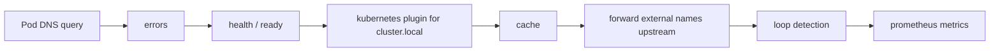
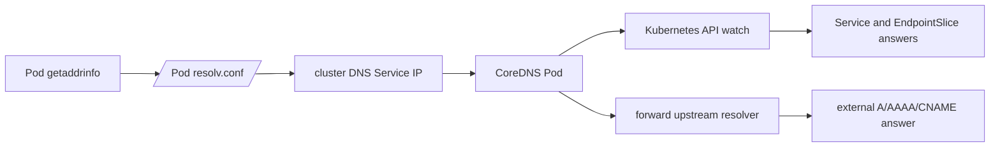

# Kubernetes DNS and CoreDNS

Kubernetes DNS is service discovery for Pods. CoreDNS watches the Kubernetes API and answers names for Services and, in selected cases, Pods. Most application-to-application traffic starts with this layer, so DNS failures often look like service, network, or application outages.

## First Checks

```bash
kubectl -n kube-system get deploy,svc,endpointslice -l k8s-app=kube-dns
kubectl -n kube-system logs deployment/coredns
kubectl exec -it <pod> -- cat /etc/resolv.conf
kubectl exec -it <pod> -- nslookup kubernetes.default.svc.cluster.local
kubectl -n kube-system get configmap coredns -o yaml
```

## Names Kubernetes Publishes

The most important Service name forms are:

| Name | Scope |
| --- | --- |
| `service` | Same namespace as the querying Pod through search paths. |
| `service.namespace` | Service in another namespace. |
| `service.namespace.svc` | Service under the cluster service zone. |
| `service.namespace.svc.cluster.local` | Fully qualified Service name in the default cluster domain. |

Headless Services use `clusterIP: None` and publish endpoint records directly. StatefulSets often combine headless Services, stable Pod hostnames, and ordered identities.

## Pod Resolver Configuration

Kubelet writes Pod DNS configuration based on `dnsPolicy`, `dnsConfig`, cluster DNS settings, and node resolver configuration. The common `ClusterFirst` policy sends cluster-domain names to cluster DNS and forwards external names upstream through CoreDNS.

Key fields to inspect:

- `nameserver` for the cluster DNS Service IP,
- `search` list for namespace and cluster suffixes,
- `options ndots:5` or other resolver options,
- custom `dnsPolicy` and `dnsConfig` on the Pod.

High `ndots` plus search suffixes can turn one external lookup into several cluster-local attempts before the absolute query.

## CoreDNS Corefile

CoreDNS behavior is configured through the `coredns` ConfigMap. The `kubernetes` plugin answers Service and endpoint names. The `forward` plugin sends non-cluster queries upstream. Other plugins commonly add caching, loop detection, health endpoints, readiness, metrics, reload behavior, and error logging.

Operational risks:

- forwarding loops from node stub resolvers,
- missing RBAC for Services, EndpointSlices, namespaces, or Pods,
- CoreDNS Pods not ready or overloaded,
- NetworkPolicy blocking UDP or TCP 53,
- upstream resolver timeouts,
- cache hiding recently changed answers.

CoreDNS plugin chain example:



Plugin order matters. The `kubernetes` plugin should answer cluster names before external forwarding. The `cache` plugin reduces API and upstream load, but it can also make recent changes appear delayed. The `loop` plugin protects against forwarding loops, such as forwarding to a node stub that points back at CoreDNS.

## CoreDNS Performance and Capacity

CoreDNS is a shared dependency. DNS query spikes can come from `ndots`, chatty clients, short TTLs, JVM or Go resolver behavior, broken retry loops, or external upstream slowness.

| Signal | Meaning | Action |
| --- | --- | --- |
| High CoreDNS CPU | Query volume, expensive plugins, logging, or upstream retries. | Check `coredns_dns_request_count_total`, top query names, and `ndots`. |
| Rising SERVFAIL | API watch/RBAC failure, upstream failure, DNSSEC issue, or loop. | Split cluster names from external names and inspect logs. |
| Long forward latency | Upstream resolver or network path is slow. | Compare multiple upstreams and check NAT/firewall paths. |
| Uneven node symptoms | NodeLocal DNSCache, CNI, or node-local firewall issue. | Test from Pods on multiple nodes. |

Scale CoreDNS replicas with topology in mind, keep requests/limits realistic, and avoid verbose query logging during normal operation. If NodeLocal DNSCache is enabled, capacity exists both at node-local caches and at the central CoreDNS layer.

## DNS Resolution Diagram



## CoreDNS Failure Labs

| Lab | Test | Expected Evidence |
| --- | --- | --- |
| Forwarding loop | Point CoreDNS forward target at a node stub resolver that points back to cluster DNS in a lab. | CoreDNS loop plugin logs, SERVFAIL, rising error count. |
| Stub resolver issue | Compare node `/etc/resolv.conf`, CoreDNS forward target, and Pod resolver. | Node-local `127.0.0.53` should not be blindly used as a cluster-wide upstream. |
| NodeLocal DNSCache | Query from a Pod on two nodes and capture DNS at node-local and CoreDNS points. | Packets may terminate at the node cache rather than CoreDNS first. |
| `ndots` expansion | Resolve `api.example.com` with and without trailing dot. | Multiple cluster-suffix queries before the absolute external name. |
| SERVFAIL | Query cluster name and external name separately. | Cluster-only SERVFAIL points at Kubernetes plugin/API/RBAC; external-only SERVFAIL points at forwarder/upstream. |
| TCP fallback | Query a large response with `dig +bufsize=4096` and `dig +tcp`. | UDP truncation or loss should be separated from TCP fallback behavior. |
| EndpointSlice RBAC | Remove EndpointSlice watch permission in a lab cluster only. | Service answers become stale, empty, or SERVFAIL depending on plugin behavior and cache. |

Practical commands:

```bash
kubectl -n kube-system get configmap coredns -o yaml
kubectl -n kube-system logs deployment/coredns --since=10m
kubectl auth can-i list endpointslices.discovery.k8s.io --as=system:serviceaccount:kube-system:coredns -n default
kubectl exec <pod> -- sh -c 'nslookup api.example.com; nslookup api.example.com.'
kubectl exec <pod> -- sh -c 'dig +tcp kubernetes.default.svc.cluster.local'
```

## DNS, NAT, and Egress

DNS decides which network path a Pod will try. For cluster names, CoreDNS usually returns ClusterIP or endpoint records that stay inside the cluster datapath. For external names, CoreDNS forwards upstream, and the resulting address may send Pod traffic through node SNAT, a cloud NAT gateway, an egress gateway, a proxy, or a private service endpoint.

NAT-related DNS issues:

- Pods resolve a public address instead of a private endpoint and unnecessarily cross the NAT gateway.
- CoreDNS upstream queries are SNATed through node or cloud NAT, so upstream resolvers see a shared source IP.
- Upstream DNS rate limits can affect many Pods at once when queries share one NAT source.
- `ndots` and search paths multiply external lookups, increasing CoreDNS and NAT gateway load.
- NodeLocal DNSCache changes cache locality, source addresses, and the point where DNS packet captures should be taken.
- DNS and app traffic may use different egress controls, causing names to resolve but connections to fail.

When a Pod can resolve a name but cannot connect, keep the DNS answer and the NAT path together: `nslookup` shows the selected address, while `ip route get`, flow logs, NAT gateway metrics, and packet captures show how that address leaves the cluster.

## NATS Example

NATS shows why Kubernetes DNS details matter. Application clients usually connect to a stable Service name on the NATS client port, while NATS servers in a cluster often use StatefulSet Pod DNS names behind a headless Service for peer route connections. The route names that NATS gossips through `advertise` settings must be names that the receiving peers or clients can resolve, reach, and validate with TLS.

For the full walkthrough, see [NATS, DNS, and Kubernetes Networking](../nats-dns-kubernetes/).

## Debugging Flow

1. Test from inside an affected Pod, not only from a node.
2. Inspect the Pod's `/etc/resolv.conf`.
3. Resolve a known cluster name such as `kubernetes.default.svc.cluster.local`.
4. Resolve the failing Service FQDN and the short name.
5. Check CoreDNS logs and readiness.
6. Check the CoreDNS ConfigMap and upstream forwarding.
7. Check whether NetworkPolicy allows UDP and TCP 53 to cluster DNS.
8. Check Service selectors and EndpointSlices if only one Service name fails.
9. Check whether external DNS answers use public NAT egress or private endpoint paths.

## Study Cards

<div class="study-card-grid">
  
  
  
  
  
</div>

## References

- [Kubernetes DNS for Services and Pods](https://kubernetes.io/docs/concepts/services-networking/dns-pod-service/)
- [Debugging DNS Resolution](https://kubernetes.io/docs/tasks/administer-cluster/dns-debugging-resolution/)
- [Customizing DNS Service](https://kubernetes.io/docs/tasks/administer-cluster/dns-custom-nameservers/)
- [CoreDNS Kubernetes plugin](https://coredns.io/plugins/kubernetes/)
