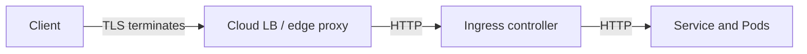
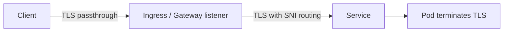
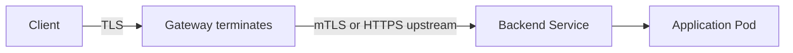

# Kubernetes Ingress, Gateway, and Load Balancers

External traffic crosses several ownership boundaries before it reaches a Pod: public DNS, cloud or bare-metal load balancer, node or proxy datapath, Ingress or Gateway controller, Service, EndpointSlice, CNI, and the workload. Debugging is faster when each boundary is tested separately.

## Command Examples

```bash
kubectl get ingress,gateway,httproute --all-namespaces
kubectl describe ingress <name>
kubectl describe gateway <name>
kubectl get svc -A --field-selector spec.type=LoadBalancer
kubectl get endpointslice -l kubernetes.io/service-name=<service>
curl -vk https://<host>/
```

Example output and meaning:

| Command | Example output | What it does |
| --- | --- | --- |
| `kubectl get ingress,gateway,httproute --all-namespaces` | `Services with ClusterIPs and EndpointSlices with backend addresses.` | Connects stable frontends to the backends that should receive traffic. |
| `kubectl describe ingress <name>` | `Services with ClusterIPs and EndpointSlices with backend addresses.` | Connects stable frontends to the backends that should receive traffic. |
| `kubectl describe gateway <name>` | `Services with ClusterIPs and EndpointSlices with backend addresses.` | Connects stable frontends to the backends that should receive traffic. |

## Ingress

Ingress is a stable API for HTTP and HTTPS routing, but it does nothing without an Ingress controller. The controller watches Ingress objects and configures a proxy or load balancer. Controller-specific annotations are common and can materially change behavior.

Ingress failure points:

- no controller is installed or watching the class,
- `ingressClassName` does not match the controller,
- TLS Secret is missing or wrong namespace,
- Host or path rule does not match,
- backend Service has no ready endpoints,
- controller cannot publish status or provision infrastructure.

## Gateway API

Gateway API splits infrastructure ownership from route ownership. GatewayClass selects an implementation, Gateway represents an entry point, and Routes such as HTTPRoute attach application routing to Gateways.

## Ingress vs Gateway API

| Question | Ingress | Gateway API |
| --- | --- | --- |
| Primary scope | HTTP/HTTPS routing through a controller. | Extensible traffic API with separate GatewayClass, Gateway, Listener, and Route resources. |
| Ownership model | Often app teams own Ingress and annotations. | Platform teams can own Gateways while app teams own Routes. |
| Extension style | Controller-specific annotations are common. | Standard resource fields and typed route attachment conditions. |
| Status clues | Ingress address, class, events, and controller logs. | Gateway, listener, and route conditions explain attachment and acceptance. |
| Best fit | Simple HTTP routing and mature controller workflows. | Shared infrastructure, multi-team routing, richer protocol support, and clearer delegation. |
| Common failure | Wrong class, annotations, host/path, TLS secret, or backend Service. | Route not accepted, listener mismatch, namespace attachment policy, or unresolved backend reference. |

Useful mental model:

- platform team owns GatewayClass and shared Gateways,
- app teams own Routes,
- status conditions explain attachment, listener, and route acceptance problems.

Gateway API is where much of the newer Kubernetes traffic-management work happens, while Ingress remains stable but limited.

## Service LoadBalancers

`type: LoadBalancer` needs an implementation outside the core Service object: cloud controller manager, MetalLB, appliance integration, or a custom controller. The Service status should show whether an external address was assigned.

Important details:

- health checks may target node ports, proxy Pods, or local endpoints,
- `externalTrafficPolicy: Local` can preserve source IP but requires local ready endpoints,
- cloud security groups or firewalls may block traffic before Kubernetes sees it,
- DNS may point at the wrong load balancer address during migrations.

## TLS, SNI, and Host Routing

TLS, SNI, and HTTP Host must align. A request can reach the right IP but fail because:

- client SNI does not match the certificate,
- certificate SAN does not include the requested host,
- Host header does not match a route,
- TLS terminates at a different layer than expected,
- backend protocol expects HTTP while the proxy speaks HTTPS, or the reverse.

Common TLS termination patterns:







If TLS fails before an HTTP route is selected, inspect SNI, certificate chain, listener mode, and whether the load balancer or gateway is the actual TLS endpoint.

## Load Balancer Health Check Mismatches

External load balancers frequently make a different request than real clients. A shallow health check can pass while user traffic fails, or fail while the backend is healthy.

| Mismatch | Symptom | Check |
| --- | --- | --- |
| Health check uses node port but traffic uses proxy Pod | Nodes look healthy while proxy routes are broken. | Controller docs, LB target group, node security groups. |
| Health check path is `/healthz` but app route needs auth or dependencies | LB passes, users see 5xx. | Compare health path with real route and dependency readiness. |
| `externalTrafficPolicy: Local` with no local endpoints | Some nodes fail health checks or black-hole traffic. | Endpoint placement per node, Service traffic policy. |
| Health check sends HTTP to HTTPS listener | Backend marked unhealthy. | LB protocol, Gateway listener protocol, backend protocol annotation. |
| Source IP allowlist misses health checker CIDRs | LB considers all targets down. | Cloud health checker ranges, firewall/security group logs. |

## Troubleshooting Flow

1. Resolve the public name and confirm the load balancer address.
2. Test TCP and TLS to the external address with the expected SNI.
3. Check Ingress or Gateway status conditions.
4. Check controller logs and class selection.
5. Check the backend Service and EndpointSlices.
6. Check health checks and `externalTrafficPolicy`.
7. Test from inside the cluster to the backend Service.
8. Compare direct Service behavior with edge behavior.

## Study Cards

<div class="study-card-grid">
  
  
  
</div>

## References

- [Kubernetes Ingress](https://kubernetes.io/docs/concepts/services-networking/ingress/)
- [Kubernetes Gateway API](https://kubernetes.io/docs/concepts/services-networking/gateway/)
- [Kubernetes Services](https://kubernetes.io/docs/concepts/services-networking/service/)
- [Debug Services](https://kubernetes.io/docs/tasks/debug/debug-application/debug-service/)
