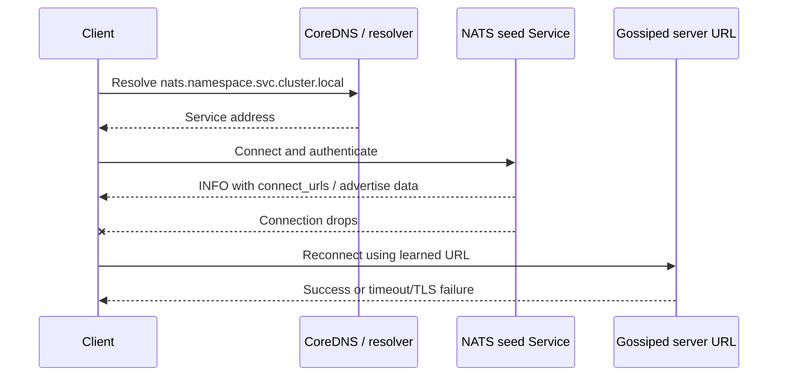

# NATS, DNS, and Kubernetes Networking

NATS is simple on the wire, but clustered NATS depends heavily on the names it gives to clients and peers. In Kubernetes, those names usually come from Service DNS, StatefulSet identity, and headless Services. When DNS, advertised addresses, TLS names, or NetworkPolicy do not match, NATS can look healthy from one Pod and unreachable from another.

## First Checks

```bash
kubectl -n <namespace> get statefulset,svc,endpointslice,pod -l app.kubernetes.io/name=nats
kubectl -n <namespace> get svc <nats-service> <nats-headless-service> -o wide
kubectl -n <namespace> get endpointslice -l kubernetes.io/service-name=<nats-headless-service>
kubectl -n <namespace> exec -it <debug-pod> -- nslookup <nats-service>.<namespace>.svc.cluster.local
kubectl -n <namespace> exec -it <debug-pod> -- nslookup <nats-0>.<nats-headless-service>.<namespace>.svc.cluster.local
kubectl -n <namespace> exec -it <debug-pod> -- nslookup -type=SRV _nats._tcp.<nats-headless-service>.<namespace>.svc.cluster.local
kubectl -n <namespace> logs statefulset/<nats-statefulset> --all-containers
```

## The Two DNS Jobs

NATS uses Kubernetes DNS for two different audiences:

| Audience | Common DNS target | Why |
| --- | --- | --- |
| Application clients | A normal ClusterIP Service such as `nats.<namespace>.svc.cluster.local:4222`. | Clients need a stable front door. Kubernetes can route to ready NATS Pods behind the Service. |
| NATS server peers | Stable StatefulSet Pod names behind a headless Service, such as `nats-0.nats-headless.<namespace>.svc.cluster.local:6222`. | Cluster routes need direct server-to-server reachability and stable peer identity. |

Do not treat those as interchangeable. Client traffic can usually go through a normal Service. Cluster route traffic should use names that resolve to the individual server Pods, because NATS forms routes between servers and gossips discovered peers.

DNS is only the bootstrap and naming layer. NATS subjects are not DNS names, and NATS does not ask DNS where a subject lives. A client resolves one or more server URLs, connects to a NATS server, and then NATS handles subject routing inside the connected server or cluster. The DNS-sensitive part is whether the client or peer can reach the server URLs it is given at connect time and during reconnect.

## StatefulSet and Headless Service Behavior

The official NATS Kubernetes path uses Helm, and the chart deploys NATS as a StatefulSet by default. That matches how clustered NATS thinks about servers: each Pod has a stable ordinal and a stable DNS name when paired with a headless Service.

Headless Services (`clusterIP: None`) do not allocate a virtual Service IP, and Kubernetes does not load-balance them through kube-proxy. Instead, cluster DNS returns endpoint addresses directly. For StatefulSets, StatefulSet Pod DNS gives names like:

| Name | Meaning |
| --- | --- |
| `nats.default.svc.cluster.local` | Normal Service name clients can use. |
| `nats-headless.default.svc.cluster.local` | Headless Service name that returns backing Pod addresses. |
| `nats-0.nats-headless.default.svc.cluster.local` | Stable DNS name for one StatefulSet Pod. |
| `_nats._tcp.nats-headless.default.svc.cluster.local` | SRV record shape when the Service port is named. |

Kubernetes normally publishes endpoint DNS for ready Pods. If a cluster needs peer names before readiness succeeds, check the chart and Service behavior around `publishNotReadyAddresses`; it can solve bootstrap ordering, but it also makes clients or peers see Pods before they are actually serving.

This matters during NATS startup. If every server waits for every other server to be Ready before DNS exposes the route names, the cluster may bootstrap slowly or unevenly. If not-ready addresses are published too broadly, peers can try route connections to Pods whose listeners, credentials, JetStream stores, or TLS files are not ready yet. The right setting depends on whether the chart's readiness probe represents "safe for clients" or "safe for peer bootstrap."

SRV records are useful when the Service has named ports, but do not assume every NATS client or server path consumes SRV records. Most NATS configuration still uses explicit `nats://host:port` URLs. SRV lookups are mainly a debugging tool unless the specific client, operator, or chart value is documented to use them.

## NATS Route Gossip and Advertise Names

NATS servers form a route mesh by connecting to configured routes, then gossiping known servers. That means DNS is not only used at startup. The first route may resolve correctly, but then a server can advertise another URL that peers or clients later try to use.

Important rules:

- `routes` should point at names peers can resolve and reach from inside the cluster.
- `cluster.advertise` should be a host:port that other NATS servers can connect to, not a transient Pod IP if TLS or cross-network routing expects DNS.
- `client_advertise` should only publish client URLs that application clients can actually reach.
- `no_advertise: true` can be useful when different client networks reach NATS through different load balancers and an internal URL would cause slow reconnects.
- With TLS, the advertised DNS name has to match the certificate SAN for that listener.

Misadvertise failures are easy to misread. A Pod can connect to `nats:4222`, receive a server-provided URL such as `10.42.3.17:4222`, then stall on reconnect because that address is wrong from its network or not covered by TLS.

## Name Boundaries

Use different names for different reachability domains:

| Domain | Better Name Shape | Avoid |
| --- | --- | --- |
| Same namespace clients | `nats:4222` or the full Service FQDN. | Pod DNS names in application config. |
| Cross-namespace clients | `nats.<namespace>.svc.cluster.local:4222`. | Short names that depend on the caller's search path. |
| NATS peer routes | `nats-0.nats-headless.<namespace>.svc.cluster.local:6222`. | A load-balanced ClusterIP Service for route identity. |
| External clients | Public or private load balancer DNS with matching TLS SANs. | Internal Pod or Service DNS names. |
| Multi-cluster gateways or leaf nodes | Names routable from the remote cluster or network. | Cluster-local `.svc.cluster.local` names from another cluster. |

This is where many Kubernetes/NATS incidents start. A name that is perfect for an in-cluster client is usually wrong for an external client, and a name that is perfect for one NATS peer may be wrong for a client reconnect URL.

## CoreDNS and Resolver Behavior

CoreDNS usually answers cluster-local NATS names from the Kubernetes API and forwards non-cluster names upstream. That means NATS incidents can involve both Kubernetes resources and resolver behavior:

- short names such as `nats` depend on namespace search suffixes,
- `ndots` can create extra CoreDNS queries for partially qualified names,
- headless Service answers can change as EndpointSlices change,
- NodeLocal DNSCache changes where DNS is cached and where packet captures should happen,
- some application runtimes cache DNS longer than CoreDNS or Kubernetes intended,
- NetworkPolicy can allow `4222/TCP` while still blocking `53/UDP` or `53/TCP`.

When the symptom is intermittent reconnect delay, check both the currently configured seed URLs and any URLs learned from NATS server gossip. The DNS answer for the seed Service may be healthy while a gossiped Pod IP, stale Pod DNS name, or external advertise name is not.

## Ports and NetworkPolicy

NATS is TCP-based. A locked-down namespace must allow both DNS and the NATS listener paths:

| Flow | Typical Port | Policy Need |
| --- | --- | --- |
| Client to NATS | `4222/TCP` | App namespaces need egress to the NATS client Service. |
| NATS route peer to peer | `6222/TCP` | NATS Pods need ingress and egress to each other on the cluster route port. |
| Monitoring | `8222/TCP` | Prometheus or operators need access only if scraping or checking HTTP monitoring. |
| Leaf nodes | `7422/TCP` | Only needed when using leaf nodes. |
| Gateways | `7522/TCP` | Only needed for superclusters. |
| DNS | `53/UDP` and `53/TCP` | NATS Pods and clients need egress to CoreDNS or NodeLocal DNSCache. |

When egress default-deny is enabled, allowing `4222/TCP` is not enough. The client may fail before connecting if UDP/TCP 53 to cluster DNS is blocked. Likewise, a NATS server may start but fail to form a cluster if route-port traffic is blocked between Pods.

## DNS, Reconnects, and Caching

NATS clients should be configured with more than one reasonable seed URL where possible. A normal Kubernetes Service DNS name is a good seed for in-cluster apps, while direct Pod DNS names are useful for server-to-server routes. After connection, NATS clients can learn more server URLs from the cluster and use them during reconnects.

Kubernetes DNS and NATS reconnect behavior interact in a few operational ways:

- Short names such as `nats` depend on the Pod namespace and search path; use FQDNs when crossing namespaces or debugging.
- `ndots` can create extra CoreDNS queries before an external or partially qualified name is tried as absolute.
- DNS answers for headless Services can change when Pods are rescheduled.
- Client libraries may cache DNS or keep server-provided URLs longer than CoreDNS caches the answer.
- A Service can resolve while having no ready endpoints; always inspect EndpointSlices alongside DNS.

Reconnect timeline:



When reconnects are slow, inspect both configured seed URLs and learned URLs. A seed Service can be healthy while an advertised Pod IP, stale DNS name, or external URL is unreachable from the client network.

For external clients, publish a deliberate load balancer or ingress-compatible endpoint and use ExternalDNS only for that client-facing name. Do not use public DNS names as internal cluster route names unless the traffic path, TLS SANs, and NetworkPolicy are intentionally designed that way.

## Failure Patterns

| Symptom | DNS/NATS Interaction To Check |
| --- | --- |
| Clients connect once but reconnect slowly | `client_advertise` or gossiped server URLs point at unreachable Pod IPs or internal names. |
| NATS Pods are Running but cluster has one-node islands | Route names resolve, but `6222/TCP`, route credentials, or TLS SANs fail between peers. |
| Headless Service lookup returns fewer Pods than expected | Pod readiness, EndpointSlice conditions, selectors, or `publishNotReadyAddresses` behavior. |
| External clients fail while in-cluster clients work | External DNS points at the wrong load balancer, or advertised names are cluster-local. |
| TLS works through one name but not another | Connected name does not match the certificate SAN for that listener. |
| DNS lookup succeeds but connection fails | NetworkPolicy, Service endpoints, route port, kube-proxy/CNI path, or firewall path after DNS. |

## Debugging Flow

1. From an affected Pod, resolve the client Service FQDN and one StatefulSet Pod FQDN.
2. Inspect EndpointSlices for both the normal Service and headless Service.
3. Confirm the NATS Pods are Ready and that readiness is not blocking needed headless records.
4. Check NATS logs for route connect, route disconnect, TLS hostname, and authorization errors.
5. Check whether server-provided URLs or `advertise` values are Pod IPs, internal names, or load balancer names.
6. Verify NetworkPolicy permits DNS, client, and route-port traffic in the relevant namespaces.
7. If TLS is enabled, compare the connected DNS name with the certificate SAN.
8. Test a publish through `nats-box` or a debug client after DNS and route checks pass.

## Study Cards

<div class="study-card-grid">
  
  
  
  
  
  
  
</div>

## References

- [NATS and Kubernetes](https://docs.nats.io/running-a-nats-service/nats-kubernetes)
- [NATS Server Clustering](https://docs.nats.io/running-a-nats-service/configuration/clustering)
- [NATS Clustering Configuration](https://docs.nats.io/running-a-nats-service/configuration/clustering/cluster_config)
- [NATS Connecting to a Cluster](https://docs.nats.io/using-nats/developer/connecting/cluster)
- [Kubernetes Services](https://kubernetes.io/docs/concepts/services-networking/service/)
- [Kubernetes DNS for Services and Pods](https://kubernetes.io/docs/concepts/services-networking/dns-pod-service/)
- [Kubernetes DNS Debugging](https://kubernetes.io/docs/tasks/administer-cluster/dns-debugging-resolution/)
