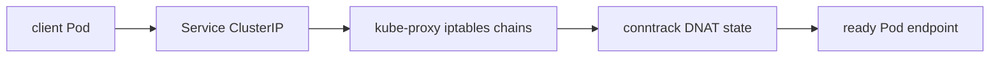
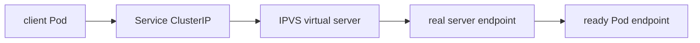
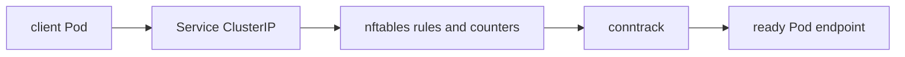
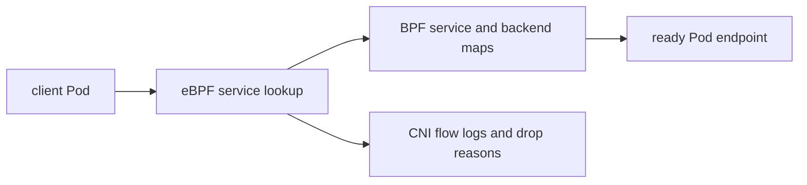

# Kubernetes Networking

Kubernetes networking starts from a simple model: every Pod gets a cluster-wide IP, containers in the same Pod share a network namespace, and Pods should be able to communicate without manual port mapping. The hard part is that Kubernetes defines the model while plugins implement much of the datapath.

## Command Examples

Start with inventory before packet captures. Most Kubernetes network incidents are faster to narrow when you know whether the failing hop is DNS, Service selection, kube-proxy replacement, CNI routing, policy enforcement, or an external load balancer.

```bash
kubectl get nodes -o wide
kubectl get pods -A -o wide
kubectl get svc,endpointslice,ingress,gateway -A -o wide
kubectl -n kube-system get pods -o wide
kubectl exec -it <pod> -- cat /etc/resolv.conf
```

Example output and meaning:

| Command | Example output | What it does |
| --- | --- | --- |
| `kubectl get nodes -o wide` | `node-a Ready ... INTERNAL-IP 10.0.1.10`. | Shows node readiness, addresses, versions, and the host layer that Pods land on. |
| `kubectl get pods -A -o wide` | Pod rows with `STATUS Running`, Pod IPs, and node names. | Maps symptoms to a namespace, Pod IP, and node before packet captures. |
| `kubectl get svc,endpointslice,ingress,gateway -A -o wide` | Services with ClusterIPs and EndpointSlices with backend Pod IPs. | Separates Service selection, endpoint readiness, and external routing objects. |

## Critical Subtopics

| Topic | Why It Matters |
| --- | --- |
| [Kubernetes DNS and CoreDNS](../dns-coredns/) | Covers Service DNS names, Pod `/etc/resolv.conf`, `dnsPolicy`, CoreDNS Corefile behavior, forwarding, `ndots`, and DNS failure modes. |
| [NATS, DNS, and Kubernetes Networking](../nats-dns-kubernetes/) | Covers how NATS clients, StatefulSet Pods, headless Services, cluster routes, advertise settings, TLS names, and NetworkPolicy depend on DNS. |
| [Kubernetes ExternalDNS](../external-dns/) | Covers how Kubernetes hostnames from Services, Ingress, and Gateway API become provider DNS records with ownership, filters, and split-horizon concerns. |
| [Services and EndpointSlices](../services-endpointslices/) | Explains selectors, readiness, EndpointSlices, kube-proxy, headless Services, LoadBalancer behavior, and source IP tradeoffs. |
| [Pod Networking and CNI](../pod-networking-cni/) | Separates the Kubernetes network model from CNI implementation details such as routes, overlays, eBPF, Pod CIDRs, and MTU. |
| [NetworkPolicy](../network-policy/) | Covers ingress and egress isolation, selectors, default deny, DNS egress, CNI enforcement, and policy debugging. |
| [Ingress, Gateway, and Load Balancers](../ingress-gateway-load-balancers/) | Covers Ingress controllers, Gateway API, Service LoadBalancers, health checks, TLS, SNI, source IP, and edge debugging. |

## The Pod Network

A Pod has one IP and one network namespace. Containers inside the Pod share:

- loopback,
- IP address,
- port space,
- routes,
- network interfaces.

This is why two containers in one Pod can talk over `localhost`, but two Pods cannot. Between Pods, traffic uses Pod IPs, Service virtual IPs, or higher-level routing.

The CNI plugin is responsible for connecting Pods to the cluster network. Depending on the plugin, packets may move through bridges, routes, overlays, BGP, eBPF programs, or cloud-native VPC networking.

## Service Networking

A Service gives a stable virtual endpoint for a changing set of Pods. The selector chooses Pods, the EndpointSlice controller writes EndpointSlices, and kube-proxy or a replacement datapath routes traffic.

| Service Type | Use |
| --- | --- |
| `ClusterIP` | Internal virtual IP for Pods inside the cluster. |
| `NodePort` | Opens a port on every node and forwards to the Service. |
| `LoadBalancer` | Asks a cloud or load balancer controller to create an external balancer. |
| `ExternalName` | DNS CNAME-style indirection to an external name. |

Quirky Service details:

- Services route to ready endpoints unless publishing not-ready addresses is configured.
- Service selectors must match Pod labels exactly; selector drift is a common outage.
- `targetPort` can be a number or named container port.
- `externalTrafficPolicy: Local` preserves client source IP for many load balancer setups but only sends traffic to nodes with local ready endpoints.
- Headless Services (`clusterIP: None`) skip the virtual IP and publish endpoint records directly, often for StatefulSets.

## Service Datapath Modes

Kubernetes defines Services, but each node implements the virtual IP datapath. Common implementations include iptables, IPVS, nftables, eBPF, or a CNI-integrated replacement. The API object can be correct while one node has stale rules, missing BPF state, a broken conntrack table, or a host firewall conflict.

| Mode | Debug Shape |
| --- | --- |
| iptables | Inspect service chains, DNAT rules, conntrack, and kube-proxy logs. |
| IPVS | Inspect virtual servers with `ipvsadm`, real servers, scheduler choice, and conntrack. |
| nftables | Inspect nft rulesets and counters written by the proxy implementation. |
| eBPF replacement | Inspect CNI agent status, BPF maps, node health, and CNI-specific service state. |

| Question | kube-proxy iptables/IPVS/nftables | CNI-Owned eBPF Service Path |
| --- | --- | --- |
| Who programs Service load balancing? | kube-proxy watches Services and EndpointSlices. | CNI agent watches APIs and writes BPF maps/programs. |
| Where do counters live? | iptables/nft counters, IPVS stats, conntrack. | CNI flow logs, BPF map counters, drop monitors. |
| What commonly goes stale? | Node-local proxy rules or conntrack entries. | BPF service/backend maps or agent state. |
| Best first isolation test | Compare ClusterIP with direct Pod IP and kube-proxy logs. | Compare ClusterIP with direct Pod IP and CNI service-map status. |

Practical Service checks:

```bash
kubectl get svc api -o wide
kubectl get endpointslice -l kubernetes.io/service-name=api -o wide
kubectl exec deploy/client -- curl -v http://api.default.svc.cluster.local:8080
kubectl exec deploy/client -- curl -v http://<pod-ip>:8080
kubectl -n kube-system logs -l k8s-app=kube-proxy --since=10m
```

## Service Datapath Diagrams

iptables mode:



IPVS mode:



nftables mode:



eBPF replacement mode:



The debugging rule is simple: inspect the datapath that is actually active. iptables output is weak evidence when an eBPF CNI replaced kube-proxy, and CNI map state is weak evidence for a cluster still using kube-proxy iptables mode.

## Service Works From One Node Only

Node-local Service failures happen because each node owns part of the datapath. A Service object and EndpointSlice can be correct while one node has stale proxy rules, bad BPF maps, conntrack pressure, host firewall drops, or CNI route drift.

```bash
kubectl get endpointslice -l kubernetes.io/service-name=api -o wide
kubectl get pods -l app=api -o wide
kubectl debug node/<bad-node> -it --image=nicolaka/netshoot
curl -v http://<cluster-ip>:<port>
curl -v http://<endpoint-pod-ip>:<port>
conntrack -S
```

Interpretation:

| Observation | Likely Layer |
| --- | --- |
| Direct Pod IP works, ClusterIP fails only on one node | Service datapath on that node. |
| Both direct Pod IP and ClusterIP fail only cross-node | CNI routing, overlay, MTU, cloud route, or policy. |
| New connections fail but old ones work | conntrack exhaustion, stale NAT state, or proxy map drift. |
| Only external LoadBalancer path fails on one node | health check, NodePort, `externalTrafficPolicy`, or host firewall. |

## DNS: CoreDNS and kube-dns

Modern clusters commonly run CoreDNS as the cluster DNS server. Older clusters used kube-dns. The job is similar: watch Kubernetes Services and endpoints, then answer DNS queries from Pods.

Default lookup behavior matters:

- A Pod resolving `api` first searches its own namespace.
- Cross-namespace lookup should use `api.other-namespace`.
- Fully qualified Service names look like `service.namespace.svc.cluster.local`.
- Search paths and `ndots` can generate multiple queries for one application lookup.

CoreDNS must have permissions to list and watch Services, namespaces, Pods, and EndpointSlices. Missing EndpointSlice RBAC can cause SERVFAIL or stale answers.

ExternalDNS is separate from CoreDNS. It watches selected Kubernetes resources and writes records to a DNS provider so clients outside the cluster can resolve names such as `app.example.com`. Debug it through source object status, ExternalDNS logs, provider permissions, and authoritative DNS records rather than through the cluster DNS datapath alone.

Common Kubernetes DNS failures:

- Node `/etc/resolv.conf` points at a local stub resolver that creates a forwarding loop.
- Too many upstream nameservers hit libc limits.
- Alpine or old musl-based images mishandle large DNS responses without TCP fallback.
- NetworkPolicy blocks UDP/TCP 53 to CoreDNS.
- `ndots:5` amplifies external lookups into several internal search attempts.
- NodeLocal DNSCache changes where DNS packets terminate and which source address CoreDNS sees.
- CoreDNS forwarder failures can break only external names while Service names still resolve.

## Ingress and Gateway API

Ingress exposes HTTP and HTTPS routing rules, but an Ingress object does nothing without an Ingress controller. Controllers differ in annotations, load balancing behavior, TLS handling, and rewrite support.

Ingress is stable but frozen. New Kubernetes traffic-management work is centered on Gateway API, which separates infrastructure roles from application route ownership and supports richer routing models.

Use this rule of thumb:

- Use `Service type: LoadBalancer` for simple L4 exposure.
- Use Ingress for existing HTTP routing ecosystems.
- Prefer Gateway API for new platform designs that need explicit GatewayClasses, shared gateways, and richer route ownership.

## Load Balancers

`type: LoadBalancer` is not magic inside core Kubernetes. It requires an implementation:

- cloud controller manager in managed clouds,
- MetalLB or similar on bare metal,
- appliance or service mesh integration,
- custom load balancer controller.

The Service status shows whether an external address was assigned:

```bash
kubectl get service <name>
kubectl describe service <name>
kubectl get endpointslice -l kubernetes.io/service-name=<name>
```

## NetworkPolicy

NetworkPolicy is an API for L3/L4 traffic control, but enforcement depends on the CNI plugin. If the CNI does not implement NetworkPolicy, policy objects may exist without effect.

Important behaviors:

- Policies are namespace scoped.
- Once a Pod is selected by an ingress policy, only allowed ingress traffic is permitted.
- Egress isolation is separate from ingress isolation.
- DNS must be allowed explicitly when egress is locked down.

Enforcement details differ by CNI. Some plugins enforce policy with iptables, some with eBPF, and some support only parts of the API or add their own policy types. A policy object existing in the API is not proof that packets are being filtered.

For default-deny egress, allow DNS deliberately:

```yaml
apiVersion: networking.k8s.io/v1
kind: NetworkPolicy
metadata:
  name: allow-dns-egress
spec:
  podSelector: {}
  policyTypes: ["Egress"]
  egress:
    - to:
        - namespaceSelector:
            matchLabels:
              kubernetes.io/metadata.name: kube-system
      ports:
        - protocol: UDP
          port: 53
        - protocol: TCP
          port: 53
```

## Packet Walkthrough: Client to Pod via Ingress

1. Client resolves the external DNS name to a load balancer address.
2. The load balancer sends traffic to an Ingress controller or gateway.
3. The controller matches host/path/TLS rules.
4. The controller forwards to a Service backend.
5. Service datapath chooses a ready endpoint.
6. CNI routes the packet to the node and Pod.
7. The Pod receives traffic on its container port.

Break the path at each boundary when debugging.

## Pod-to-External Egress

Pod egress often crosses more translations than operators expect:

```text
Pod IP -> node CNI path -> node SNAT or egress gateway -> cloud NAT or firewall -> internet or private endpoint
```

Check source IP expectations. A destination allowlist may see a node IP, NAT gateway IP, egress gateway IP, or preserved Pod IP depending on the CNI and cloud design. Hairpin traffic can happen when a Pod resolves an internal service to a public load balancer address instead of a private Service, private endpoint, or split-horizon DNS answer.

## Commands

```bash
kubectl get pods -n kube-system -l k8s-app=kube-dns
kubectl -n kube-system logs deployment/coredns
kubectl get svc,endpointslice,ingress,gateway --all-namespaces
kubectl exec -it <pod> -- nslookup kubernetes.default.svc.cluster.local
kubectl exec -it <pod> -- cat /etc/resolv.conf
kubectl exec -it <pod> -- curl -v http://<service>.<namespace>.svc.cluster.local:<port>
kubectl exec -it <pod> -- curl -v http://<pod-ip>:<port>
```

## Study Cards

<div class="study-card-grid">
  
  
  
  
  
</div>

## References

- [Kubernetes Services, Load Balancing, and Networking](https://kubernetes.io/docs/concepts/services-networking/)
- [DNS debugging in Kubernetes](https://kubernetes.io/docs/tasks/administer-cluster/dns-debugging-resolution/)
- [Kubernetes Ingress](https://kubernetes.io/docs/concepts/services-networking/ingress/)
- [Kubernetes Gateway API](https://kubernetes.io/docs/concepts/services-networking/gateway/)
