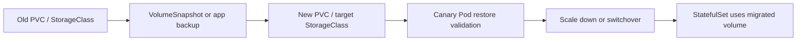
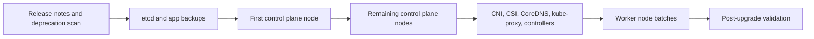

# Kubernetes Storage and Upgrades

Storage and upgrades are where Kubernetes stops being purely declarative and starts touching durable state. Treat both as operational workflows with backups, sequencing, and rollback plans.

This page was reviewed against the Kubernetes v1.36 documentation in May 2026. As of May 24, 2026, the upstream releases page lists v1.36.1 as the latest v1.36 patch release and lists v1.36, v1.35, and v1.34 as the maintained minor release branches.

<aside class="version-callout">
  <strong>Version-sensitive:</strong> Kubernetes release support, skew rules, kubeadm behavior, and add-on compatibility move with each release. Verify the target minor and patch release before executing an upgrade.
</aside>

## Storage Building Blocks

| Object | Meaning |
| --- | --- |
| Volume | A mounted storage source in a Pod spec. Some are ephemeral, some are persistent. |
| PersistentVolume | A cluster-scoped storage resource. It has capacity, access modes, reclaim policy, and implementation details. |
| PersistentVolumeClaim | A namespaced request for storage. Pods mount PVCs, not arbitrary PVs. |
| StorageClass | Defines dynamic provisioning behavior and storage parameters. |
| VolumeSnapshot | Snapshot API object when a snapshot controller and CSI support exist. |

PVs and PVCs decouple application YAML from infrastructure implementation. A developer asks for "20Gi fast storage"; the platform decides which backend provides it.

## CSI

CSI is the Container Storage Interface. Kubernetes uses it to integrate storage systems without baking vendor-specific volume plugins into core Kubernetes.

Typical CSI components:

- **Controller plugin:** provisions, deletes, attaches, detaches, expands, and snapshots volumes.
- **Node plugin:** stages and publishes volumes on nodes so Pods can mount them.
- **External sidecars:** provisioner, attacher, resizer, snapshotter, health monitor depending on driver features.

Operational lesson: CSI driver compatibility matters. Kubernetes may support an API, but the driver and sidecars must support the exact feature and version combination.

CSI sidecar compatibility examples:

| Feature | CSI Piece To Verify | Failure If Mismatched |
| --- | --- | --- |
| Dynamic provisioning | external-provisioner and driver controller service | PVCs stay Pending or provision wrong parameters. |
| Attach/detach | external-attacher, VolumeAttachment support, node plugin | Pods wait on attach or detach, especially across zones. |
| Expansion | external-resizer, driver expansion capability, filesystem resize | PVC expands in API but filesystem stays old size. |
| Snapshots | snapshot-controller, external-snapshotter, VolumeSnapshotClass | Snapshot objects exist but no backend snapshot is created. |
| Health monitoring | health-monitor sidecars and driver support | Volume degradation is invisible to Kubernetes. |

## Access Modes

| Mode | Meaning |
| --- | --- |
| `ReadWriteOnce` | Read-write by a single node. Multiple Pods can use it if co-located on that node. |
| `ReadOnlyMany` | Read-only by many nodes. |
| `ReadWriteMany` | Read-write by many nodes if the backend supports it. |
| `ReadWriteOncePod` | Read-write by a single Pod; stable in Kubernetes v1.29 for CSI volumes. |

Do not assume `ReadWriteMany` is available. Many block storage systems only support single-node attachment.

## StatefulSets

StatefulSets provide stable identity:

- predictable Pod names,
- ordered rollout behavior,
- stable PVCs through `volumeClaimTemplates`,
- stable DNS when paired with a headless Service.

They do not make the application safe. PostgreSQL, Kafka, etcd, and similar systems still need application-level replication, quorum, backup, and recovery logic.

StatefulSet volume migration shape:



Prefer application-native replication or backup/restore when the storage backend cannot safely clone volumes across classes, zones, or encryption domains. Kubernetes can move objects; it cannot prove database-level consistency by itself.

## Reclaim Policies

Reclaim policy controls what happens to the PV after its PVC is deleted:

- `Delete`: delete the backing volume through the provisioner.
- `Retain`: keep the backing volume for manual recovery or cleanup.

For databases, understand reclaim policy before running cleanup automation. Accidentally deleting PVCs with a `Delete` policy can delete the underlying disk.

## Kubernetes Upgrades

The safe high-level upgrade sequence is:

1. Read release notes, deprecations, API removals, and add-on compatibility.
2. Back up `etcd` and application data.
3. Check version skew policy for API server, kubelet, kubeadm, kubectl, controller manager, scheduler, and add-ons.
4. Upgrade one primary control plane node.
5. Upgrade additional control plane nodes.
6. Upgrade worker nodes in controlled batches.
7. Upgrade CNI, CSI, CoreDNS, ingress/gateway controllers, and cloud controllers as required by their compatibility matrices.
8. Verify workloads, DNS, Service routing, admission webhooks, storage attach/mount, and node readiness.

For kubeadm clusters, skipping minor versions is unsupported. Move one minor at a time and stay on supported release lines.

<aside class="runbook-panel">
  <strong>Runbook shape:</strong> inventory current versions, back up `etcd` and app data, upgrade control plane nodes one at a time, update add-ons, roll worker nodes in batches, then validate API, DNS, Service routing, and storage.
</aside>

## Upgrade Inventory

Before selecting a target version, capture what the cluster is actually running:

```bash
kubectl version
kubectl get nodes -o wide
kubectl get pods -A -o wide
kubectl get apiservices
kubectl get mutatingwebhookconfiguration,validatingwebhookconfiguration
kubectl get pdb -A
kubectl get deployment,daemonset,statefulset -A
kubeadm upgrade plan
```

Inventory these owners:

| Area | What To Check |
| --- | --- |
| Kubernetes core | Current API server, controller manager, scheduler, kubelet, kube-proxy, and `kubectl` versions. |
| `etcd` | Backup method, quorum, disk health, compaction/defrag practice, and restore test. |
| API usage | Deprecated APIs, removed beta versions, CRD conversion webhooks, and admission webhooks. |
| Networking | CNI version, kube-proxy or eBPF mode, NetworkPolicy behavior, MTU, load balancer controller, and ingress/gateway controller. |
| Storage | CSI driver and sidecar versions, VolumeAttachment health, snapshot controller, expansion support, and StatefulSet disruption rules. |
| Workloads | PodDisruptionBudgets, anti-affinity, topology spread, readiness probes, max unavailable settings, and stateful drain behavior. |

Run deprecation checks before the upgrade, not during it. A removed API can break a controller even if the currently stored objects still appear healthy.

## Version Skew and Order

Kubernetes version skew policy drives the safe order. The API server moves first, and node components must not be newer than the API server they depend on.



| Component | Practical Rule |
| --- | --- |
| `kube-apiserver` | Upgrade one minor version at a time; do not skip minor versions. |
| `kube-controller-manager`, `kube-scheduler`, cloud controller | Keep them no newer than the API servers they talk to; usually upgrade with or just after the control plane. |
| `kubelet` | Must not be newer than the API server; can lag within the supported skew window, but drain nodes before minor kubelet upgrades. |
| `kube-proxy` | Must not be newer than the API server and should be kept close to node versions unless the CNI replaces it. |
| `kubectl` | Keep within the supported skew of the API server; do not use a much newer client as a migration plan. |

In an HA control plane, upgrade API servers one at a time and remember that temporary skew narrows what node and controller versions are valid. Do not start upgrading nodes until the control plane is healthy at the target minor version.

## kubeadm Control Plane Workflow

For kubeadm-managed clusters, use the upstream kubeadm flow, not ad hoc static Pod edits:

1. Upgrade package repositories or node images for the target minor and patch version.
2. On the first control plane node, run `kubeadm upgrade plan`.
3. Run `kubeadm upgrade apply <target-version>` on the first control plane node.
4. Upgrade and restart that node's `kubelet` and `kubectl` packages according to your OS packaging flow.
5. Drain, upgrade, restart, and uncordon that control plane node when the kubelet changes.
6. On each additional control plane node, run `kubeadm upgrade node` instead of `kubeadm upgrade apply`.
7. Upgrade CNI and other add-ons according to their own compatibility matrix.
8. Confirm all control plane Pods, nodes, admission webhooks, CoreDNS, Services, and storage paths are healthy before worker upgrades.

Since Kubernetes v1.28, kubeadm waits until all control plane instances are upgraded before upgrading add-ons such as CoreDNS and kube-proxy by default. Still read the kubeadm output and release notes carefully; add-on behavior can be version- and distribution-specific.

## Worker Node Workflow

Upgrade workers in small batches:

1. Confirm there is enough spare capacity for evicted workloads.
2. Cordon the node.
3. Drain it while respecting PodDisruptionBudgets and application maintenance rules.
4. Upgrade kubelet, kubeadm, container runtime packages, OS packages, and node image as applicable.
5. Restart kubelet and confirm the node returns `Ready`.
6. Uncordon the node.
7. Watch workload readiness, Service endpoints, DNS, storage mounts, and application error rates before the next batch.

Do not use `--disable-eviction` or broad `--force` drains as normal procedure. If a drain hangs, inspect PDBs, local storage, DaemonSets, finalizers, and stuck terminating Pods. For stateful workloads, the database or queue runbook owns safe disruption timing; Kubernetes only performs the eviction mechanics.

## Add-On and Platform Upgrades

Kubernetes upgrades are incomplete until add-ons are compatible:

| Add-On | Upgrade Concern |
| --- | --- |
| CNI | Pod creation, routing, NetworkPolicy, eBPF programs, MTU, and kube-proxy replacement behavior. |
| CSI | Attach, mount, resize, snapshot, node-driver-registrar, external-provisioner, external-attacher, and external-snapshotter compatibility. |
| CoreDNS | Corefile changes, plugin compatibility, cache behavior, and upstream forwarding. |
| kube-proxy | iptables/IPVS/eBPF mode compatibility and Service datapath behavior. |
| Admission webhooks | Availability, `failurePolicy`, `timeoutSeconds`, supported API versions, and TLS certificates. |
| Ingress/Gateway controllers | Listener programming, load balancer reconciliation, TLS, health checks, and Gateway API CRD versions. |
| Metrics and autoscaling | metrics-server, HPA/VPA signals, cluster autoscaler, Karpenter, and node lifecycle taints. |

Managed Kubernetes changes the command surface, not the responsibility. Cloud providers may upgrade the control plane for you, but you still own release-note review, add-on compatibility, node pool rollouts, PDBs, stateful workload disruption, and post-upgrade validation.

## Upgrade Risks

| Risk | Why It Matters | Mitigation |
| --- | --- | --- |
| API removal | Old manifests or controllers fail. | Run deprecation scans before upgrade. |
| Webhook failure | Admission can block creates/updates. | Ensure webhook availability and timeouts. |
| CNI incompatibility | Pods cannot get IPs or route traffic. | Validate CNI support for target Kubernetes. |
| CSI incompatibility | Volumes fail to attach or mount. | Validate sidecars and driver versions. |
| CoreDNS drift | Service discovery breaks. | Test internal DNS before and after. |
| PDB constraints | Drains hang. | Review PodDisruptionBudgets and capacity. |
| Node image drift | New nodes may have different kernel, runtime, sysctls, or CNI behavior. | Canary one node pool before fleet rollout. |
| Stateful disruption | Databases and queues may not tolerate ordinary evictions. | Use app-specific switchover, backup, and quorum runbooks. |

## Post-Upgrade Validation

Check platform behavior before declaring the upgrade complete:

```bash
kubectl get --raw /readyz?verbose
kubectl get nodes
kubectl get pods -A --field-selector=status.phase!=Running
kubectl get events -A --sort-by=.lastTimestamp
kubectl -n kube-system rollout status deploy/coredns
kubectl get endpointslice -A
kubectl get volumeattachment
```

Validate:

- API writes and watches still work.
- Admission webhooks are reachable and not blocking routine deploys.
- New Pods get IPs and can resolve cluster DNS.
- Services and EndpointSlices update when Pods roll.
- Ingress, Gateway, and load balancer controllers still program traffic.
- PVC attach, mount, resize, and snapshot workflows still work.
- Stateful applications meet quorum, replication, and backup requirements.

## Rollback and Recovery

Kubernetes rollback is constrained. You can usually roll back a node image or add-on quickly, but control plane downgrades are not a casual operation and may be unsupported after storage migrations or API changes. Plan an abort point before each phase:

| Phase | Abort Option |
| --- | --- |
| Before first control plane node | Stop and fix deprecations, backup, compatibility, or capacity gaps. |
| During control plane rollout | Pause after one node if API health, webhooks, or etcd behavior is wrong. |
| Before worker batches | Hold nodes at the old kubelet while the control plane remains within skew policy. |
| During worker rollout | Stop the batch, cordon bad nodes, and revert the node image or package set if supported. |
| After add-on upgrade | Roll back the add-on manifest or Helm release if the target Kubernetes version still supports the old add-on. |

## Commands

```bash
kubectl get pv,pvc,storageclass,volumesnapshotclass
kubectl describe pvc <claim>
kubectl get volumeattachment
kubectl version
kubectl get nodes -o wide
kubectl get apiservices
kubectl get mutatingwebhookconfiguration,validatingwebhookconfiguration
kubectl get pdb -A
kubeadm upgrade plan
kubectl drain <node> --ignore-daemonsets --delete-emptydir-data
kubectl uncordon <node>
```

## Study Cards

<div class="study-card-grid">
  
  
  
  
  
  
  
</div>

## References

- [Kubernetes Persistent Volumes](https://kubernetes.io/docs/concepts/storage/persistent-volumes/)
- [Kubernetes Storage](https://kubernetes.io/docs/concepts/storage/)
- [Upgrading kubeadm clusters](https://kubernetes.io/docs/tasks/administer-cluster/kubeadm/kubeadm-upgrade/)
- [Kubernetes version skew policy](https://kubernetes.io/releases/version-skew-policy/)
- [Kubernetes releases](https://kubernetes.io/releases/)
