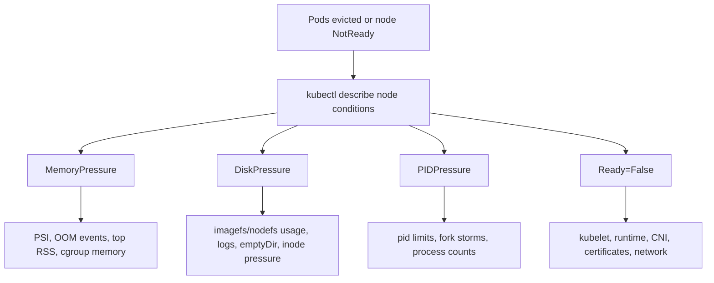

# Kubernetes Troubleshooting

Kubernetes troubleshooting is a graph walk. Start from the user's symptom, then move through the API object, controller, Pod, node, network, storage, and external dependency that must all agree before the workload works.

## First Checks

```bash
kubectl get nodes
kubectl get pods --all-namespaces -o wide
kubectl get events --sort-by=.lastTimestamp
kubectl get deployment,statefulset,daemonset,job,cronjob --all-namespaces
kubectl get svc,endpointslice,ingress,networkpolicy --all-namespaces
kubectl get pv,pvc,storageclass --all-namespaces
```

Read these from most specific to most general:

1. The object that users touched or traffic targets.
2. Its controller status and conditions.
3. The Pod status, events, logs, probes, and mounted config.
4. The node where the Pod landed.
5. Service, EndpointSlice, DNS, NetworkPolicy, ingress, and external dependency paths.

## Common Paths

| Symptom | First Checks | Common Causes |
| --- | --- | --- |
| Pod stuck `Pending` | `kubectl describe pod`, events, scheduler messages, PVC status. | Node capacity, taints, tolerations, node affinity, unbound PVC, missing RuntimeClass. |
| `CrashLoopBackOff` | Previous logs, current logs, exit code, command, env, mounts, probes. | Bad config, missing secret, wrong command, dependency unavailable, liveness probe killing startup. |
| `ImagePullBackOff` | Pod events, image name, tag, registry auth, pull secret. | Typo, missing tag, private registry credentials, registry TLS/DNS/network issue. |
| Service unreachable | Service selector, EndpointSlice, port names, DNS, NetworkPolicy, Pod readiness. | Selector mismatch, Pods not ready, wrong targetPort, DNS search issue, policy deny. |
| Rollout stuck | Deployment conditions, ReplicaSet status, Pod events. | New Pods unavailable, probe failure, quota, image pull, PDB or scheduling pressure. |
| PVC pending | PVC events, StorageClass, CSI controller logs, volume attachments. | Missing default StorageClass, unsupported access mode, capacity, zone mismatch, CSI failure. |
| Node `NotReady` | Node conditions, kubelet logs, container runtime logs, disk and memory pressure. | Kubelet stopped, CNI broken, runtime down, disk pressure, certificate/bootstrap issue. |

## Pod Failure Workflow

Use the Pod as the smallest debuggable unit. A controller may create the Pod, but the Pod status tells you what Kubernetes actually tried to run.

```bash
kubectl -n <namespace> get pod <pod> -o wide
kubectl -n <namespace> describe pod <pod>
kubectl -n <namespace> logs <pod> --all-containers
kubectl -n <namespace> logs <pod> --all-containers --previous
kubectl -n <namespace> get pod <pod> -o jsonpath='{.status.containerStatuses[*]}'
```

Interpret the results:

- `Waiting` with image pull reasons means the container never started.
- `Terminated` with a nonzero exit code means the process started and exited.
- `Running` but not `Ready` usually points at readiness probes, app startup, or dependency checks.
- Repeated liveness probe failures can hide the real startup error by restarting the container before it can finish initialization.

## Service and DNS Workflow

Services do not send traffic to arbitrary Pods. They select ready endpoints. Debug the object chain in order:

```bash
kubectl -n <namespace> get svc <service> -o yaml
kubectl -n <namespace> get endpointslice -l kubernetes.io/service-name=<service> -o wide
kubectl -n <namespace> get pods -l '<selector>' -o wide --show-labels
kubectl -n <namespace> exec -it <debug-pod> -- nslookup <service>.<namespace>.svc.cluster.local
kubectl -n <namespace> exec -it <debug-pod> -- nc -vz <service> <port>
```

If DNS resolves but connections fail, move to Service ports, EndpointSlices, kube-proxy or CNI dataplane, NetworkPolicy, and application listen ports. If DNS does not resolve, inspect CoreDNS, the Pod's `/etc/resolv.conf`, namespace, search path, and service name.

## Rollout and Controller Workflow

Controllers reconcile desired state into Pods. When a rollout is stuck, compare desired, current, available, and observed generation.

```bash
kubectl -n <namespace> rollout status deployment/<deployment>
kubectl -n <namespace> describe deployment <deployment>
kubectl -n <namespace> get rs -l app=<app> -o wide
kubectl -n <namespace> get events --sort-by=.lastTimestamp
kubectl -n <namespace> rollout history deployment/<deployment>
```

A Deployment that cannot progress usually has a Pod-level reason. Do not tune rollout settings until you know why the new ReplicaSet cannot produce ready Pods.

## Node and Cluster Workflow

When many unrelated Pods fail on one node, inspect node health before debugging each workload.

```bash
kubectl describe node <node>
kubectl get node <node> -o jsonpath='{.status.conditions}'
kubectl top node <node>
kubectl get pods --all-namespaces --field-selector spec.nodeName=<node> -o wide
```

Node conditions such as `MemoryPressure`, `DiskPressure`, `PIDPressure`, and `Ready=False` explain scheduling and eviction behavior. On the node, kubelet, container runtime, CNI plugin, disk, and certificate state are the usual next checks.

Node pressure decision tree:



Treat node pressure as a scheduling and eviction problem first. Deleting Pods without fixing the pressure source usually recreates the same failure on the same or another node.

## Image Pull Failure Workflow

Image pulls cross registry naming, credentials, DNS, TLS, network policy, runtime, and node disk state.

```bash
kubectl -n <namespace> describe pod <pod>
kubectl -n <namespace> get secret <pull-secret> -o yaml
kubectl get node <node> -o wide
kubectl debug node/<node> -it --image=nicolaka/netshoot
nslookup <registry-host>
curl -vk https://<registry-host>/v2/
```

| Event or Symptom | Likely Cause |
| --- | --- |
| `manifest unknown` | Wrong image name or tag. |
| `unauthorized` | Missing or wrong imagePullSecret, registry scope, or token expiry. |
| TLS x509 error | Registry certificate chain, MITM proxy, or node trust store. |
| DNS timeout | Node resolver, firewall, proxy, or private registry DNS. |
| Pull starts then stalls | Registry throttling, NAT/proxy, node disk pressure, or MTU. |

## Evidence Capture

For incidents, capture state before deleting Pods or restarting components:

```bash
ns=<namespace>
app=<app-label>
mkdir -p k8s-capture
kubectl -n "$ns" get deploy,rs,pod,svc,endpointslice,networkpolicy,pvc -l app="$app" -o yaml > k8s-capture/objects.yaml
kubectl -n "$ns" get events --sort-by=.lastTimestamp > k8s-capture/events.txt
kubectl -n "$ns" describe pod -l app="$app" > k8s-capture/pods.describe.txt
kubectl -n "$ns" logs -l app="$app" --all-containers --prefix --tail=300 > k8s-capture/logs.txt
```

## Study Cards

<div class="study-card-grid">
  
  
  
  
</div>

## References

- [Kubernetes troubleshooting applications](https://kubernetes.io/docs/tasks/debug/debug-application/)
- [Kubernetes debugging services](https://kubernetes.io/docs/tasks/debug/debug-application/debug-service/)
- [Kubernetes debugging running Pods](https://kubernetes.io/docs/tasks/debug/debug-application/debug-running-pod/)
