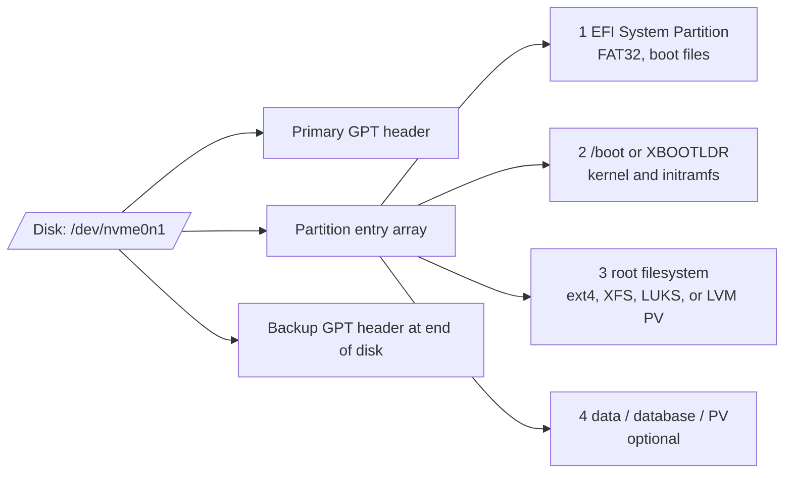

# Linux Block Devices and Partitioning

Storage operations start below the filesystem. Operators need to identify the right device, understand whether it is a disk, partition, virtual mapping, multipath device, LVM logical volume, or encrypted device, and avoid relying on names that can change across boots.

## First Checks

```bash
lsblk -o NAME,MAJ:MIN,SIZE,TYPE,FSTYPE,MOUNTPOINTS
blkid
udevadm info --query=all --name=/dev/sda | head
parted -l
cat /proc/partitions
```

## Block Device Model

Linux exposes block devices under `/dev`. A device can represent physical media, a partition, a device-mapper mapping, a loop device, an md RAID array, an LVM logical volume, a multipath device, or a cloud disk.

Common naming patterns:

| Pattern | Meaning |
| --- | --- |
| `/dev/sdX` | SCSI/SATA/USB-style disk exposed through the SCSI layer. |
| `/dev/nvme0n1` | NVMe namespace. Partitions are named like `/dev/nvme0n1p1`. |
| `/dev/vdX` | Virtio block device in many virtualized environments. |
| `/dev/dm-*` | Device mapper target, often LVM, dm-crypt, or multipath. |
| `/dev/md*` | Linux software RAID device. |
| `/dev/loop*` | Loopback block device backed by a file. |

Device names such as `/dev/sdb` are not stable identity. A reboot, controller change, or cloud attach order change can rename devices.

Device state is visible in more than one place:

| Path | Meaning |
| --- | --- |
| `/sys/block` | Kernel block device topology and attributes. |
| `/sys/class/block` | Class view of block devices, including partitions and device-mapper nodes. |
| `/dev` | Device nodes created by devtmpfs and adjusted by udev. |
| `/dev/disk/by-*` | udev-created stable symlinks based on ID, path, UUID, label, or partition UUID. |

Major and minor numbers connect `/dev` nodes to kernel devices. `lsblk -o NAME,MAJ:MIN,...` is useful because the same storage object can have multiple symlinks but only one major/minor identity at a time.

## Stable Identity

Prefer stable names when configuring mounts, storage layers, and automation:

- filesystem UUIDs,
- filesystem labels,
- partition UUIDs,
- `/dev/disk/by-id/` paths,
- multipath WWIDs,
- LVM VG/LV names.

Use `lsblk -f`, `blkid`, and `/dev/disk/by-*` to map friendly names to stable identity before changing anything.

Be precise about which stable identifier you use. Filesystem UUIDs identify a filesystem, PARTUUID identifies a partition table entry, by-id often identifies physical or virtual media, and LVM logical volume paths identify a mapping. Cloning disks or VM images can duplicate UUIDs, so check for collisions after restores and golden-image cloning.

## Partition Tables

GPT is the common modern partition table. MBR still appears on older systems and small disks. A partition table divides a disk into partitions, but higher layers may use the whole disk directly, especially in LVM, cloud, database, or Ceph environments.

Typical GPT layout:



GPT gives each partition a type GUID and a unique PARTUUID. Filesystems inside partitions have their own UUIDs. That distinction matters: bootloaders and initramfs may use PARTUUID to find a partition, while `/etc/fstab` often uses filesystem UUID or label to mount a filesystem.

Partition safety rules:

- confirm the target disk by size, serial, path, and current holders,
- check whether a device has mounted filesystems or children,
- avoid editing partitions under active filesystems unless the workflow supports it,
- let the kernel re-read partition tables before using new partitions,
- document destructive commands before running them.

## Holders and Slaves

The storage stack is layered. A partition might be a physical volume, which backs a volume group, which backs a logical volume, which holds a filesystem. `lsblk` and `dmsetup ls --tree` show parent-child relationships. Do not operate on a lower layer without understanding the upper layers that depend on it.

## Troubleshooting Flow

1. Identify the device with `lsblk`, size, model, serial, and path.
2. Check whether it has children, holders, mounts, or LVM/device-mapper mappings.
3. Check stable IDs under `/dev/disk/by-id` and `blkid`.
4. Check kernel logs for discovery, reset, or I/O errors.
5. Confirm partition table type and partitions.
6. Only then create filesystems, PVs, RAID members, or encryption layers.

## Study Cards

<div class="study-card-grid">
  
  
  
  
</div>

## References

- [lsblk(8)](https://man7.org/linux/man-pages/man8/lsblk.8.html)
- [blkid(8)](https://man7.org/linux/man-pages/man8/blkid.8.html)
- [parted manual](https://www.gnu.org/software/parted/manual/parted.html)
- [Device Mapper kernel documentation](https://www.kernel.org/doc/html/latest/admin-guide/device-mapper/index.html)
