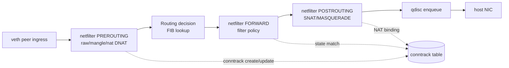

# Linux Network Stack

Linux networking is both OS internals and production infrastructure. Containers, Kubernetes, firewalls, service meshes, and load balancers all depend on sockets, namespaces, routes, neighbor tables, netfilter, conntrack, qdisc, and NIC queues.

## Command Examples

```bash
ip addr
ip route
ip rule
ip neigh
ss -tulpen
nft list ruleset
cat /proc/net/softnet_stat
ip link show type bridge
bridge link
```

Example output and meaning:

| Command | Example output | What it does |
| --- | --- | --- |
| `ip addr` | `Interfaces, addresses, link state, counters, drops, and errors.` | Shows local interface state before blaming remote systems. |
| `ip route` | `Destination, gateway, interface, and selected source address.` | Shows how the host will route the target flow. |
| `ip rule` | `0: from all lookup local; 100: from 10.0.0.0/24 lookup 100.` | Shows policy routing rules that can override the main route table. |

## Sockets

Sockets are kernel endpoints for network communication. Listening sockets have queues. Established TCP sockets have send and receive buffers, congestion state, retransmission timers, and sequence windows. UDP sockets receive datagrams and leave reliability to the application.

## Namespaces

Network namespaces give isolated network stacks: interfaces, routes, firewall rules, sockets, and neighbor tables. Containers usually run inside their own netns connected to the host through veth pairs, bridges, overlays, or CNI plugins.

## Netfilter and conntrack

Netfilter hooks let nftables or iptables inspect and transform packets. Conntrack records flow state for stateful firewalls and NAT. A full conntrack table can make new connections fail while established traffic continues.

## Container Bridge Networking

Most Linux container networking is normal Linux networking assembled by a runtime. A container gets a network namespace with its own interfaces, routes, sockets, and neighbor table. The host gets the other end of a veth pair and attaches it to a Linux bridge such as `docker0` or a user-defined `br-...` device.

The common egress path is:

```text
container eth0 -> veth peer -> Linux bridge -> host route -> SNAT/MASQUERADE -> host NIC
```

The common published-port path is:

```text
host_ip:published_port -> DNAT -> container_ip:container_port -> bridge -> veth -> container
```

The bridge acts as a software switch and learns MAC addresses. NAT is separate and is handled by netfilter rules plus conntrack state. When debugging, inspect both layers: bridge membership and routes for forwarding, then nftables or iptables rules for DNAT, SNAT, MASQUERADE, and filtering.

Netfilter and routing lookup path for a forwarded container packet:



For packets delivered to the host itself, routing selects `INPUT` instead of `FORWARD`; for packets generated by the host, the path starts at `OUTPUT` and then `POSTROUTING`. This is why a host-level curl can work while container forwarding fails: different hooks, routes, source addresses, and conntrack entries are involved.

Useful checks:

```bash
docker network inspect bridge
ip link show type bridge
bridge link
nsenter -t <pid> -n -- ip addr
nsenter -t <pid> -n -- ip route
nft list ruleset
iptables -t nat -S
conntrack -L 2>/dev/null | head
```

For deeper container runtime context, see [Containerization, OCI, and VMs]({{ "/docs/linux/containerization-oci-vms/" | relative_url }}).

## qdisc, Softirq, and NIC Queues

Packets may queue before transmission or after receive. Under load, drops can happen in NIC rings, qdisc, socket buffers, or softnet backlog. High softirq CPU often points at network packet processing rather than application code.

## Debugging Flow

1. Check the namespace where the process runs.
2. Confirm listening sockets and bound addresses.
3. Confirm route and source address selection.
4. Confirm neighbor resolution.
5. Check firewall and conntrack state.
6. Watch drops, errors, retransmits, and softirq pressure.
7. Capture packets at process namespace, host, and peer when possible.

## Study Cards

<div class="study-card-grid">
  
  
  
  
</div>

## References

- [Linux kernel networking documentation](https://docs.kernel.org/networking/index.html)
- [network_namespaces(7)](https://man7.org/linux/man-pages/man7/network_namespaces.7.html)
- [socket(7)](https://man7.org/linux/man-pages/man7/socket.7.html)
- [bridge(8)](https://man7.org/linux/man-pages/man8/bridge.8.html)
- [nftables documentation](https://wiki.nftables.org/wiki-nftables/index.php/Main_Page)
