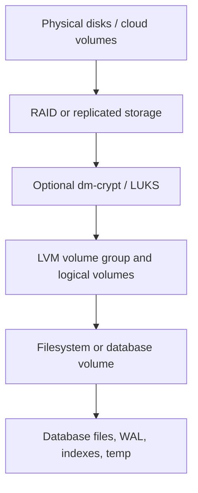

# Storage Drives, RAID, and Database Performance

Storage design is a set of tradeoffs between latency, throughput, durability, rebuild risk, capacity, and operational recovery. A fast disk layout that loses the only copy of data is not resilient. A redundant disk layout that hides latency until a database stalls is not healthy. Databases make these tradeoffs visible because they issue sync writes, random reads, scans, compactions, checkpoints, and recovery reads under real user pressure.

## Command Examples

```bash
lsblk -o NAME,TYPE,MODEL,SERIAL,ROTA,SIZE,FSTYPE,MOUNTPOINTS
cat /proc/mdstat
mdadm --detail /dev/md0
iostat -xz 1
smartctl -a /dev/sda
nvme smart-log /dev/nvme0
```

Example output and meaning:

| Command | Example output | What it does |
| --- | --- | --- |
| `lsblk -o NAME,TYPE,MODEL,SERIAL,ROTA,SIZE,FSTYPE,MOUNTPOINTS` | `Device names, filesystems, mountpoints, latency, errors, or health fields.` | Connects storage symptoms to device and filesystem evidence. |
| `cat /proc/mdstat` | `md0 : active raid1 ... [UU] or recovery progress.` | Shows RAID health and rebuild state. |
| `mdadm --detail /dev/md0` | `Array level, state, active devices, failed devices, and UUID.` | Shows md RAID identity and degradation. |

## Drive Types

| Drive | Strengths | Weaknesses | Common Uses |
| --- | --- | --- | --- |
| HDD | Low cost per TB, good sequential throughput, large capacity. | High random latency, mechanical failure modes, slow rebuilds. | Archives, backups, cold tiers, sequential workloads. |
| SATA SSD | Much lower random latency than HDD, no seek time, good boot/data disks. | Limited write endurance, controller/firmware variance, SATA ceiling. | General servers, read-heavy databases, mixed workloads. |
| NVMe SSD | High IOPS, low latency, deep queues, strong parallelism. | Cost, thermal throttling, endurance planning, fast failure blast radius if unreplicated. | Databases, search nodes, caches, write-heavy services. |
| Network block storage | Managed durability and snapshots, flexible resizing. | Variable latency, noisy neighbors, attach limits, hidden failure domains. | Cloud databases, Kubernetes PVCs, managed platforms. |

`lsblk` exposes `ROTA`: `1` usually means rotational media, while `0` usually means SSD or virtualized storage. Treat it as a clue, not a full performance model. Cloud volumes, SAN LUNs, and virtual disks may hide the real media.

## RAID Vocabulary

| Term | Meaning |
| --- | --- |
| Striping | Splitting blocks across disks for aggregate throughput and capacity. Sometimes mistakenly written as "stripping." |
| Mirroring | Writing copies of the same data to multiple disks. |
| Parity | Storing calculated redundancy that can reconstruct missing data after a drive failure. |
| Chunk size | The amount of sequential data written to one member before moving to the next stripe member. |
| Degraded array | Array still running after a member failure, usually with reduced redundancy and performance. |
| Rebuild | Reconstructing data onto a replacement disk. Rebuilds create heavy reads and writes. |
| Hot spare | Unused drive that can automatically replace a failed member. |
| Stripe width | Full data span across the participating data disks in a stripe. It matters for large sequential writes. |
| Write penalty | Extra reads and writes required to complete a logical write, especially on parity RAID. |
| Write-intent bitmap | Metadata that records changed regions so crash recovery or resync can avoid scanning the whole array. |

RAID is not backup. RAID can survive some device failures. It does not protect against deletion, corruption, ransomware, bad migrations, wrong `rm`, filesystem bugs, or application-level logical damage.

## RAID 0 Through 10

| Level | Minimum Drives | Capacity Shape | Failure Tolerance | Performance Shape | Good Fit |
| --- | ---: | --- | --- | --- | --- |
| RAID 0 | 2 | Sum of members. | None. Any member loss loses the array. | High read/write throughput through striping. | Scratch, cache, rebuildable data, replicated search shards. |
| RAID 1 | 2 | Size of one member. | Usually one or more mirrors can fail if one good copy remains. | Reads can improve; writes go to every mirror. | Boot disks, simple durable volumes, WAL on small systems. |
| RAID 5 | 3 | Sum minus one member. | One member. | Reads good; small random writes pay parity penalty. | Capacity-focused mostly-read workloads, not write-heavy databases. |
| RAID 6 | 4 | Sum minus two members. | Two members. | More parity overhead than RAID 5, safer during rebuilds. | Large HDD arrays where rebuild risk matters. |
| RAID 10 | 4 | Half of raw capacity. | One disk per mirror pair, sometimes more if failures hit different pairs. | Good random reads and writes; faster rebuilds than parity RAID. | General database storage, VM datastores, mixed read/write workloads. |

RAID 10 is usually the conservative default for write-heavy local storage when you need both redundancy and performance. RAID 0 is a performance tool, not a resilience tool. RAID 5 and RAID 6 can be reasonable for capacity, but parity updates and long rebuilds are poor fits for latency-sensitive write workloads.

RAID level details:

- RAID 0 stripes data across all members. Large reads and writes can use all disks, but the array's failure probability rises with every added member because any single disk loss loses the whole volume.
- RAID 1 mirrors data. Reads can be balanced across copies, but each write must reach every mirror image that participates in durability. Rebuild reads from a surviving copy and writes the replacement.
- RAID 5 stripes data plus one parity block per stripe. A small overwrite often becomes read old data, read old parity, write new data, write new parity. That read-modify-write path is why small random writes hurt.
- RAID 6 is like RAID 5 with two parity calculations. It tolerates two failed members, but small writes have more parity work and rebuilds still stress every surviving disk.
- RAID 10 stripes across mirrors. It gives mirror-style rebuild behavior and stripe-style aggregate throughput. It can survive multiple disk failures only when at least one member in each mirror set survives.
- RAID 0+1 is a mirror of striped sets. RAID 10 is a stripe of mirrors. RAID 10 is usually preferred because one failed disk only degrades one mirror pair; RAID 0+1 can lose a whole stripe side after one member fails.

## RAID Performance Patterns

RAID performance is workload-shaped. A layout that looks fast in sequential benchmarks may be bad for sync commits, compactions, or degraded rebuilds.

| Workload Shape | RAID 0 | RAID 1 | RAID 5 | RAID 6 | RAID 10 |
| --- | --- | --- | --- | --- | --- |
| Sequential reads | Scales with members. | Can improve through read balancing. | Usually good. | Usually good. | Scales across mirror pairs. |
| Sequential writes | Scales with members. | Similar to one member per mirror set. | Good when full-stripe writes avoid read-modify-write. | Good when full-stripe writes avoid read-modify-write. | Scales across mirror pairs. |
| Small random reads | Scales well. | Can improve if reads are balanced. | Usually good until degraded. | Usually good until degraded. | Strong. |
| Small random writes | Strong but unsafe. | Similar to one disk per mirror set. | Poorer because of parity write penalty. | Poorer than RAID 5 because of dual parity. | Strong. |
| Sync write latency | Fastest member path, no redundancy. | Waits for mirror durability. | Sensitive to parity and cache safety. | More parity-sensitive. | Usually strong with protected cache. |
| Degraded mode | Lost. | Usually serviceable. | Reads reconstruct missing data from parity. | Reads may reconstruct missing data from parity. | Only affected mirror pairs slow down. |

Important knobs and caveats:

- Small random parity writes are expensive because the array must preserve parity consistency. Full-stripe writes are better because parity can be calculated from the new data without reading old data first.
- Chunk size and stripe width should match the workload only after measurement. Too small can amplify metadata and seek overhead; too large can underuse disks for medium I/O.
- Write-back cache is useful only when it is power-loss protected. A cache that acknowledges durable writes before they are safe can break PostgreSQL and filesystem assumptions.
- Rebuilds compete with application I/O. Throttling rebuild too hard extends the risk window; running it unbounded can stall the database.
- SSD and NVMe arrays still need endurance planning. RAID does not remove write amplification, garbage collection, thermal throttling, or firmware failure risks.
- Discard/TRIM must pass through every layer that should receive it: filesystem, LVM, dm-crypt, md RAID, multipath, hypervisor, and physical device.

## Disk Failure Recovery

The first goal during a disk failure is evidence and containment, not heroic repair.

1. Stop unnecessary writes and reduce rebuild pressure if the service allows it.
2. Identify whether the failure is physical media, controller, cable/path, filesystem, RAID member, cloud volume, or application corruption.
3. Capture evidence before changing state: `lsblk`, `/proc/mdstat`, `mdadm --detail`, `dmesg`, `journalctl -k`, SMART/NVMe health, and application errors.
4. Verify backups, snapshots, replicas, and restore points before replacing or rebuilding.
5. If the array is degraded but serving, decide whether to fail over the application before rebuilding.
6. Replace the failed member by stable identity: serial, by-id path, enclosure slot, cloud disk ID, or md member UUID.
7. Start the rebuild and monitor read errors, speed, remaining time, temperature, and latency.
8. After rebuild, run filesystem checks only when the lower block layer is stable and the filesystem requires it.
9. Validate application-level consistency: PostgreSQL recovery status, Elasticsearch cluster health, checksums, sample reads, and backups.

Do not run `fsck`, `xfs_repair`, or database repair tools on top of a device that is still returning I/O errors. Lower-layer instability can turn recoverable metadata damage into unrecoverable damage.

Common Linux md recovery checks:

```bash
cat /proc/mdstat
mdadm --detail /dev/md0
mdadm --examine /dev/sdX1
journalctl -k | grep -Ei 'md|raid|I/O error|medium error|reset|nvme|scsi'
```

Typical replacement shape:

```bash
mdadm /dev/md0 --fail /dev/sdX1
mdadm /dev/md0 --remove /dev/sdX1
mdadm /dev/md0 --add /dev/sdY1
watch -n 5 cat /proc/mdstat
```

Use those commands only after mapping the correct device. Removing the wrong member from a degraded array can destroy the last good redundancy.

## RAID Failure Modes

Disk failures are only one class of RAID incident.

| Failure | What It Looks Like | Risk |
| --- | --- | --- |
| Clean member failure | SMART/NVMe media errors, failed md member, degraded array. | Reduced redundancy and slower service until rebuild completes. |
| Unreadable sector during rebuild | Rebuild stalls or logs medium errors from surviving disks. | Parity RAID may be unable to reconstruct a stripe. |
| Controller, cable, or backplane fault | Multiple drives reset or disappear together. | Replacing disks can misdiagnose the real failure and create new damage. |
| Write hole or unsafe cache | Power loss leaves parity or metadata inconsistent. | Filesystem or database corruption even though disks later appear present. |
| Wrong-disk removal | Healthy member removed while failed member remains. | Can turn a degraded RAID 5 into data loss or break a RAID 10 mirror pair. |
| Metadata damage | md superblock, LVM metadata, or controller metadata cannot assemble cleanly. | Forcing assembly with stale members can overwrite the newest data. |
| Silent corruption | Reads return bad data without a hard disk failure. | RAID without end-to-end checksums may mirror or reconstruct incorrect data. |

Recovery by level:

- RAID 0: there is no degraded recovery. Restore from backup, rebuild from replicas, or recreate the scratch/cache volume.
- RAID 1: identify the failed member by serial or by-id path, fail/remove it if needed, add the replacement, and watch mirror resync.
- RAID 5: verify backups before rebuild, replace one failed member, monitor surviving disks for read errors, and consider application failover during rebuild.
- RAID 6: tolerate up to two member failures, but still avoid casual rebuilds. Replace one failed device at a time unless the platform explicitly supports a planned multi-device operation.
- RAID 10: map mirror pairs before replacing hardware. The dangerous case is losing both members of the same mirror pair, not simply losing any two disks.

Do not force-assemble an array, run filesystem repair, or start database-level repair until you know which members contain the newest writes. If the array holds production data and metadata is ambiguous, clone members or take block-level images before invasive recovery.

## Rebuild Risk

Rebuilds are dangerous because they read the surviving members heavily while writing the replacement. On large HDD arrays, rebuilds can last hours or days. During that window:

- latency rises for applications,
- a second disk can fail,
- an unreadable sector can block reconstruction,
- controller or cable problems can appear as disk failures,
- parity RAID has less margin than mirrors or RAID 10.

Mitigations:

- keep current backups and test restores,
- prefer RAID 10 or distributed replication for write-heavy critical data,
- replace suspect drives before they fail hard,
- avoid mixing very old and new disks in one failure domain,
- monitor SMART/NVMe wear and media errors,
- schedule rebuilds or failovers with application impact in mind.

## LVM With RAID

LVM and RAID can be layered in several valid ways. The important part is knowing which layer owns redundancy and which layer owns allocation.



## RAID vs LVM vs Filesystem

| Layer | Owns | Does Not Own | Debug First When |
| --- | --- | --- | --- |
| RAID / replicated block layer | Redundancy, striping, rebuilds, degraded member handling. | Logical volume sizing, filesystem metadata, database consistency. | Members fail, rebuild stalls, latency spikes during recovery, or array is degraded. |
| LVM / device mapper | Allocation, snapshots, thin pools, volume resizing, device mapping. | Disk-level redundancy unless using LVM RAID, filesystem repair, application recovery. | Volumes are missing, thin pool is full, mappings are wrong, or metadata was damaged. |
| Filesystem | Inodes, directories, free space, journaling, mount options. | Lower block health, RAID rebuilds, database transaction semantics. | Mount fails, files vanish, inode/free-space pressure appears, or journal recovery is needed. |
| Database storage layout | WAL, table/index files, temp files, checkpoints, crash recovery. | Block redundancy, filesystem metadata, physical device health. | Queries stall, sync writes slow, checkpoints spike, or recovery cannot read required files. |

Common layouts:

| Layout | Shape | When It Fits |
| --- | --- | --- |
| LVM on md RAID | disks -> md RAID -> LVM PV -> VG -> LV -> filesystem/database | Common Linux server pattern. md owns redundancy; LVM owns flexible volumes. |
| LUKS on md RAID with LVM | disks -> md RAID -> LUKS -> LVM -> filesystems | One encrypted container over the redundant array. Simple to reason about. |
| md RAID under LUKS per disk | disks -> LUKS per disk -> md RAID -> LVM | Useful when each physical disk must be independently encrypted; boot and recovery are more complex. |
| LVM native RAID | disks as PVs -> VG -> RAID LV -> filesystem/database | LVM owns both allocation and RAID segment type. Useful when operations are standardized on LVM tooling. |
| RAID on top of LVM LVs | disks -> LVM LVs -> md RAID -> filesystem | Usually avoid unless there is a very specific reason; it can hide failure domains and make recovery harder. |

Native LVM RAID supports RAID LV types such as `raid0`, `raid1`, `raid5`, `raid6`, and `raid10`. LVM uses device mapper for visible LVs and Linux md logic for RAID placement. It also creates hidden sub-LVs for RAID images and metadata, so use `lvs -a` when troubleshooting.

Useful checks:

```bash
lvs -a -o lv_name,segtype,attr,devices,lv_health_status,sync_percent
lvchange --syncaction check /dev/vg_data/lv_db
lvs -o lv_name,raid_sync_action,raid_mismatch_count
vgcfgbackup vg_data
```

Operational rules:

- If md RAID is below LVM, fix md health before changing LVs or filesystems.
- If LVM native RAID is used, monitor `lv_health_status`, `sync_percent`, `raid_mismatch_count`, and hidden `_rimage_` or `_rmeta_` sub-LVs.
- Keep `vgcfgbackup` output with system backups. LVM metadata recovery can restore mappings, but it does not recover overwritten data.
- Be careful with `pvmove` during degraded RAID or disk errors. It creates extra I/O and can turn weak media into a hard failure.
- Document the stack order in the runbook. During an incident, `lsblk` and `dmsetup ls --tree` should explain the same layer order the design document claims.

## PostgreSQL Storage Mapping

PostgreSQL cares about durable sync writes, random reads, sequential scans, checkpoints, temporary files, and recovery speed.

| PostgreSQL Path | Storage Sensitivity |
| --- | --- |
| `pg_wal` | Latency-sensitive sync writes. Bad write cache behavior can break durability. |
| Data directory | Random reads/writes, checkpoints, vacuum, index reads, heap reads. |
| Temporary files | Sorts, hashes, index builds, large queries; often bursty. |
| Backups and archives | Sequential throughput and capacity. |

Storage-related PostgreSQL settings and choices:

- `random_page_cost` should reflect the relative cost of random reads. SSD/NVMe usually justify a lower value than slow HDDs after measurement.
- `effective_io_concurrency` helps PostgreSQL decide how much concurrent I/O to issue for some access paths, especially bitmap heap scans on storage that handles parallel I/O well.
- `effective_cache_size` should reflect likely OS and database cache available to the planner.
- `checkpoint_timeout`, `max_wal_size`, and checkpoint pacing affect bursts of dirty-page writeback.
- `wal_compression` can trade CPU for lower WAL volume.
- `temp_tablespaces` can move temporary-file I/O to different storage when that is actually faster and safe.

RAID guidance for PostgreSQL:

- RAID 10 on SSD/NVMe is usually a strong local default for mixed OLTP workloads.
- RAID 1 can work well for smaller systems or dedicated WAL volumes.
- RAID 0 is only reasonable when the database has another full durability layer, such as tested replication plus backups, and the node can be lost.
- Parity RAID can be acceptable for mostly-read data, but write-heavy OLTP often exposes the parity write penalty.
- Battery-backed or power-loss-protected write cache matters; lying write caches can violate durability assumptions.

PostgreSQL examples:

- OLTP primary on four NVMe drives: use RAID 10 for the data directory and `pg_wal` unless the platform already provides durable replicated block storage. Tune `random_page_cost` and `effective_io_concurrency` after measuring real latency.
- Dedicated WAL mirror: place `pg_wal` on RAID 1 with power-loss-protected SSDs when WAL latency is the bottleneck and data files live on a separate RAID 10 volume.
- Reporting database on large mostly-read data: RAID 6 can be acceptable when query latency targets tolerate parity overhead and rebuild windows, but benchmark checkpoints, index builds, and refresh jobs.
- Temporary-file volume: RAID 0 or ephemeral NVMe may be reasonable for `temp_tablespaces` only when losing it does not lose committed data and the database can restart cleanly.
- Standby or disposable read replica: RAID 0 can be acceptable if promotion is not required, base backups are current, WAL retention is sufficient, and rebuild time is part of the SLO.

During PostgreSQL storage failure, prefer database-aware recovery over filesystem heroics. Check `pg_wal` durability, crash recovery logs, `pg_isready`, replication status, backup manifests, and point-in-time recovery options before deciding that the block device repair was enough.

## Elasticsearch Storage Mapping

Elasticsearch stores Lucene segment files in shard directories. Its resilience usually comes from shard replicas on other nodes, snapshots, and cluster allocation, not from one local RAID controller alone.

Storage-sensitive Elasticsearch behaviors:

- indexing writes new segments and later merges them,
- merges create heavy sequential reads and writes,
- searches benefit from filesystem cache,
- shard relocation and recovery can saturate disks,
- snapshots protect against node or cluster loss when tested and retained.

Elasticsearch storage guidance:

- Prefer fast local SSD/NVMe for hot data nodes when low latency matters.
- Size shard counts and replicas so a disk or node failure can recover without overwhelming the cluster.
- RAID 0 can improve one node's local throughput but makes that node's data dependent on every member disk; replicas and snapshots must be healthy.
- RAID 1 or RAID 10 reduces single-node disk-loss blast radius but does not replace Elasticsearch replicas.
- Avoid relying on deprecated multiple `path.data` striping behavior; use a filesystem spanning disks through RAID/LVM or add nodes.
- Watch disk watermarks, merge backlog, recovery traffic, and filesystem cache pressure.

For Elasticsearch, the operational question is not "does this disk have RAID?" It is "can the cluster relocate or restore shards fast enough while serving traffic if this node or volume disappears?"

Elasticsearch examples:

- Hot tier with several data nodes: local NVMe RAID 0 can be reasonable if every index has replicas on other nodes, snapshots are current, and losing one node does not violate capacity or recovery targets.
- Hot tier with fewer nodes or expensive recovery: RAID 10 lowers the chance that one disk failure removes an entire node, while still keeping good merge and search performance.
- Warm tier on capacity disks: RAID 6 may fit mostly-read data with slower recovery expectations, but shard relocation and segment merges can still punish parity arrays.
- Single-node lab or edge deployment: RAID 1 or RAID 10 can reduce local disk-failure downtime, but it is still not a substitute for snapshots because there is no replica elsewhere.
- Kubernetes Elasticsearch: prefer clear node-local or PVC failure domains. A replicated Elasticsearch cluster on top of opaque replicated storage can work, but it complicates performance diagnosis and recovery ownership.

During Elasticsearch storage failure, first decide whether to keep serving from replicas, exclude the node, or stop the node. Check cluster health, unassigned shards, allocation explanations, disk watermarks, snapshot status, and corruption logs. Do not rely on local RAID rebuild alone if shard copies or snapshots are already safer recovery paths.

## Choosing a Layout

| Workload | Conservative Choice | Notes |
| --- | --- | --- |
| PostgreSQL OLTP | SSD/NVMe RAID 10, reliable write cache, tested backups. | Keep WAL latency low and watch checkpoint writeback. |
| PostgreSQL analytics | Fast SSD/NVMe or capacity tiers depending on scan volume. | Planner costs and cache assumptions matter. |
| Elasticsearch hot tier | Local SSD/NVMe, replicas across nodes, snapshots. | RAID 0 is a performance tradeoff only if node loss is acceptable. |
| Elasticsearch warm/cold tier | Larger SSDs or HDDs depending on query latency target. | Lifecycle policy and snapshot strategy matter. |
| Backups/archive | HDD, object storage, or capacity volumes. | Optimize restore reliability, not only write cost. |
| Scratch/temp/cache | RAID 0 or ephemeral SSD. | Only for rebuildable data. |

## Study Cards

<div class="study-card-grid">
  
  
  
  
  
  
  
  
  
  
</div>

## References

- [Linux md RAID documentation](https://www.kernel.org/doc/html/latest/admin-guide/md.html)
- [mdadm(8)](https://man7.org/linux/man-pages/man8/mdadm.8.html)
- [lvmraid(7)](https://man7.org/linux/man-pages/man7/lvmraid.7.html)
- [PostgreSQL WAL Reliability](https://www.postgresql.org/docs/current/wal-reliability.html)
- [PostgreSQL Resource Consumption](https://www.postgresql.org/docs/current/runtime-config-resource.html)
- [PostgreSQL Query Planning Configuration](https://www.postgresql.org/docs/current/runtime-config-query.html)
- [PostgreSQL WAL Configuration](https://www.postgresql.org/docs/current/wal-configuration.html)
- [Elasticsearch path settings](https://www.elastic.co/docs/reference/elasticsearch/index-settings/path)
- [Elasticsearch data corruption troubleshooting](https://www.elastic.co/guide/en/elasticsearch/reference/current/corruption-troubleshooting.html)
