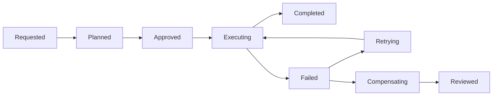

# Advanced Agents

Advanced agents are workflow engines with probabilistic planning. The model may choose the next action, but deterministic systems must own state, permissions, execution, retries, and rollback.

## Agent Patterns

| Pattern | Use | Risk |
| --- | --- | --- |
| ReAct | Interleave reasoning and actions. | Hidden bad intermediate actions. |
| Planner/executor | Separate decomposition from execution. | Planner creates impossible tasks. |
| Reflection | Review output or trajectory before finalizing. | Extra tokens without better correctness. |
| Tool router | Choose among specialized tools. | Wrong tool or missing auth boundary. |
| Multi-agent | Split roles or debate. | Coordination overhead and inconsistent state. |
| Durable execution | Persist state across failures. | Resume bugs and duplicated side effects. |

## State Machine Boundary



## Sandbox and Approval Controls

| Control | Purpose |
| --- | --- |
| Read-only tools | Allow exploration without side effects. |
| Approval gates | Pause before irreversible or expensive actions. |
| Sandboxes | Limit file, network, process, and secret access. |
| Idempotency keys | Prevent duplicate writes on retry. |
| Audit replay | Reconstruct prompts, tools, observations, and state. |

## Practical Lab: Trajectory Review

```text
trajectory_case:
  goal:
  tool_calls:
  observations:
  final_answer:
  invalid_tool_calls:
  unnecessary_steps:
  policy_violations:
  recovery_quality:
```

## Study Cards

<div class="study-card-grid">
  
  
  
</div>

## References

- [ReAct](https://arxiv.org/abs/2210.03629)
- [Toolformer](https://arxiv.org/abs/2302.04761)
- [NIST AI Risk Management Framework](https://www.nist.gov/itl/ai-risk-management-framework)
