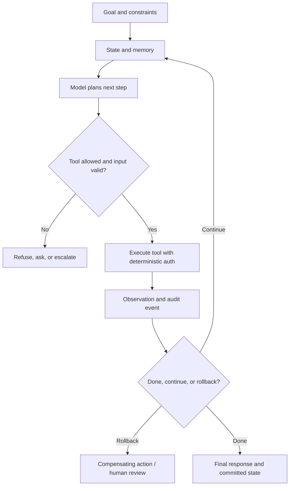

# ML Agents and Tool Use

An agent is a system that uses a model to decide actions over time, often calling tools, reading state, writing state, and observing results. The model call is only one component. The system boundary includes tool schemas, permissions, memory, retry behavior, approvals, and rollback.

## Command Examples

```bash
python - <<'PY'
tool = {"name": "search_docs", "input_schema": {"type": "object"}}
print(tool["name"])
PY
```

Example output and meaning:

| Command | Example output | What it does |
| --- | --- | --- |
| `Python snippet` | `search_docs`. | Confirms the tool name and schema are explicit before the agent is allowed to call it. |

The important check is whether every tool has a narrow schema, clear permission boundary, idempotency story, and observable audit trail.

## Agent Loop



| Step | Question |
| --- | --- |
| Goal | What outcome is the agent pursuing? |
| State | What context and memory are available? |
| Plan | What next action or decomposition is chosen? |
| Tool call | What external effect or observation is requested? |
| Observation | What did the tool return? |
| Reflection | Should the plan continue, change, or stop? |
| Finalization | What result is returned and what state is committed? |

Agents fail when any step is underspecified or trusted too broadly.

## Tool Design

Good tools are narrow and explicit:

- typed inputs,
- clear read/write behavior,
- bounded side effects,
- idempotency keys for writes,
- safe retries,
- audit logs,
- timeouts,
- rate limits,
- permission checks outside the model.

Do not rely on the model to enforce authorization. The tool host must enforce it.

## Memory and State

Agent memory can be useful, but every memory type has risk.

| Memory | Use | Risk |
| --- | --- | --- |
| Short-term context | Current task state. | Context overflow or stale assumptions. |
| Long-term memory | User/project preferences. | Privacy, poisoning, outdated facts. |
| External state | Files, tickets, databases, APIs. | Side effects and consistency errors. |
| Scratchpad/state machine | Multi-step progress tracking. | Hidden failure modes if not observable. |

## Guardrails

Guardrails should be layered:

1. restrict tool availability,
2. validate tool inputs,
3. require human approval for high-impact actions,
4. sandbox execution,
5. log every tool call,
6. run policy checks on outputs,
7. make rollback possible.

## Evaluation

Agent evals must include trajectories, not only final answers.

Measure:

- task success,
- tool selection accuracy,
- invalid tool calls,
- unnecessary actions,
- recovery from tool errors,
- permission violations,
- cost and latency,
- state consistency after failure.

Agent safety test cases:

| Case | What To Verify |
| --- | --- |
| Tool returns transient error | Agent retries within budget and does not duplicate side effects. |
| Tool input asks for forbidden scope | Tool host rejects even if model requested it. |
| Human approval required | Agent pauses before irreversible action. |
| Memory contains stale instruction | Current task policy overrides stale or poisoned memory. |
| Partial completion | State records what happened and supports rollback or resume. |

## Agent Production Gaps

Agents are production workflows with probabilistic planning. Treat every tool call and state transition as an auditable operation.

| Gap | What To Fill | Operational Check |
| --- | --- | --- |
| ML-GAP-061 Tool Contract Design | Define typed schemas, required fields, validation, side effects, and error responses for every tool. | Reject ambiguous free-form tool inputs at the host boundary. |
| ML-GAP-062 Tool Authorization Boundary | Enforce user, tenant, resource, and action authorization outside the model. | Test forbidden actions even when the model requests them confidently. |
| ML-GAP-063 Idempotency Keys | Make write tools safe under retries, duplicate plans, or partial network failures. | Require idempotency keys or operation IDs for external side effects. |
| ML-GAP-064 State Machine Design | Model the workflow as explicit states instead of hidden conversation assumptions. | Persist current state, allowed transitions, and terminal outcomes. |
| ML-GAP-065 Human Approval Gates | Require approval for irreversible, high-cost, privileged, or externally visible actions. | Verify the agent pauses and records approver identity. |
| ML-GAP-066 Sandbox Execution | Run code, shell, browser, and file tools in constrained environments. | Limit filesystem, network, secrets, CPU, memory, and time. |
| ML-GAP-067 Retry and Backoff Policy | Bound retries so transient errors do not become duplicate side effects or runaway cost. | Track retry count, delay, final status, and compensating action. |
| ML-GAP-068 Tool Timeout Budget | Assign per-tool and total task timeouts that match user experience and rollback needs. | Fail closed when tools exceed budget. |
| ML-GAP-069 Parallel Tool Calls | Parallel execution can race on shared state or reorder observations. | Declare which tools are read-only, commutative, or mutually exclusive. |
| ML-GAP-070 Memory Poisoning | Long-term memory can store attacker-provided instructions or stale facts. | Separate preferences from instructions and expire or review sensitive memory. |
| ML-GAP-071 Trajectory Evaluation | Evaluate plans, tool choices, observations, and recovery paths, not only final answers. | Store trajectories and score invalid or unnecessary tool calls. |
| ML-GAP-072 Audit and Replay | Incidents require deterministic reconstruction of prompts, tool calls, state, and outputs. | Keep prompt versions, model IDs, tool inputs, outputs, timestamps, and policy decisions. |

## Study Cards

<div class="study-card-grid">
  
  
  
  
</div>

## References

- [ReAct: Synergizing Reasoning and Acting in Language Models](https://arxiv.org/abs/2210.03629)
- [Toolformer](https://arxiv.org/abs/2302.04761)
- [OpenAI function calling guide](https://platform.openai.com/docs/guides/function-calling)
- [NIST AI Risk Management Framework](https://www.nist.gov/itl/ai-risk-management-framework)
