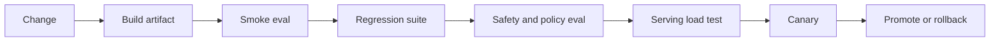

# ML Evaluation and CI/CD

ML CI/CD should test behavior, not only build artifacts. A release can change model weights, prompts, retrieval, tools, generation parameters, runtime kernels, quantization, or safety policy. Each change needs a gate that matches the risk.

Regression gates compare a candidate against the current approved baseline and block release when required behavior gets worse beyond an agreed threshold.

## Command Examples

```bash
git diff --name-only
date -Is
```

Example output and meaning:

| Command | Example output | What it does |
| --- | --- | --- |
| `git diff --name-only` | `prompts/support.yaml and evals/golden.jsonl` | Shows which prompt, eval, or policy artifacts changed in the release. |
| `date -Is` | `2026-06-06T10:24:33-07:00` | Pins command output and logs to an exact incident timestamp. |

Before running evals, identify what changed: data, model, prompt, retrieval, tool, serving runtime, or policy.

## Evaluation Harness

| Component | Purpose |
| --- | --- |
| Case schema | Defines input, expected behavior, metadata, risk, and slices. |
| Runner | Executes the candidate system in a reproducible environment. |
| Judge | Scores deterministic checks, model-graded checks, human review, or hybrid criteria. |
| Baseline | Current production system or last approved release. |
| Report | Shows aggregate, slice, regression, cost, latency, and failure examples. |
| Gate | Blocks release when thresholds or severity rules fail. |

## Release Pipeline



## Gate Matrix

| Change | Required Gates |
| --- | --- |
| Prompt template | Golden set, prompt-injection cases, latency/token budget. |
| Model weights | Target eval, regression eval, safety eval, calibration, serving benchmark. |
| LoRA adapter | Base/adaptor compatibility, merge comparison, task and regression evals. |
| Retrieval index | Recall@k, citation support, ACL tests, freshness checks. |
| Tool schema | Authorization tests, idempotency, trajectory evals, audit replay. |
| vLLM/runtime | Latency, throughput, KV-cache pressure, output compatibility, rollback. |
| Quantization | Quality, calibration, safety, and hardware-specific performance tests. |

## Human Review

Human review is most useful for ambiguous usefulness, policy boundary cases, preference labels, and incident samples. It is weakest when reviewers lack instructions or when aggregate scores hide severe failures.

Review packet:

```text
case_id:
input:
retrieved_context:
candidate_output:
baseline_output:
expected_behavior:
risk_slice:
reviewer_label:
notes:
```

## Study Cards

<div class="study-card-grid">
  
  
  
</div>

## References

- [HELM evaluation benchmark](https://arxiv.org/abs/2211.09110)
- [NIST AI Risk Management Framework](https://www.nist.gov/itl/ai-risk-management-framework)
- [Model Cards for Model Reporting](https://arxiv.org/abs/1810.03993)
