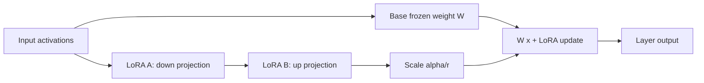

# Fine-Tuning and LoRA

Fine-tuning adapts model weights to a task, domain, style, or policy. LoRA is a parameter-efficient method that trains small low-rank adapter matrices while keeping the base model mostly frozen.

Use fine-tuning when you need consistent behavior changes. Use RAG when the main problem is fresh or inspectable knowledge.

## Command Examples

```bash
python -c "import torch; print(torch.__version__)"
python -c "import transformers, peft; print(transformers.__version__); print(peft.__version__)"
```

Example output and meaning:

| Command | Example output | What it does |
| --- | --- | --- |
| `Python snippet` | `A version, tensor shape, score, retrieved IDs, metric delta, or explicit error.` | Turns the example into a measurable model, data, or pipeline signal. |
| `Python snippet` | `A version, tensor shape, score, retrieved IDs, metric delta, or explicit error.` | Turns the example into a measurable model, data, or pipeline signal. |

These checks only prove library imports. Fine-tuning quality depends on data, objective, hyperparameters, and evaluation.

## Adaptation Choices

| Method | Trains | Good For | Watch Out For |
| --- | --- | --- | --- |
| Full fine-tune | Most or all weights. | Strong adaptation with enough data and compute. | Expensive, higher overfit and regression risk. |
| LoRA | Low-rank adapter matrices. | Efficient domain/task adaptation. | Adapter compatibility, rank choices, merge behavior. |
| Prompt tuning | Learned prompt embeddings. | Narrow tasks with stable input format. | Less flexible than weight adaptation. |
| Instruction tuning | Model behavior on instruction/response examples. | Following domain-specific task formats. | Dataset quality and evaluation matter more than size alone. |

## LoRA Mental Model

LoRA adds trainable low-rank updates to selected weight matrices. Instead of changing a large matrix directly, it learns smaller matrices whose product approximates the update.



Important parameters:

| Parameter | Meaning |
| --- | --- |
| Rank `r` | Size of the low-rank adapter; higher rank has more capacity. |
| Alpha | Scaling factor for adapter contribution. |
| Target modules | Layers where adapters attach, often attention projections. |
| Dropout | Regularization inside adapter training. |
| Merge | Folding adapter updates into base weights for deployment. |

## Data Quality

Fine-tuning data should represent the behavior you want, including edge cases and negative examples. Bad examples teach bad behavior.

Checklist:

- remove duplicates and near-duplicates,
- separate train/validation/test by source or time where possible,
- preserve realistic input distribution,
- include refusal or escalation cases when policy matters,
- version the dataset and preprocessing code,
- avoid leaking eval answers into training data.

## Evaluation and Rollback

Evaluate before and after adaptation:

| Eval | Purpose |
| --- | --- |
| Task accuracy | Did the target behavior improve? |
| Regression set | Did old required behavior remain intact? |
| Safety/policy eval | Did unsafe behavior increase? |
| Calibration | Are scores/confidence still meaningful? |
| Latency/cost | Did adapter or larger context affect service targets? |

Keep base model, adapter, tokenizer, dataset version, and config tied together so rollback is deterministic.

Fine-tune release gate:

| Gate | Pass Condition |
| --- | --- |
| Dataset audit | Training data is deduplicated, licensed/allowed, and split from evals. |
| Target eval | The intended task improves by a meaningful margin. |
| Regression eval | Existing required behaviors do not degrade beyond threshold. |
| Safety eval | Policy, refusal, privacy, and abuse cases remain within limits. |
| Serving eval | Latency, memory, and cost fit production budget. |
| Rollback | Base model, adapter, tokenizer, and config can be restored together. |

## Fine-Tune Failure Modes and Controls

Fine-tuning changes model behavior, so the release process needs controls for data format, adapter design, evaluation contamination, safety, and rollback.

| Gap | What To Fill | Operational Check |
| --- | --- | --- |
| ML-GAP-036 SFT Dataset Format | Store supervised fine-tuning examples in the exact prompt, message, role, and target format the trainer expects. | Render examples through the training template and inspect tokenized samples. |
| ML-GAP-037 Chat Template Drift | Base models and runtimes may use different chat templates, system tokens, or stop tokens. | Version the chat template with the tokenizer and serving runtime. |
| ML-GAP-038 LoRA Target Modules | Adapter placement controls what behavior can change and how much memory is used. | Document target modules such as `q_proj`, `v_proj`, MLP layers, or all linear layers. |
| ML-GAP-039 LoRA Rank Selection | Rank controls adapter capacity; too low underfits and too high can overfit or waste memory. | Sweep rank with target eval, regression eval, and memory cost. |
| ML-GAP-040 QLoRA and Quantized Training | Quantized base weights reduce memory but add dtype, optimizer, and merge constraints. | Test train, save, load, merge, and inference paths on the exact runtime. |
| ML-GAP-041 Packing and Sequence Length | Example packing and truncation change loss weighting and can cut off important answer tokens. | Inspect packed batches and truncation rates by task type. |
| ML-GAP-042 Catastrophic Forgetting | A fine-tune can erase general behavior or previously required domain behavior. | Run a golden regression set across old and new tasks. |
| ML-GAP-043 Overfitting Small Data | Small curated datasets can memorize examples or produce brittle style imitation. | Track train/validation divergence and evaluate held-out sources. |
| ML-GAP-044 Adapter Merge Risk | Merging adapters into base weights can change precision, reversibility, and compatibility. | Compare merged and unmerged outputs before promotion. |
| ML-GAP-045 Eval Contamination | Training data that includes eval prompts or answers makes score gains meaningless. | Deduplicate train data against evals with exact and fuzzy matching. |
| ML-GAP-046 Safety Regression | Task-specific tuning can weaken refusal, privacy, security, or abuse boundaries. | Run safety evals and red-team prompts before release. |
| ML-GAP-047 Rollback Compatibility | Rollback fails if base model, adapter, tokenizer, template, or runtime are not versioned together. | Keep a deployable artifact bundle and test downgrade. |

## Study Cards

<div class="study-card-grid">
  
  
  
  
</div>

## References

- [LoRA: Low-Rank Adaptation of Large Language Models](https://arxiv.org/abs/2106.09685)
- [Hugging Face PEFT documentation](https://huggingface.co/docs/peft/index)
- [PyTorch saving and loading models](https://pytorch.org/tutorials/beginner/saving_loading_models.html)
- [Training language models to follow instructions with human feedback](https://arxiv.org/abs/2203.02155)
