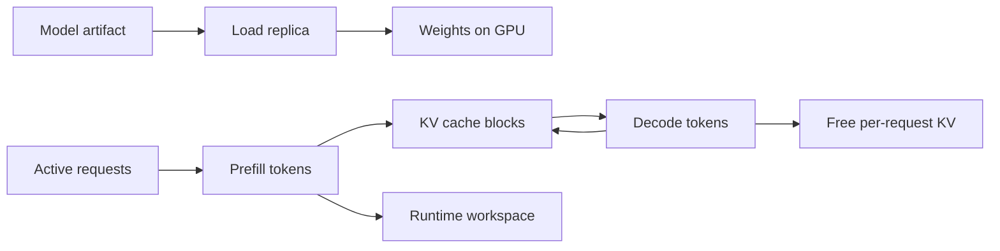

# Model Memory Math

Model memory math turns model size, precision, architecture, context length, and traffic shape into capacity estimates. Exact numbers depend on kernels and runtime layout, but rough math catches impossible deployments before they become GPU incidents.

## Command Examples

```bash
nvidia-smi --query-gpu=name,memory.total,memory.used --format=csv
python - <<'PY'
params_b = 70
bytes_per_param = 2
print(f"weights ~= {params_b * bytes_per_param:.0f} GB decimal")
PY
```

Example output and meaning:

| Command | Example output | What it does |
| --- | --- | --- |
| `nvidia-smi --query-gpu=name,memory.total,memory.used --format=csv` | `GPU utilization, memory use, CUDA visibility, model list, or serving metrics.` | Separates accelerator visibility from model-serving capacity and latency. |
| `Python snippet` | `A version, tensor shape, score, retrieved IDs, metric delta, or explicit error.` | Turns the example into a measurable model, data, or pipeline signal. |
| `params_b = 70` | `Concrete IDs, states, counters, versions, rows, or error strings.` | Turns the example from a command list into evidence for the next debugging step. |

These checks prove only the GPU memory budget and rough weight size. They do not include KV cache, temporary workspace, allocator overhead, fragmentation, replicas, or host RAM needed during load.

## Memory Classes



| Memory | When It Exists | Capacity Driver |
| --- | --- | --- |
| Weights | While a replica is loaded. | Parameter count and bytes per parameter. |
| KV cache | During active autoregressive requests. | Layers, tokens, KV heads, head dim, dtype, active sequences. |
| Activations | During forward passes. | Batch shape, sequence length, kernels, runtime. |
| Workspace | Runtime-specific temporary buffers. | Engine, kernels, parallelism, compilation. |
| Optimizer state | Training or optimizer-backed fine-tuning. | Optimizer type and parameter count. |
| Host staging memory | During load and sharding. | Shard format, loader, CPU RAM, mmap behavior. |

## Weights vs KV Cache vs Activations

| Question | Weights | KV Cache | Activations |
| --- | --- | --- | --- |
| Shared across requests? | Yes, one loaded replica shares weights. | No, cache is per active sequence, except explicit safe prefix reuse. | Mostly temporary per forward pass. |
| Biggest input variable | Parameter count and precision. | Context length, output length, KV heads, dtype, and concurrency. | Batch shape, sequence length, kernels, and model architecture. |
| Serving failure signal | Model will not load, or replica count is too high. | Requests queue, preempt, reject, or OOM under long contexts. | OOM or slow prefill from large batch/prompt shapes. |
| Quantization effect | Weight quantization can materially shrink base memory. | Only KV-specific quantization shrinks cache. | Activation quantization depends on kernels and hardware. |
| Capacity planning mistake | Assuming the model fits because weights fit. | Ignoring p95/p99 prompt and output tokens. | Forgetting workspace and temporary buffers during warmup. |

## Weight Memory

```text
weight_memory ~= parameters * bytes_per_parameter
```

| Model Size | FP16/BF16 | FP8/INT8 | INT4 |
| --- | --- | --- | --- |
| 7B | ~14 GB | ~7 GB | ~3.5 GB |
| 13B | ~26 GB | ~13 GB | ~6.5 GB |
| 34B | ~68 GB | ~34 GB | ~17 GB |
| 70B | ~140 GB | ~70 GB | ~35 GB |

Leave headroom. Runtime metadata, embeddings, temporary buffers, CUDA context, fragmentation, and KV cache all consume additional memory.

## KV-Cache Examples

```text
kv_cache ~= layers * tokens * 2(K,V) * kv_heads * head_dim * bytes_per_value * active_sequences
```

| Architecture Shape | Why It Changes Memory |
| --- | --- |
| Multi-head attention | KV heads usually match query heads; highest KV memory. |
| Grouped-query attention | Fewer KV heads than query heads; lower KV memory. |
| Multi-query attention | One or very few KV heads; lowest KV memory. |
| Sliding-window attention | Keeps only a recent attention window for some layers. |
| MoE | Expert layers change compute and weights, but attention KV still scales with active tokens. |

Example for 32 layers, 8 KV heads, head dim 128, BF16, 8K tokens:

```text
32 * 8192 * 2 * 8 * 128 * 2 ~= 1 GiB per active long sequence
```

The same context with 32 KV heads is roughly 4 GiB. This is why GQA/MQA can materially improve serving capacity.

## Capacity Worksheet

| Input | Value |
| --- | --- |
| GPU memory per device |  |
| Number of GPUs |  |
| Model parameters |  |
| Weight precision |  |
| Tensor parallel size |  |
| Runtime headroom target | 10-20 percent minimum |
| Layers |  |
| KV heads |  |
| Head dim |  |
| KV dtype |  |
| p95 prompt tokens |  |
| p95 output tokens |  |
| Target concurrent sequences |  |

Compute in this order:

1. Estimate weight memory per replica.
2. Divide or shard weights according to tensor/pipeline parallelism.
3. Reserve runtime workspace and allocator headroom.
4. Estimate KV cache per active sequence by request class.
5. Multiply by concurrency and burst target.
6. Check whether long-context requests need a separate serving pool.

## Loading and Cold Start

| Issue | Practical Meaning |
| --- | --- |
| Shard loading | All shard files and index metadata must match the model revision. |
| Host RAM spike | Some loaders stage weights in CPU memory before GPU transfer. |
| mmap behavior | `safetensors` can reduce unsafe loading and improve load behavior, but the runtime still needs enough memory. |
| Warmup | First requests may compile kernels, allocate cache blocks, or populate CUDA context. |
| Tensor parallel load | Every rank needs the right shard, NCCL health, and matching config. |

## Common Mistakes

| Mistake | Better Check |
| --- | --- |
| Counting only weight memory. | Include KV cache, workspace, fragmentation, and CUDA context. |
| Using max context for all traffic. | Capacity plan by request class and p95/p99 token lengths. |
| Assuming INT4 weights mean small KV cache. | KV cache may still be BF16/FP16 unless separately quantized. |
| Ignoring host RAM. | Test cold start from empty cache and record peak host memory. |
| Using average tokens. | Plan around p95/p99 prompt and output tokens. |

## Study Cards

<div class="study-card-grid">
  
  
  
</div>

## References

- [Hugging Face Transformers KV cache documentation](https://huggingface.co/docs/transformers/main/kv_cache)
- [vLLM documentation](https://docs.vllm.ai/en/stable/)
- [Efficient Memory Management for Large Language Model Serving with PagedAttention](https://arxiv.org/abs/2309.06180)
