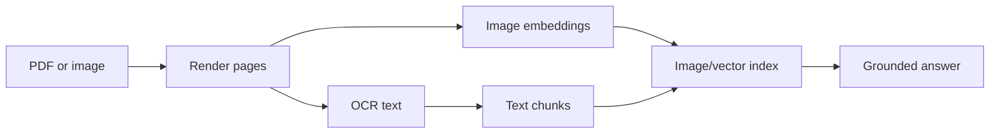

# Multimodal ML

Multimodal systems combine text, images, audio, video, documents, or structured data. They add preprocessing, alignment, storage, privacy, and evaluation problems beyond text-only LLMs.

## Modality Map

| Modality | Common Tasks | Operational Risk |
| --- | --- | --- |
| Vision | Classification, detection, segmentation, OCR. | Image quality, resolution, privacy, bias. |
| Audio | Speech recognition, diarization, classification. | Noise, accents, latency, consent. |
| Text-to-speech | Voice generation. | Misuse, consent, watermarking. |
| Vision-language | Captioning, document QA, UI understanding. | Hallucinated visual details. |
| Video | Temporal understanding and generation. | Cost, storage, frame sampling. |

## Multimodal RAG

Multimodal RAG retrieves evidence from text, images, tables, diagrams, and OCR. The system needs source metadata, page/region coordinates, image hashes, and citation rendering that users can inspect.

## OCR Pipeline



## Practical Lab: Document QA Evidence

```text
question: "What is the invoice due date?"
evidence:
  page: 2
  bounding_box: [120, 310, 260, 340]
  extracted_text: "Due: 2026-06-15"
answer_policy:
  cite page and field
  abstain if OCR confidence is low
```

## Study Cards

<div class="study-card-grid">
  
  
  
</div>

## References

- [CLIP](https://arxiv.org/abs/2103.00020)
- [Whisper](https://arxiv.org/abs/2212.04356)
- [LayoutLM](https://arxiv.org/abs/1912.13318)
