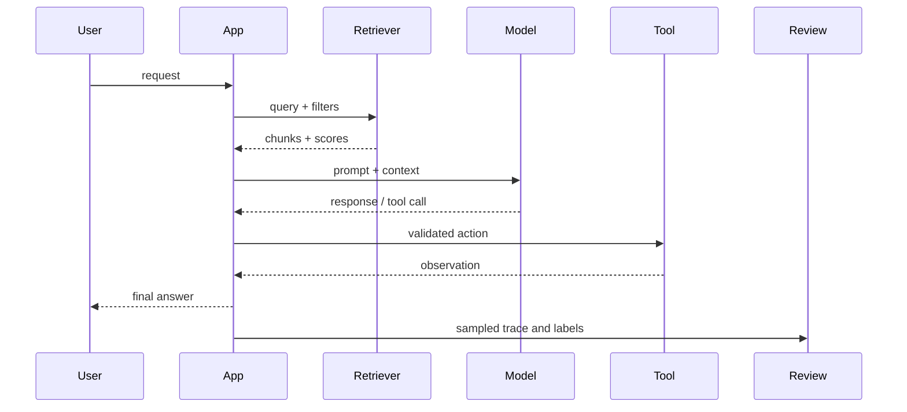

# ML Observability and Incident Response

ML incidents often hide behind normal infrastructure health. The API can be up, the GPU can be busy, and the model can still produce unsafe, stale, slow, biased, or ungrounded answers. Observability needs system metrics and behavior evidence.

Prompt and retrieval logging should capture enough evidence to debug behavior without turning logs into an uncontrolled copy of sensitive user data.

## Command Examples

```bash
date -Is
curl -s http://localhost:8000/health
curl -s http://localhost:8000/metrics | head
```

Example output and meaning:

| Command | Example output | What it does |
| --- | --- | --- |
| `date -Is` | `2026-06-06T10:24:33-07:00` | Pins command output and logs to an exact incident timestamp. |
| `curl -s http://localhost:8000/health` | `HTTP status, headers, timing, JSON payload, or TLS/proxy error.` | Separates reachability, TLS, proxy, and application behavior. |
| `curl -s http://localhost:8000/metrics \| head` | `HTTP status, headers, timing, JSON payload, or TLS/proxy error.` | Separates reachability, TLS, proxy, and application behavior. |

Health endpoints prove process reachability. They do not prove output quality.

## Signal Layers

| Layer | Signals |
| --- | --- |
| Infrastructure | GPU memory, CPU, network, disk, container restarts, node pressure. |
| Serving | queue time, TTFT, inter-token latency, token throughput, errors, cancellations. |
| Model behavior | refusal rate, unsafe completion rate, hallucination rate, task success, calibration. |
| Retrieval | corpus version, retrieved chunks, scores, filters, reranker output, citation support. |
| Agent tools | tool calls, arguments, approvals, retries, side effects, rollback. |
| Product feedback | thumbs up/down, escalation, user edits, support tickets, churn, manual review. |

## Trace Shape



Every trace should have a request ID, model ID, prompt version, retrieval index version, policy version, and output metadata.

## Quality Monitoring Matrix

| Failure | Metric | Sample Evidence |
| --- | --- | --- |
| Hallucination | Unsupported claim rate. | Claim, cited source, verifier result. |
| Retrieval miss | Relevant-source absent rate. | Query, expected doc, retrieved top-k. |
| Prompt injection | Injection acceptance rate. | Source text, model behavior, policy outcome. |
| Safety regression | Unsafe completion or bad refusal rate. | Red-team class, severity, output. |
| Drift | Distribution change by embeddings, topics, prompt length, language, tenant. | Baseline and current histograms. |
| Cost runaway | Token and tool cost per request. | Prompt tokens, output tokens, tool calls. |

## Incident Runbook

1. Freeze the incident version: model, prompt, adapter, retrieval index, tool schema, runtime, and generation config.
2. Preserve samples with request IDs and privacy controls.
3. Classify the failure as serving, retrieval, model behavior, tool action, policy, data, or product integration.
4. Compare affected slices against baseline and canary.
5. Roll back the narrowest release-linked component.
6. Add a regression eval, monitor, or guardrail before re-release.
7. Document customer impact, detection gap, and prevention.

## Study Cards

<div class="study-card-grid">
  
  
  
</div>

## References

- [NIST AI Risk Management Framework](https://www.nist.gov/itl/ai-risk-management-framework)
- [vLLM Production Metrics](https://docs.vllm.ai/en/stable/usage/metrics/)
- [HELM evaluation benchmark](https://arxiv.org/abs/2211.09110)
