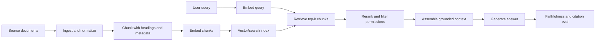

# Retrieval-Augmented Generation

Retrieval-Augmented Generation combines a retrieval system with a generative model. The retriever finds relevant source material, and the model uses that context to answer. RAG is a systems pattern, not a single model feature.

## Command Examples

```bash
python - <<'PY'
docs = ["postgres upgrades", "kubernetes storage", "ceph recovery"]
print(len(docs))
PY
```

Example output and meaning:

| Command | Example output | What it does |
| --- | --- | --- |
| `Python snippet` | `3`. | Confirms the corpus slice being tested has the expected document count before retrieval. |

The real checks are corpus quality, chunking, embeddings, embedding model fit, retrieval metrics, prompt assembly, and answer evaluation.

## RAG Pipeline



| Stage | Job |
| --- | --- |
| Ingest | Load documents, metadata, permissions, versions, and timestamps. |
| Chunk | Split content into retrievable units. |
| Embed | Convert chunks and queries into vectors. |
| Index | Store vectors and metadata in a vector database or search engine. |
| Retrieve | Fetch candidate chunks for a query. |
| Rerank | Reorder candidates with a stronger relevance model or heuristic. |
| Assemble | Build prompt context with sources and boundaries. |
| Generate | Produce an answer constrained by retrieved evidence. |
| Evaluate | Measure retrieval and answer quality. |

## Chunking and Metadata

Bad chunking is a common RAG failure. Chunks need enough context to answer but not so much unrelated text that retrieval becomes noisy.

Metadata matters:

- document title,
- URL or source ID,
- version or timestamp,
- section heading,
- permissions,
- product or tenant,
- language,
- content type.

RAG without permission filtering can leak data even when the model itself is unchanged.

## Retrieval Metrics

| Metric | Question |
| --- | --- |
| Recall@k | Did the right source appear in the top k results? |
| MRR | How high did the first relevant result rank? |
| Precision@k | How many retrieved chunks were useful? |
| Answer faithfulness | Did the answer stay grounded in retrieved content? |
| Citation accuracy | Do cited sources actually support the claim? |

Evaluate retrieval separately from generation. If retrieval misses the right source, a better prompt will not reliably fix it.

Retrieval debugging matrix:

| Failure | Evidence To Capture | Fix Lever |
| --- | --- | --- |
| Relevant source not in corpus | Source URL/version absent from ingestion logs. | Ingest coverage and connectors. |
| Source exists but not retrieved | Chunk text, embedding vector, metadata filters, top-k scores. | Chunking, embedding model, hybrid search, filters. |
| Source retrieved but not used | Prompt context order and truncation. | Reranking, context assembly, quote extraction. |
| Answer unsupported by citation | Claim-to-source check fails. | Faithfulness eval, citation verifier, stricter prompt. |
| User sees forbidden content | Permission filter absent before context assembly. | ACL-aware retrieval and tenant filters. |

## RAG Production Gaps

RAG quality depends on the whole document path. A better generator cannot compensate for missing, stale, unauthorized, or poorly ranked evidence.

| Gap | What To Fill | Operational Check |
| --- | --- | --- |
| ML-GAP-048 Ingestion Coverage | Verify that every intended source, version, and connector successfully lands in the corpus. | Compare source inventory to indexed document IDs and ingest logs. |
| ML-GAP-049 Chunk Boundary Strategy | Preserve headings, tables, code blocks, and semantic boundaries instead of splitting blindly by token count. | Review retrieved chunks for answerable context and noise. |
| ML-GAP-050 Metadata Schema | Standardize source ID, URL, tenant, permission, timestamp, product, language, and content type. | Reject chunks missing required metadata before indexing. |
| ML-GAP-051 Hybrid Retrieval | Combine dense vectors with lexical search when exact identifiers, errors, APIs, or rare terms matter. | Compare vector-only, keyword-only, and hybrid Recall@k. |
| ML-GAP-052 Query Rewriting | Rewrite ambiguous, conversational, or multi-hop queries without losing user intent. | Log original and rewritten queries and evaluate both. |
| ML-GAP-053 Reranker Evaluation | Rerankers can improve relevance but add latency and can suppress necessary diversity. | Measure Recall@k, MRR, and tail latency with and without reranking. |
| ML-GAP-054 ACL Filtering | Apply permissions before context assembly so unauthorized text never reaches the model prompt. | Test with users from different tenants and roles. |
| ML-GAP-055 Freshness and Reindexing | Define how changed, deleted, or expired documents update embeddings and search indexes. | Track source version, index version, and last-ingested timestamp. |
| ML-GAP-056 Citation Grounding | Citations must support specific generated claims, not merely point to generally related documents. | Run claim-to-citation checks on sampled answers. |
| ML-GAP-057 Context Window Budget | Limit context by relevance, diversity, recency, and token budget so critical evidence is not truncated. | Record selected chunks, dropped chunks, token counts, and final prompt. |
| ML-GAP-058 Hallucination Triage | Separate retrieval miss, context omission, conflicting evidence, and generator fabrication. | Capture query, retrieved chunks, prompt, answer, citations, and expected source. |
| ML-GAP-059 Retrieval Observability | Store enough traces to debug corpus, vector, filter, rerank, context, and generation decisions. | Emit query ID, embedding model, index version, scores, filters, and prompt hash. |
| ML-GAP-060 Cost and Latency Budget | RAG adds embedding, search, rerank, context, and generation cost. | Budget p50/p95 latency and cost per query stage. |

## Common Failure Modes

| Symptom | Likely Cause |
| --- | --- |
| Confident answer with bad source | Prompt does not force grounding or citation verification. |
| Right doc missing | Bad chunking, weak embedding model, missing metadata, stale index. |
| Outdated answer | Corpus freshness or source versioning problem. |
| Access leak | Missing permission filter before context assembly. |
| Good retrieval, bad answer | Prompt, context ordering, model limits, or conflicting chunks. |

## Runbook

1. Capture query, retrieved chunks, scores, prompt, model response, and citations.
2. Check whether a relevant chunk existed in the corpus.
3. Check whether it was embedded and indexed.
4. Check whether retrieval returned it in top k.
5. Check reranking and context assembly order.
6. Check whether answer claims are supported by cited chunks.
7. Add the case to retrieval and answer regression evals.

## Study Cards

<div class="study-card-grid">
  
  
  
  
</div>

## References

- [Retrieval-Augmented Generation for Knowledge-Intensive NLP Tasks](https://arxiv.org/abs/2005.11401)
- [FAISS documentation](https://faiss.ai/)
- [OpenSearch vector search documentation](https://docs.opensearch.org/latest/search-plugins/vector-search/)
- [BEIR retrieval benchmark](https://arxiv.org/abs/2104.08663)
