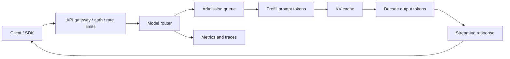

# ML Serving, Inference, and vLLM

Serving is where model behavior meets latency, cost, GPU memory, API compatibility, traffic shape, and rollback. For LLMs, inference has two very different phases: prefill processes the prompt and builds KV cache, while decode generates new tokens one step at a time. A system can have healthy GPUs and still fail user expectations if queue time, time to first token, inter-token latency, or context limits are wrong.

## First Checks

```bash
python -c "import torch; print(torch.cuda.is_available())"
nvidia-smi
curl -s http://localhost:8000/v1/models
curl -s http://localhost:8000/metrics | grep 'vllm:'
```

These checks prove accelerator visibility, API reachability, and metrics exposure. They do not prove capacity, quality, safety, or cost.

## Serving Mental Model



| Layer | Main Decision | Failure Mode |
| --- | --- | --- |
| API gateway | Authentication, quota, request size, tenant routing. | Unauthorized traffic reaches model or valid traffic is throttled incorrectly. |
| Router | Model version, adapter, region, hardware pool, canary split. | Requests hit a stale model or incompatible tokenizer/runtime. |
| Scheduler | Queueing, batching, priority, prefill/decode mix. | High tail latency even when GPU utilization looks good. |
| Runtime | KV cache, attention kernels, quantization, parallelism. | OOM, low throughput, bad output, or unstable latency. |
| Streamer | Partial-token delivery, cancellation, timeout handling. | Client disconnects waste GPU work or hang worker state. |

## Core Inference Metrics

| Metric | Why It Matters |
| --- | --- |
| Time to first token | Captures queue plus prefill latency; users feel this before generation speed. |
| Inter-token latency | Captures decode smoothness for streaming. |
| End-to-end latency | Captures total user-visible duration. |
| Tokens per second | Throughput metric; separate prompt tokens from generation tokens. |
| Queue time | Admission and capacity pressure signal. |
| KV cache utilization | Memory pressure signal for LLM serving. |
| Request success/error rate | Health signal by model, route, tenant, and status. |
| Cost per 1K tokens | Unit economics across model size, hardware, and batch policy. |

## Batching, Streaming, and KV Cache

Traditional static batching waits to collect requests, then runs them together. LLM serving often uses continuous batching: new requests enter the active batch as other requests finish. This improves GPU utilization, but it means request latency depends on token lengths, scheduling, and memory pressure.

| Concept | Practical Meaning | Operational Tradeoff |
| --- | --- | --- |
| Prefill | Processes prompt tokens and creates KV cache. | Long prompts raise TTFT and memory pressure. |
| Decode | Generates one or more output tokens using KV cache. | Long outputs dominate inter-token latency and GPU occupancy. |
| KV cache | Stored attention keys and values for active sequences. | Enables autoregressive decoding but consumes large memory. |
| Prefix caching | Reuses KV cache for shared prompt prefixes. | Helps repeated long prefixes, not long unique generations. |
| Chunked prefill | Breaks large prompt prefill into schedulable chunks. | Can improve fairness but needs tail-latency testing. |
| Cancellation | Stops work when the client disconnects. | Prevents wasted decode on abandoned streams. |

## vLLM Runbook

vLLM is an LLM inference and serving engine focused on high-throughput serving, PagedAttention KV-cache management, continuous batching, OpenAI-compatible APIs, prefix caching, quantization, speculative decoding, parallelism, and production metrics.

Minimal local server:

```bash
vllm serve NousResearch/Meta-Llama-3-8B-Instruct \
  --dtype auto \
  --api-key token-abc123
```

OpenAI-compatible request:

```bash
curl http://localhost:8000/v1/chat/completions \
  -H 'Authorization: Bearer token-abc123' \
  -H 'Content-Type: application/json' \
  -d '{
    "model": "NousResearch/Meta-Llama-3-8B-Instruct",
    "messages": [{"role": "user", "content": "Explain prefill vs decode."}],
    "temperature": 0.2,
    "max_tokens": 256
  }'
```

Common vLLM serving controls:

| Control | Why It Matters | Check |
| --- | --- | --- |
| `--max-model-len` | Caps context length and KV-cache demand. | Confirm product prompt plus output budget fits. |
| `--gpu-memory-utilization` | Reserves a fraction of GPU memory for model execution. | Watch `vllm:kv_cache_usage_perc` and OOMs. |
| `--tensor-parallel-size` | Splits model tensors across GPUs. | Verify interconnect and NCCL health. |
| `--pipeline-parallel-size` | Splits layers across pipeline stages. | Test latency; pipeline bubbles can hurt small batches. |
| `--enable-prefix-caching` | Reuses KV for shared prompt prefixes. | Track `vllm:prefix_cache_hits` and `vllm:prompt_tokens_cached`. |
| `--generation-config vllm` | Avoids silently using model-repo generation defaults. | Version generation settings with deployment config. |
| `--speculative-config` | Enables speculative decoding methods such as draft model, n-gram, suffix, MTP, or EAGLE where supported. | Compare acceptance, latency, and quality on real traffic. |

## vLLM Tuning Matrix

| Symptom | Likely Cause | vLLM Evidence | Lever |
| --- | --- | --- | --- |
| High time to first token | Queue pressure, long prompts, prefill bottleneck, cold model. | `vllm:request_queue_time_seconds`, `vllm:request_prefill_time_seconds`, prompt-token histograms. | Shorter prompts, prefix caching, chunked prefill, more replicas, admission limits. |
| Slow streaming | Decode-bound workload, low batch occupancy, memory bandwidth limit. | `vllm:inter_token_latency_seconds`, generation tokens/sec, GPU metrics. | Speculative decoding, quantization, smaller model, more GPUs, decode-optimized routing. |
| OOM under burst | KV cache pressure or context lengths too high. | `vllm:kv_cache_usage_perc`, `vllm:num_preemptions`, request token histograms. | Lower max context, reduce concurrency, more memory, quantized KV cache where validated. |
| Requests wait while GPU is busy | Scheduler capacity or priority contention. | `vllm:num_requests_waiting`, `vllm:num_requests_running`, queue time. | Tune admission, autoscale, split traffic by prompt/output shape. |
| Prefix caching gives no gain | Unique prompts or output-dominated workload. | Low prefix cache hit rate, high decode time. | Normalize stable system prompts, cache document prefixes, or disable if not helpful. |
| Speculative decoding disappoints | High QPS throughput-bound traffic, bad draft model, incompatible feature, sampling mismatch. | Accepted-token counters, draft-token counters, latency A/B. | Choose n-gram/suffix for low-risk speedup or model-based speculation for compatible workloads. |

## Deployment Patterns

| Pattern | Use | Risk |
| --- | --- | --- |
| Blue/green | Swap all traffic between old and new serving stacks. | Requires fast rollback and compatible clients. |
| Canary | Send a small slice to a new model/runtime. | Needs per-version metrics and automatic stop conditions. |
| Shadow traffic | Replay requests to a candidate without user-visible output. | Requires privacy review and cost budget. |
| A/B test | Compare product outcomes across versions. | Must isolate confounders and policy differences. |
| Model router | Route by tenant, task, latency tier, or cost tier. | Routing logic becomes part of the model contract. |
| Adapter routing | Serve multiple LoRA adapters over one base model where supported. | Adapter compatibility and cache pressure must be measured. |

## Inference Optimization

| Technique | Helps | Watch Out For |
| --- | --- | --- |
| Quantization | Reduces memory and may improve throughput. | Quality, calibration, unsupported kernels, and hardware-specific behavior. |
| Speculative decoding | Reduces inter-token latency when draft tokens are accepted. | Extra compute and compatibility constraints. |
| Prefix caching | Reduces repeated prefill work for shared prefixes. | No decode benefit for long unique outputs. |
| Prompt compression | Reduces prompt tokens and TTFT. | Lost context can damage answer quality. |
| Dynamic batching | Improves throughput under mixed traffic. | Tail latency and fairness. |
| Tensor parallelism | Fits large models across GPUs. | Interconnect and collective overhead. |
| Disaggregated prefill/decode | Separates prefill-heavy and decode-heavy work. | More moving parts and KV transfer observability. |

## Serving Incident Flow

1. Identify the failing route, model ID, adapter, runtime version, and request shape.
2. Split the symptom into queue, prefill, decode, streaming, API, or quality.
3. Compare prompt tokens, output tokens, TTFT, inter-token latency, and total latency.
4. Check KV cache utilization, waiting requests, preemptions, and GPU memory.
5. Compare canary and baseline metrics by tenant and prompt length.
6. Roll back model, runtime, quantization, or generation config if release-linked.
7. Add the request shape to serving load tests and eval gates.

## Study Cards

<div class="study-card-grid">
  
  
  
  
  
</div>

## References

- [vLLM documentation](https://docs.vllm.ai/en/stable/)
- [vLLM OpenAI-Compatible Server](https://docs.vllm.ai/en/stable/serving/openai_compatible_server/)
- [vLLM Production Metrics](https://docs.vllm.ai/en/stable/usage/metrics/)
- [vLLM Automatic Prefix Caching](https://docs.vllm.ai/en/stable/features/automatic_prefix_caching/)
- [vLLM Speculative Decoding](https://docs.vllm.ai/en/stable/features/speculative_decoding/)
- [Efficient Memory Management for Large Language Model Serving with PagedAttention](https://arxiv.org/abs/2309.06180)
