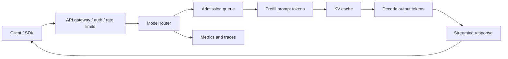

# ML Serving, Inference, and vLLM

Serving is where model behavior meets latency, cost, GPU memory, API compatibility, traffic shape, and rollback. For LLMs, inference has two very different phases: prefill processes the prompt and builds KV cache, while decode generates new tokens one step at a time. A system can have healthy GPUs and still fail user expectations if queue time, time to first token, inter-token latency, or context limits are wrong.

## Command Examples

```bash
python -c "import torch; print(torch.cuda.is_available())"
nvidia-smi
curl -s http://localhost:8000/v1/models
curl -s http://localhost:8000/metrics | grep 'vllm:'
```

Example output and meaning:

| Command | Example output | What it does |
| --- | --- | --- |
| `Python snippet` | `A version, tensor shape, score, retrieved IDs, metric delta, or explicit error.` | Turns the example into a measurable model, data, or pipeline signal. |
| `nvidia-smi` | `GPU utilization, memory use, CUDA visibility, model list, or serving metrics.` | Separates accelerator visibility from model-serving capacity and latency. |
| `curl -s http://localhost:8000/v1/models` | `HTTP status, headers, timing, JSON payload, or TLS/proxy error.` | Separates reachability, TLS, proxy, and application behavior. |

These checks prove accelerator visibility, API reachability, and metrics exposure. They do not prove capacity, quality, safety, or cost.

## Plain Inference vs vLLM Inference

Inference is the act of using trained weights to produce predictions or generated tokens. "vLLM inference" is not a different kind of model intelligence; it is inference executed through the vLLM runtime, scheduler, memory manager, kernels, API server, and metrics surface. The model, tokenizer, prompt, sampling settings, and adapters still define the behavior contract. vLLM changes how requests are packed onto hardware and observed in production.

| Question | Plain Model Inference | vLLM Inference |
| --- | --- | --- |
| What is being done? | Run the model forward pass to score, classify, embed, or generate. | Run LLM generation through vLLM's serving engine and scheduler. |
| Common shape | Single request, offline batch job, notebook call, or framework-specific server. | Many concurrent chat/completion requests through an OpenAI-compatible server or vLLM API. |
| Main concern | Correct preprocessing, model mode, output quality, dtype, and latency for one call or batch. | Throughput, TTFT, inter-token latency, KV-cache pressure, queueing, fairness, and GPU utilization. |
| Batching model | Often fixed batch sizes chosen before the forward pass. | Continuous batching where active requests enter and leave as token generation progresses. |
| Memory pressure | Weights, activations, framework overhead, and input batch shape. | Weights plus large per-request KV cache managed by PagedAttention. |
| Operational knobs | Batch size, dtype, device placement, compilation, model version, preprocessing. | `--max-model-len`, `--gpu-memory-utilization`, prefix caching, speculative decoding, parallelism, quantization, and admission limits. |
| Failure signal | Wrong predictions, preprocessing drift, OOM, slow batch, or framework error. | High queue time, high TTFT, slow streaming, KV-cache exhaustion, preemptions, or OpenAI-compatible API mismatch. |

Debugging starts at different layers. If a single deterministic prompt gives the wrong answer in both PyTorch/Hugging Face and vLLM, suspect model weights, tokenizer, prompt, adapter, or sampling config. If the answer is good in a single-call test but production vLLM traffic has high tail latency, suspect scheduler pressure, request shape mix, KV cache, batching, or hardware saturation.

## Serving Mental Model



| Layer | Main Decision | Failure Mode |
| --- | --- | --- |
| API gateway | Authentication, quota, request size, tenant routing. | Unauthorized traffic reaches model or valid traffic is throttled incorrectly. |
| Router | Model version, adapter, region, hardware pool, canary split. | Requests hit a stale model or incompatible tokenizer/runtime. |
| Scheduler | Queueing, batching, priority, prefill/decode mix. | High tail latency even when GPU utilization looks good. |
| Runtime | KV cache, attention kernels, quantization, parallelism. | OOM, low throughput, bad output, or unstable latency. |
| Streamer | Partial-token delivery, cancellation, timeout handling. | Client disconnects waste GPU work or hang worker state. |

## Core Inference Metrics

| Metric | Why It Matters |
| --- | --- |
| Time to first token | Captures queue plus prefill latency; users feel this before generation speed. |
| Inter-token latency | Captures decode smoothness for streaming. |
| End-to-end latency | Captures total user-visible duration. |
| Tokens per second | Throughput metric; separate prompt tokens from generation tokens. |
| Queue time | Admission and capacity pressure signal. |
| KV cache utilization | Memory pressure signal for LLM serving. |
| Request success/error rate | Health signal by model, route, tenant, and status. |
| Cost per 1K tokens | Unit economics across model size, hardware, and batch policy. |

## Batching, Streaming, and KV Cache

Traditional static batching waits to collect requests, then runs them together. LLM serving often uses continuous batching: new requests enter the active batch as other requests finish. This improves GPU utilization, but it means request latency depends on token lengths, scheduling, and memory pressure.

## Prefill vs Decode

| Question | Prefill | Decode |
| --- | --- | --- |
| What runs? | The model processes the input prompt tokens. | The model generates new tokens autoregressively. |
| Main user-visible metric | Time to first token. | Inter-token latency and streaming smoothness. |
| Main resource pressure | Compute-heavy prompt processing and initial KV allocation. | Memory-bandwidth-sensitive reads of growing KV cache. |
| Traffic shape that hurts | Long prompts, large retrieved context, many tools/messages. | Long outputs, agents that keep generating, high active concurrency. |
| Common mitigation | Prompt trimming, prefix caching, chunked prefill, prefill routing. | Output caps, speculative decoding, decode pools, model/quantization choices. |
| Bad shortcut | Judging health only by total tokens/sec. | Judging health only by GPU utilization. |

| Concept | Practical Meaning | Operational Tradeoff |
| --- | --- | --- |
| Prefill | Processes prompt tokens and creates KV cache. | Long prompts raise TTFT and memory pressure. |
| Decode | Generates one or more output tokens using KV cache. | Long outputs dominate inter-token latency and GPU occupancy. |
| KV cache | Stored attention keys and values for active sequences. | Enables autoregressive decoding but consumes large memory. |
| Prefix caching | Reuses KV cache for shared prompt prefixes. | Helps repeated long prefixes, not long unique generations. |
| Chunked prefill | Breaks large prompt prefill into schedulable chunks. | Can improve fairness but needs tail-latency testing. |
| Cancellation | Stops work when the client disconnects. | Prevents wasted decode on abandoned streams. |

## KV-Cache Deep Dive

The KV cache is the stored key and value tensors produced by transformer attention layers during autoregressive inference. It exists because decoder-only LLMs generate one token at a time. Each new token needs to attend to previous tokens, but the keys and values for those previous tokens do not change once they have been computed. Caching them avoids rerunning the full previous context on every decode step.

In a self-attention layer, each token representation is projected into query, key, and value tensors:

- query (`Q`) asks what the current position should attend to,
- key (`K`) describes what each previous position offers for matching,
- value (`V`) is the information read when attention selects that position.

For the next generated token, the model only needs a new query for the current position plus the cached keys and values for prior positions. The model appends the new token's keys and values to the cache, then repeats the process for the next token.

| Phase | What Happens to KV Cache | Performance Impact |
| --- | --- | --- |
| Prefill | Runs the prompt tokens and writes their keys and values into cache. | Compute-heavy and drives time to first token for long prompts. |
| Decode | Runs one generation step at a time, reading old KV and appending new KV. | Often memory-bandwidth-sensitive because every step reads prior keys and values. |
| Streaming | Sends tokens while decode grows the cache. | Smoothness depends on inter-token latency and available cache headroom. |
| Cancellation | Frees cache for abandoned requests. | Prevents disconnected clients from holding scarce GPU memory. |

Without a KV cache, generating token 1, token 2, token 3, and so on would repeatedly recompute attention state for the same earlier context. With a KV cache, the system pays the prompt prefill cost once, then each decode step extends the cached state. This is why KV cache is central to LLM serving performance.

Approximate KV-cache memory per active sequence:

```text
layers * active_tokens * 2(K,V) * kv_heads * head_dim * bytes_per_value
```

For a rough fp16 multi-head attention example with 32 layers, 32 KV heads, and head dimension 128:

```text
32 layers * 8192 tokens * 2 * 32 heads * 128 dim * 2 bytes
~= 4 GiB for one long active sequence
```

Grouped-query attention and multi-query attention reduce this by using fewer KV heads than query heads, but long context and high concurrency can still dominate memory. Allocator overhead, block size, padding, fragmentation, prefix sharing, quantized KV cache, and engine-specific layout also affect the real number.

| Performance Lever | Helps | Watch Out For |
| --- | --- | --- |
| Shorter prompts | Lower prefill time and less initial KV memory. | Removing useful context can hurt quality. |
| Lower output cap | Limits decode duration and final KV growth. | Too small a cap can truncate useful answers. |
| Prefix caching | Reuses KV for repeated prompt prefixes. | Helps shared prefixes, not unique long generations. |
| PagedAttention | Packs KV blocks more efficiently. | Does not reduce attention compute by itself. |
| KV quantization | Reduces KV memory and bandwidth where supported. | Must validate quality, calibration, and kernel support. |
| Admission control | Prevents cache exhaustion under bursts. | Overly strict limits waste capacity. |
| Request-shape routing | Separates long-context or long-output traffic. | Adds routing complexity and capacity planning work. |

Operationally, treat KV cache as a first-class capacity resource, not a hidden implementation detail. A serving stack can have model weights loaded and GPU utilization below 100 percent but still reject or delay requests because KV cache is full. Track prompt-token distribution, output-token distribution, active sequences, queue time, time to first token, inter-token latency, `vllm:kv_cache_usage_perc`, and `vllm:num_preemptions` together.

Common mistakes:

- confusing KV cache with application response caching; KV cache stores internal attention tensors, not final answers,
- assuming it persists conversation memory across requests; clients still need to send the conversation history unless the serving layer explicitly supports reusable prefixes,
- treating high GPU utilization as proof of healthy serving; KV-cache pressure can cause tail latency before GPU compute saturates,
- increasing `--max-model-len` without reducing concurrency or adding memory,
- enabling prefix caching without checking whether prompts actually share stable token prefixes,
- changing tokenizer, chat template, model, LoRA adapter, or sampling setup without retesting cache reuse and output compatibility.

## PagedAttention Deep Dive

PagedAttention is vLLM's KV-cache memory-management technique for transformer inference. The name is an operating-system analogy: instead of requiring each request's KV cache to live in one large contiguous GPU allocation, vLLM splits the cache into fixed-size blocks and maps a request's logical token positions to physical blocks through a block table. The attention kernel follows that table when reading past keys and values.

The problem it solves is not "how does attention work mathematically." It solves the serving-layer memory problem created by autoregressive decoding:

- every active sequence needs KV cache for previously processed tokens,
- request lengths vary widely,
- prompts and outputs grow over time,
- requests finish at different moments,
- reserving a worst-case contiguous buffer wastes memory,
- fragmented free memory can prevent admitting new requests even when total free memory looks adequate.

PagedAttention makes KV allocation more like paged virtual memory. A request receives blocks as it needs them during prefill and decode. Its logical context can span many physical blocks that are not adjacent in GPU memory. When a request finishes, its blocks can be returned to the free pool. This lowers internal fragmentation and lets the scheduler keep more useful work resident on the GPU.

| Concept | What to Know |
| --- | --- |
| Logical blocks | Token-position ranges for one sequence's KV cache. |
| Physical blocks | Fixed-size GPU memory chunks that store actual key/value tensors. |
| Block table | Per-sequence mapping from logical blocks to physical blocks. |
| Non-contiguous storage | A sequence can use scattered physical blocks instead of one large contiguous allocation. |
| Block sharing | Shared prompt prefixes or parallel samples can reuse KV blocks instead of duplicating all prefix memory. |
| Copy-on-write | Shared blocks are copied only when a sequence needs to diverge from the shared state. |
| Preemption pressure | If KV blocks are exhausted, the runtime may need to wait, evict, swap, recompute, or reject work depending on configuration and version. |

Why it matters for inference:

| Inference Concern | Why PagedAttention Matters |
| --- | --- |
| Higher concurrency | More requests can fit because less KV memory is wasted. |
| Longer context | Long prompts and long generations consume large KV cache; block allocation makes that memory easier to pack. |
| Continuous batching | Dynamic admission works better when the scheduler can add and remove blocks as sequences grow or finish. |
| Tail latency | Better memory packing reduces avoidable queueing and OOM-driven retries, though it does not remove compute bottlenecks. |
| Throughput | More live sequences can share the GPU, which can raise tokens/sec under mixed traffic. |
| Cost | Better GPU memory utilization can reduce replicas needed for the same traffic shape. |

Important limits:

- PagedAttention does not change model weights, tokenizer behavior, sampling semantics, or output quality by itself.
- It does not make attention compute free; long context still increases prefill work and decode memory bandwidth.
- It primarily improves KV-cache placement and sharing, not the model's reasoning ability.
- Very high `--max-model-len` values still reserve capacity expectations and can reduce achievable concurrency.
- Prefix caching and PagedAttention are related but different: PagedAttention manages KV blocks; prefix caching decides when repeated prompt prefixes can reuse existing KV.
- The right tuning is workload-specific. Watch `vllm:kv_cache_usage_perc`, `vllm:num_preemptions`, queue time, TTFT, inter-token latency, prompt-token histograms, and output-token histograms together.

## vLLM Runbook

vLLM is an LLM inference and serving engine focused on high-throughput serving, PagedAttention KV-cache management, continuous batching, OpenAI-compatible APIs, prefix caching, quantization, speculative decoding, parallelism, and production metrics.

Minimal local server:

```bash
vllm serve NousResearch/Meta-Llama-3-8B-Instruct \
  --dtype auto \
  --api-key token-abc123
```

OpenAI-compatible request:

```bash
curl http://localhost:8000/v1/chat/completions \
  -H 'Authorization: Bearer token-abc123' \
  -H 'Content-Type: application/json' \
  -d '{
    "model": "NousResearch/Meta-Llama-3-8B-Instruct",
    "messages": [{"role": "user", "content": "Explain prefill vs decode."}],
    "temperature": 0.2,
    "max_tokens": 256
  }'
```

Common vLLM serving controls:

| Control | Why It Matters | Check |
| --- | --- | --- |
| `--max-model-len` | Caps context length and KV-cache demand. | Confirm product prompt plus output budget fits. |
| `--gpu-memory-utilization` | Reserves a fraction of GPU memory for model execution. | Watch `vllm:kv_cache_usage_perc` and OOMs. |
| `--tensor-parallel-size` | Splits model tensors across GPUs. | Verify interconnect and NCCL health. |
| `--pipeline-parallel-size` | Splits layers across pipeline stages. | Test latency; pipeline bubbles can hurt small batches. |
| `--enable-prefix-caching` | Reuses KV for shared prompt prefixes. | Track `vllm:prefix_cache_hits` and `vllm:prompt_tokens_cached`. |
| `--generation-config vllm` | Avoids silently using model-repo generation defaults. | Version generation settings with deployment config. |
| `--speculative-config` | Enables speculative decoding methods such as draft model, n-gram, suffix, MTP, or EAGLE where supported. | Compare acceptance, latency, and quality on real traffic. |

## vLLM Tuning Matrix

| Symptom | Likely Cause | vLLM Evidence | Lever |
| --- | --- | --- | --- |
| High time to first token | Queue pressure, long prompts, prefill bottleneck, cold model. | `vllm:request_queue_time_seconds`, `vllm:request_prefill_time_seconds`, prompt-token histograms. | Shorter prompts, prefix caching, chunked prefill, more replicas, admission limits. |
| Slow streaming | Decode-bound workload, low batch occupancy, memory bandwidth limit. | `vllm:inter_token_latency_seconds`, generation tokens/sec, GPU metrics. | Speculative decoding, quantization, smaller model, more GPUs, decode-optimized routing. |
| OOM under burst | KV cache pressure or context lengths too high. | `vllm:kv_cache_usage_perc`, `vllm:num_preemptions`, request token histograms. | Lower max context, reduce concurrency, more memory, quantized KV cache where validated. |
| Requests wait while GPU is busy | Scheduler capacity or priority contention. | `vllm:num_requests_waiting`, `vllm:num_requests_running`, queue time. | Tune admission, autoscale, split traffic by prompt/output shape. |
| Prefix caching gives no gain | Unique prompts or output-dominated workload. | Low prefix cache hit rate, high decode time. | Normalize stable system prompts, cache document prefixes, or disable if not helpful. |
| Speculative decoding disappoints | High QPS throughput-bound traffic, bad draft model, incompatible feature, sampling mismatch. | Accepted-token counters, draft-token counters, latency A/B. | Choose n-gram/suffix for low-risk speedup or model-based speculation for compatible workloads. |

## Deployment Patterns

| Pattern | Use | Risk |
| --- | --- | --- |
| Blue/green | Swap all traffic between old and new serving stacks. | Requires fast rollback and compatible clients. |
| Canary | Send a small slice to a new model/runtime. | Needs per-version metrics and automatic stop conditions. |
| Shadow traffic | Replay requests to a candidate without user-visible output. | Requires privacy review and cost budget. |
| A/B test | Compare product outcomes across versions. | Must isolate confounders and policy differences. |
| Model router | Route by tenant, task, latency tier, or cost tier. | Routing logic becomes part of the model contract. |
| Adapter routing | Serve multiple LoRA adapters over one base model where supported. | Adapter compatibility and cache pressure must be measured. |

## Inference Optimization

| Technique | Helps | Watch Out For |
| --- | --- | --- |
| Quantization | Reduces memory and may improve throughput. | Quality, calibration, unsupported kernels, and hardware-specific behavior. |
| Speculative decoding | Reduces inter-token latency when draft tokens are accepted. | Extra compute and compatibility constraints. |
| Prefix caching | Reduces repeated prefill work for shared prefixes. | No decode benefit for long unique outputs. |
| Prompt compression | Reduces prompt tokens and TTFT. | Lost context can damage answer quality. |
| Dynamic batching | Improves throughput under mixed traffic. | Tail latency and fairness. |
| Tensor parallelism | Fits large models across GPUs. | Interconnect and collective overhead. |
| Disaggregated prefill/decode | Separates prefill-heavy and decode-heavy work. | More moving parts and KV transfer observability. |

## Serving Incident Flow

1. Identify the failing route, model ID, adapter, runtime version, and request shape.
2. Split the symptom into queue, prefill, decode, streaming, API, or quality.
3. Compare prompt tokens, output tokens, TTFT, inter-token latency, and total latency.
4. Check KV cache utilization, waiting requests, preemptions, and GPU memory.
5. Compare canary and baseline metrics by tenant and prompt length.
6. Roll back model, runtime, quantization, or generation config if release-linked.
7. Add the request shape to serving load tests and eval gates.

## Study Cards

<div class="study-card-grid">
  
  
  
  
  
  
  
  
  
  
  
</div>

## References

- [vLLM documentation](https://docs.vllm.ai/en/stable/)
- [vLLM OpenAI-Compatible Server](https://docs.vllm.ai/en/stable/serving/openai_compatible_server/)
- [vLLM Production Metrics](https://docs.vllm.ai/en/stable/usage/metrics/)
- [vLLM Automatic Prefix Caching](https://docs.vllm.ai/en/stable/features/automatic_prefix_caching/)
- [vLLM Speculative Decoding](https://docs.vllm.ai/en/stable/features/speculative_decoding/)
- [Efficient Memory Management for Large Language Model Serving with PagedAttention](https://arxiv.org/abs/2309.06180)
