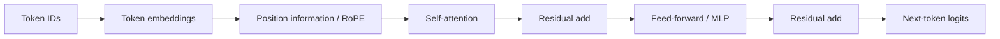

# Transformer Internals

Transformers are sequence models built around attention, residual streams, normalization, and feed-forward blocks. LLMs are usually decoder-only transformers trained to predict the next token.

## Command Examples

```python
tokens = ["The", " cat", " sat"]
print(list(enumerate(tokens)))
```

Example output and meaning:

| Command | Example output | What it does |
| --- | --- | --- |
| `Python example` | `A numeric score, tensor shape, token IDs, retrieved IDs, or explicit error.` | Shows the example produces measurable output instead of silent success. |

Before interpreting model behavior, know what the tokenizer actually produced.

## Layer Anatomy



| Component | Purpose |
| --- | --- |
| Tokenizer | Converts text to token IDs. |
| Embedding | Maps token IDs to vectors. |
| Positional encoding / RoPE | Gives sequence order information. |
| Self-attention | Lets each position read other positions. |
| Multi-head attention | Runs multiple attention views in parallel. |
| MLP block | Applies nonlinear transformations at each position. |
| LayerNorm / RMSNorm | Stabilizes residual stream scale. |
| LM head | Converts hidden state to token logits. |

## KV Cache

During autoregressive inference, the model caches attention keys and values from previous tokens. This avoids recomputing old context every decode step, but it consumes memory proportional to layers, heads, hidden size, active sequences, and context length.

## Context Windows

Longer context increases capability and cost. It raises prefill latency, KV-cache memory, and evaluation complexity. Long context does not guarantee the model will use all evidence correctly.

## MoE Basics

Mixture-of-Experts models route tokens to a subset of expert MLPs. They can increase parameter count without activating every parameter per token, but add routing, load balancing, capacity, and serving complexity.

## Practical Lab: Prompt Token Budget

```text
Budget:
  system/developer prompt: 600 tokens
  retrieved context: 6000 tokens
  user input: 400 tokens
  output cap: 1000 tokens
  model context: 8192 tokens
Outcome:
  600 + 6000 + 400 + 1000 = 8000, leaving only 192 tokens of margin.
```

## Study Cards

<div class="study-card-grid">
  
  
  
</div>

## References

- [Attention Is All You Need](https://arxiv.org/abs/1706.03762)
- [RoFormer: Enhanced Transformer with Rotary Position Embedding](https://arxiv.org/abs/2104.09864)
- [Switch Transformers](https://arxiv.org/abs/2101.03961)
