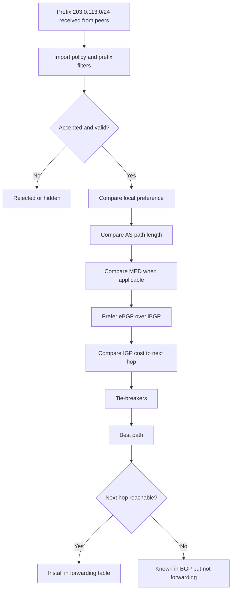

# BGP and Dynamic Routing

BGP is a control-plane protocol for exchanging reachability between autonomous systems and routing domains. It does not carry application traffic. It tells routers which prefixes are reachable, through which neighbors, with which policy attributes.

You need BGP knowledge when debugging internet routing, data-center fabrics, cloud interconnects, Kubernetes load balancer announcements, anycast, or route leaks.

## First Checks

```bash
show bgp summary
show bgp ipv4 unicast
show route protocol bgp
show bgp neighbors
show bgp <prefix>
```

Exact commands vary by router, FRRouting, Bird, Junos, or cloud appliance, but the questions stay the same: are sessions established, are routes received, are routes selected, and are routes exported?

## Core Terms

| Term | Meaning |
| --- | --- |
| ASN | Autonomous System Number identifying a routing domain. |
| eBGP | BGP between different ASNs. |
| iBGP | BGP inside one ASN. |
| Prefix | CIDR route being advertised, such as `203.0.113.0/24`. |
| Neighbor / peer | Router that exchanges BGP updates with another router. |
| NLRI | Network Layer Reachability Information carried in BGP updates. |
| RIB | Routing Information Base: candidate routes known to the control plane. |
| FIB | Forwarding Information Base: programmed data-plane routes used to forward packets. |

BGP policy decides what to accept, prefer, and advertise. A route can exist in BGP but never reach the forwarding table.

## Route Selection

Common route-selection attributes:

| Attribute | Typical Role |
| --- | --- |
| Local preference | Prefer outbound path inside an AS; higher usually wins. |
| AS path length | Shorter AS path is often preferred after local policy. |
| Origin | Historical route-origin type. |
| MED | Hint to external neighbors about preferred inbound path. |
| eBGP over iBGP | External paths often beat internal paths after earlier attributes. |
| IGP cost to next hop | Prefer closer exit when other attributes tie. |
| Router ID | Final deterministic tie-breaker in many implementations. |

Local policy can override default order. Never debug BGP only from the generic algorithm; inspect the actual route policy.

### Best-Path Walkthrough



Example route-audit questions:

| Question | Evidence |
| --- | --- |
| Was the route accepted? | Import policy logs, route-map counters, prefix-list hit counts. |
| Why did this path lose? | Best-path detail showing lower local preference, longer AS path, MED, or next-hop cost. |
| Did the best route enter the FIB? | `show route <prefix>`, kernel route table, hardware FIB counters. |
| Is the next hop reachable? | IGP route to next hop, ARP/NDP, interface state, recursive resolution. |
| Is the route exported? | Export policy, communities, neighbor advertised-routes view. |

## Communities and Policy

BGP communities are route tags used by policy. Operators use them to mark customer routes, control export, influence upstream behavior, identify blackhole routes, or drive traffic-engineering policy.

Examples of policy questions:

- Is this prefix tagged for export to the right peers?
- Is a no-export community suppressing propagation?
- Is a blackhole community intentionally discarding traffic?
- Is route-map policy changing local preference or MED?
- Is prefix filtering rejecting the announcement?

## ECMP and Anycast

BGP can install multiple equal-cost paths when policy and implementation allow ECMP. Anycast advertises the same prefix from multiple locations so clients reach a nearby or policy-preferred site.

Failure modes:

| Design | Failure Mode |
| --- | --- |
| ECMP | Hash imbalance, flow pinning, partial next-hop failure. |
| Anycast | Bad health signal keeps a broken site advertising. |
| Multi-homing | Asymmetric routing, route dampening, provider policy mismatch. |
| Route reflection | Hidden path diversity or reflector policy mistake. |

Data-plane health and BGP health are different. A BGP session can stay up while the service behind the prefix is broken.

## Route Leaks and Prefix Safety

Route leaks happen when a network advertises routes to the wrong neighbors or with the wrong scope. Prefix safety depends on filters, maximum-prefix limits, RPKI validation, IRR data, and peer policy.

Operational controls:

```text
prefix-list: only advertise owned or delegated prefixes
max-prefix: shut or warn when a peer sends too many routes
RPKI: reject or de-prefer invalid origin announcements
communities: control export scope
route-maps: apply explicit import/export policy
```

## Runbook

1. Confirm the affected prefix and expected source/destination.
2. Check whether BGP sessions are established.
3. Check whether the route is received from the expected neighbor.
4. Check best-path selection and why alternatives lost.
5. Check whether the selected route entered the forwarding table.
6. Check export policy to downstream or upstream peers.
7. Validate data-plane forwarding with traceroute, captures, or flow logs.
8. Record route attributes before changing policy.

## Study Cards

<div class="study-card-grid">
  
  
  
  
</div>

## References

- [RFC 4271: Border Gateway Protocol 4](https://www.rfc-editor.org/rfc/rfc4271)
- [RFC 1997: BGP Communities Attribute](https://www.rfc-editor.org/rfc/rfc1997)
- [RFC 7854: BGP Monitoring Protocol](https://www.rfc-editor.org/rfc/rfc7854)
- [FRRouting BGP documentation](https://docs.frrouting.org/en/latest/bgp.html)
