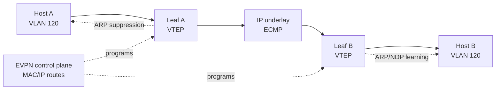

# Datacenter L2/L3 Operations

Host operators do not need to be fabric engineers, but they need enough L2/L3 vocabulary to collect useful evidence and avoid misdiagnosing a network fault as an application fault. A "fabric issue" can mean a failed link member, stale neighbor state, asymmetric ECMP, route withdrawal, ARP suppression bug, bad VLAN trunk, or control-plane churn.

## First Checks

```bash
ip -br link
ip -s link
ip neigh
bridge fdb show
ethtool <interface>
ethtool -S <interface>
cat /proc/net/bonding/bond0 2>/dev/null
```

Collect interface counters before restarting services. Carrier changes, RX/TX errors, dropped frames, bond member churn, and neighbor flaps are often the only host-visible evidence of a lower-layer event.

## LACP and Bonds

LACP combines multiple physical links into one logical bundle. Linux often exposes this through bonding mode `802.3ad`.

| Failure | Host Evidence |
| --- | --- |
| One member down | `cat /proc/net/bonding/bond0`, carrier changes, reduced throughput. |
| Hash imbalance | One link saturated while others are idle. |
| Switch mismatch | Link up but no traffic on one member, LACP state not collecting/distributing. |
| Wrong VLAN on bundle | DHCP, ARP, or gateway reachability fails despite link up. |

LACP does not make one TCP flow use every link. Hashing normally pins each flow to one member, so many flows scale better than one large flow.

## MLAG, vPC, and Dual-Homed Servers

MLAG-style designs let one host connect a bond to two physical switches that pretend to be one logical peer. Names vary by vendor, but the operational risk is similar: the host may see one bond while the fabric has peer links, consistency checks, and split-brain protections.

Useful questions during an incident:

- Did both switch peers keep the same VLAN and LACP view?
- Did the peer link or keepalive fail?
- Is only one rack, one switch peer, or one hash bucket affected?
- Did the failure correlate with a maintenance window or fabric control-plane event?

## STP and L2 Loop Protection

Modern datacenter fabrics often reduce spanning-tree exposure, but access layers, lab networks, and mixed environments still see STP/RSTP. A port can be physically up while blocked by loop protection.

Symptoms include intermittent broadcast storms, MAC flapping, ARP instability, and sudden loss across an L2 domain. On Linux, watch neighbor table churn and interface drops:

```bash
ip monitor neigh
ip monitor link
journalctl -k -g 'link is|martian|duplicate|neigh'
```

## ARP and NDP Instability

ARP for IPv4 and Neighbor Discovery for IPv6 are local-link dependencies. Duplicate IPs, stale neighbor entries after failover, proxy ARP, EVPN ARP suppression bugs, or blocked multicast can break traffic while routes look correct.

```bash
ip neigh show nud failed,stale,delay,probe
arping -I <interface> <gateway-ip>
ndisc6 <gateway-ipv6> <interface>
tcpdump -nn -i <interface> 'arp or icmp6'
```

If two MAC addresses answer for one IP, preserve the capture and neighbor output before clearing entries.

## EVPN, VXLAN, and Overlays

EVPN/VXLAN fabrics carry L2 or L3 reachability over an IP underlay. The host may only see an ordinary VLAN, but the fabric is learning MAC/IP reachability through a control plane.

Operational implications:

- a host route can fail because the overlay control plane withdrew a MAC/IP binding,
- ARP suppression can return stale answers,
- MTU must account for VXLAN overhead,
- ECMP underlay paths can fail only for some flow hashes.

When a network team asks for evidence, provide source/destination IPs, MACs, VLAN, timestamps, flow tuple, and whether same-rack, cross-rack, and cross-zone paths differ.

### EVPN/VXLAN Failure Map



Partial-failure clues:

| Symptom | Likely Layer |
| --- | --- |
| Same rack works, cross-rack fails | VXLAN underlay, VTEP reachability, fabric route, or MTU. |
| First packet after idle fails | ARP/NDP suppression, stale MAC/IP binding, or neighbor cache timeout. |
| Only some flows fail | ECMP hash bucket, one spine/leaf path, or one LACP member. |
| One host sees gateway MAC change repeatedly | Anycast gateway inconsistency, MLAG peer issue, or MAC flap. |
| Large packets fail cross-rack | VXLAN overhead and underlay MTU mismatch. |

## ECMP and Anycast

ECMP spreads flows across equal-cost paths by hashing packet fields. Anycast advertises the same service prefix from multiple locations. Both designs can produce partial failures.

| Design | Failure Pattern |
| --- | --- |
| ECMP | Some connections fail because only one path or hash bucket is bad. |
| Anycast | Some clients hit a broken site that still advertises the prefix. |
| Route dampening | A flapping route is suppressed after repeated instability. |
| BGP health | Route stays up while the service behind it is unhealthy. |

Use multiple source ports or clients when testing ECMP. Repeating one flow can keep hitting the same broken path.

## Fabric Issue Evidence Pack

Send this with an escalation instead of "network is down":

```text
time window:
source host, interface, VLAN, IP, MAC:
destination IP, port, protocol:
same-rack result:
cross-rack result:
gateway ARP/NDP result:
tcpdump result:
interface counters before/after:
bond/LACP state:
recent route or DNS change:
```

## Study Cards

<div class="study-card-grid">
  
  
  
</div>

## References

- [Switching, VLANs, and Hosts](/docs/networking/switching-vlans-hosts/)
- [BGP and Dynamic Routing](/docs/networking/bgp-dynamic-routing/)
- [Packet Capture and Analysis](/docs/networking/packet-capture-analysis/)
- [IEEE 802.1AX Link Aggregation](https://www.ieee802.org/1/pages/802.1AX.html)
- [RFC 7432: BGP MPLS-Based Ethernet VPN](https://www.rfc-editor.org/rfc/rfc7432)
