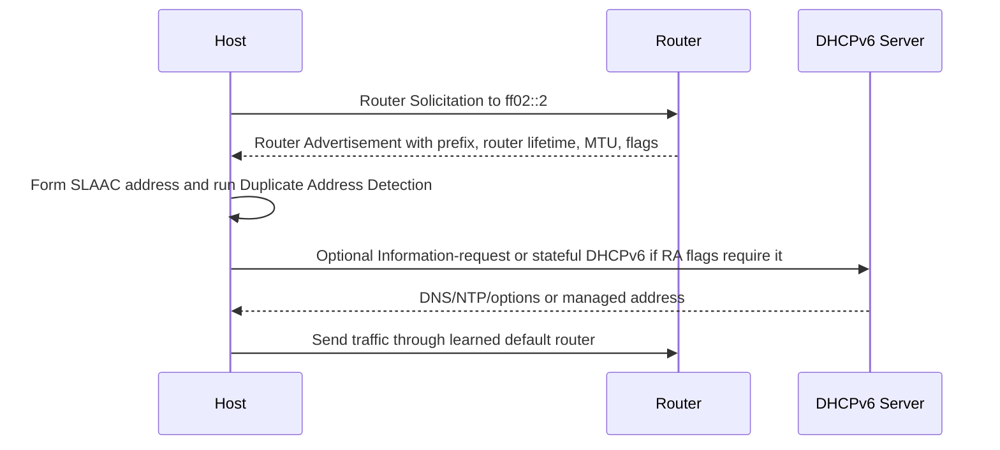

# IPv6 Operations

IPv6 is not just IPv4 with longer addresses. Hosts learn routers through Router Advertisements, use Neighbor Discovery instead of ARP, always have link-local addresses, often use SLAAC, and may run dual-stack with IPv4. Many incidents come from assuming IPv4 operational habits apply unchanged.

## First Checks

```bash
ip -6 addr
ip -6 route
ip -6 neigh
resolvectl query example.com AAAA
ping -6 2001:4860:4860::8888
tracepath6 example.com
```

Check IPv6 separately from IPv4. A dual-stack application may prefer IPv6, fall back to IPv4, or fail slowly depending on resolver and client behavior.

## Address Types

| Address Type | Example | Use |
| --- | --- | --- |
| Link-local | `fe80::/10` | Required on every IPv6 interface; local link only. |
| Unique local | `fc00::/7` | Private internal addressing. |
| Global unicast | `2000::/3` | Routable public IPv6 space. |
| Multicast | `ff00::/8` | Neighbor discovery, router discovery, service protocols. |
| Loopback | `::1/128` | Local host. |

Link-local addresses require an interface scope when used manually, such as `fe80::1%eth0`.

## SLAAC, DHCPv6, and Router Advertisements

IPv6 hosts learn default routers from Router Advertisements, not DHCPv6. RAs can also advertise prefixes for SLAAC and flags that tell hosts whether to use DHCPv6 for addresses or other configuration.

| Mechanism | Provides |
| --- | --- |
| Router Advertisement | Default router, prefixes, lifetimes, flags, MTU, sometimes DNS via RDNSS. |
| SLAAC | Host-generated address from advertised prefix. |
| DHCPv6 stateful | Managed IPv6 address assignment. |
| DHCPv6 stateless | Options such as DNS without address assignment. |

If RAs are blocked, hosts may have IPv6 addresses but no default route.

Router Advertisement and SLAAC flow:



RA flag interpretation:

| RA Signal | Operational Meaning |
| --- | --- |
| Router lifetime > 0 | This router can be installed as a default route. |
| Prefix `A` flag | Host may form SLAAC addresses from the prefix. |
| Managed `M` flag | Use stateful DHCPv6 for address assignment. |
| Other `O` flag | Use DHCPv6 for options such as DNS. |
| RDNSS option | Router advertises DNS recursive resolver information. |
| MTU option | Host learns link MTU from the router. |

## Neighbor Discovery

NDP replaces ARP for IPv6 and uses ICMPv6. It handles address resolution, duplicate address detection, router discovery, and reachability detection.

Useful captures:

```bash
sudo tcpdump -nn -i eth0 'icmp6'
sudo tcpdump -nn -i eth0 'ip6 and (icmp6 or port 546 or port 547)'
```

Do not block all ICMPv6. IPv6 depends on ICMPv6 for core network function, including Packet Too Big messages for MTU discovery.

NDP failure interpretation:

| Capture Pattern | Meaning |
| --- | --- |
| Neighbor Solicitation leaves, no Advertisement returns | Peer absent, multicast filtered, wrong VLAN, or firewall blocks ICMPv6. |
| Duplicate Address Detection fails | Another host already uses the address or proxying is wrong. |
| Packet Too Big missing | Path MTU Discovery can fail and large TCP/TLS transfers can hang. |
| Link-local ping works but global does not | Prefix, default route, firewall, or upstream routing issue. |

## Privacy Addresses and Stable Addresses

IPv6 hosts may use temporary privacy addresses for outbound connections while keeping stable addresses for inbound or management use.

Checks:

```bash
sysctl net.ipv6.conf.all.use_tempaddr
ip -6 addr show temporary
```

This can surprise allowlists and logs because the source address may rotate.

## Dual-Stack and DNS

Dual-stack clients resolve A and AAAA records. Connection behavior depends on client implementation, Happy Eyeballs behavior, resolver response timing, and route health.

Common failure modes:

- AAAA exists but IPv6 routing is broken.
- Firewall allows IPv4 but blocks IPv6.
- Service binds only IPv4 while DNS advertises AAAA.
- Observability dashboards ignore IPv6 traffic.
- Split-horizon DNS returns different IPv6 answers by location.

## NAT64 and DNS64

NAT64 lets IPv6-only clients reach IPv4 services through a translation gateway. DNS64 synthesizes AAAA records from A records so clients have an IPv6 destination.

This is useful for IPv6-only networks, but it can break literal IPv4 dependencies, embedded addresses, or protocols that do not survive translation.

## Firewalling

IPv6 needs separate firewall policy. Do not assume IPv4 firewall rules cover IPv6.

```bash
nft list ruleset
ip6tables-save 2>/dev/null | head
```

Allow necessary ICMPv6 types for neighbor discovery and path MTU. Overly broad ICMPv6 blocking causes hard-to-debug failures.

## Runbook

1. Check IPv6 address, route, neighbor, and DNS AAAA state.
2. Confirm Router Advertisements and default route.
3. Capture ICMPv6 if neighbor discovery or MTU is suspicious.
4. Test by literal IPv6 address and by DNS name.
5. Compare IPv4 and IPv6 firewall policy.
6. Check service bind addresses and load balancer listeners.
7. For dual-stack incidents, decide whether to fix IPv6 or temporarily remove broken AAAA answers.

## Study Cards

<div class="study-card-grid">
  
  
  
  
</div>

## References

- [RFC 8200: IPv6 Specification](https://www.rfc-editor.org/rfc/rfc8200)
- [RFC 4861: Neighbor Discovery for IPv6](https://www.rfc-editor.org/rfc/rfc4861)
- [RFC 4862: IPv6 Stateless Address Autoconfiguration](https://www.rfc-editor.org/rfc/rfc4862)
- [RFC 8305: Happy Eyeballs Version 2](https://www.rfc-editor.org/rfc/rfc8305)
