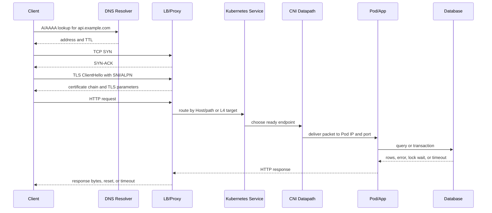

# Request Path

This page is the master map for a production request. It traces one HTTPS request from a client to a Kubernetes workload and database, then back to the caller. Use it when an incident crosses DNS, Linux, proxies, Kubernetes, application code, and data stores.

The walkthrough deliberately keeps DNS, client behavior, TCP, TLS, proxying, Kubernetes Service routing, CNI delivery, Pod execution, application logic, database work, and response routing in one view.

## Command Examples

```bash
date -Is
getent hosts api.example.com
curl -v --connect-timeout 3 --max-time 15 https://api.example.com/health
openssl s_client -connect api.example.com:443 -servername api.example.com -brief
ip route get "$(getent ahostsv4 api.example.com | awk 'NR==1 {print $1}')"
ss -tanp '( dport = :443 or sport = :443 )'
```

From Kubernetes:

```bash
kubectl get svc,endpointslice,ingress,gateway -A -o wide
kubectl exec deploy/client -- getent hosts api.default.svc.cluster.local
kubectl exec deploy/client -- curl -v http://api.default.svc.cluster.local:8080/health
kubectl logs deploy/api --since=10m
```

Example output and meaning:

| Command | Example output | What it does |
| --- | --- | --- |
| `curl -v --connect-timeout 3 --max-time 15 https://api.example.com/health` | DNS, TCP connect, TLS handshake, headers, and HTTP status. | Splits client-visible failure into connect, TLS, proxy, or app response. |
| `ip route get "$(getent ahostsv4 api.example.com | awk 'NR==1 {print $1}')"` | Destination, gateway, interface, and source address. | Shows the host path selected for the resolved address. |
| `kubectl get svc,endpointslice,ingress,gateway -A -o wide` | Edge objects, Service IPs, and ready endpoint addresses. | Connects external routing to Kubernetes backend inventory. |

## End-to-End Diagram



## Request Stages

| Stage | What Must Be True | Evidence |
| --- | --- | --- |
| DNS | Client resolves the intended name to the intended address family and path. | `getent`, `dig`, resolver logs, CoreDNS logs. |
| Client | Client has a total deadline, connection pool behavior, retry policy, and proxy settings that match the service. | client config, `curl -v`, app logs. |
| TCP | SYN, SYN-ACK, ACK complete without retransmit storms or resets. | `tcpdump`, `ss -ti`, firewall counters. |
| TLS | SNI, ALPN, certificate chain, trust store, and mTLS policy agree. | `openssl s_client`, proxy logs, certificate inspection. |
| Proxy / LB | Route, health check, source IP, headers, and timeout budget match real traffic. | access logs, upstream stats, target health. |
| Kubernetes Service | Selector, EndpointSlices, readiness, and kube-proxy or eBPF datapath agree. | `kubectl get svc,endpointslice`, node datapath state. |
| CNI | Pod IP routing, NetworkPolicy, MTU, SNAT, and node-to-node path work. | Pod `ip route`, CNI logs, captures, flow logs. |
| Pod / app | Process listens on the target port and can serve within deadline. | `ss`, app logs, readiness, traces. |
| Database | Pool, DNS, TLS, auth, locks, replication, and query plan fit the request budget. | DB logs, pool stats, `EXPLAIN`, wait events. |
| Response path | Return packets and response bytes traverse the same required stateful devices. | captures on both sides, conntrack, proxy response logs. |

## Practical Failure Walkthrough

When a user reports "API timed out":

1. Resolve the same name from the same source environment.
2. Test TCP and TLS separately from HTTP.
3. Compare direct backend and load-balanced behavior.
4. In Kubernetes, compare Service DNS, ClusterIP, and direct Pod IP.
5. Check EndpointSlices and readiness before changing load balancer config.
6. Capture request and response at the nearest safe boundary.
7. Check database and dependency latency before raising proxy timeouts.
8. Preserve the final error string and request ID for tracing.

```bash
curl -v --resolve api.example.com:443:198.51.100.10 https://api.example.com/health
kubectl get endpointslice -l kubernetes.io/service-name=api -o wide
kubectl exec deploy/client -- curl -v http://api.default.svc.cluster.local:8080/health
kubectl exec deploy/client -- curl -v http://<pod-ip>:8080/health
```

If direct Pod IP works and Service IP fails, inspect Service datapath. If Service IP works but ingress fails, inspect proxy routing, TLS, health checks, and timeout budget. If all network paths work but the user request times out, inspect app and database work.

## Response Path

Return traffic matters as much as request traffic. NAT, stateful firewalls, ECMP, asymmetric routing, source IP preservation, and proxy connection reuse can make the response path differ from the request path.

Evidence to collect:

```bash
conntrack -L -p tcp 2>/dev/null | grep '203.0.113.10'
tcpdump -nn -i any 'host 203.0.113.10 and tcp'
kubectl logs deploy/api --since=10m | grep '<request-id>'
```

## Study Cards

<div class="study-card-grid">
  
  
  
</div>

## References

- [Cross-Layer Incident Runbooks](/docs/networking/cross-layer-incident-runbooks/)
- [Packet Path](/docs/networking/packet-path/)
- [Kubernetes Services and EndpointSlices](/docs/kubernetes/services-endpointslices/)
- [Kubernetes Pod Networking and CNI](/docs/kubernetes/pod-networking-cni/)
- [PostgreSQL Operations and HA](/docs/databases/postgres/operations-ha/)
