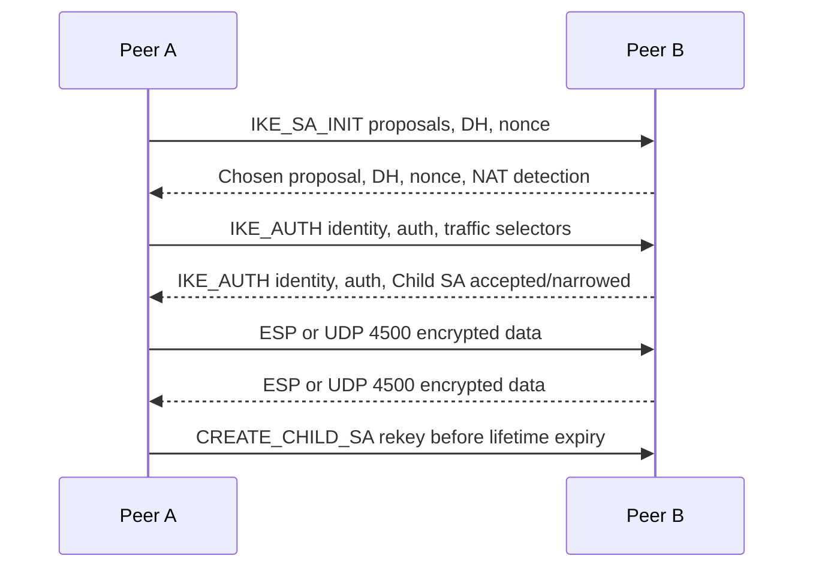

# VPNs and IPsec Tunnels

A VPN is a controlled path through an untrusted or shared network. The hard operational parts are rarely just encryption. Operators also have to reason about identity, routes, traffic selectors, NAT traversal, MTU, firewall policy, failover, and whether both peers agree about what traffic belongs in the tunnel.

## Command Examples

```bash
ip route
ip rule
ip xfrm state
ip xfrm policy
ipsec statusall
tcpdump -nn -i any udp port 500 or udp port 4500 or esp
ping -M do -s 1372 <remote-ip>
```

Example output and meaning:

| Command | Example output | What it does |
| --- | --- | --- |
| `ip route` | `Destination, gateway, interface, and selected source address.` | Shows how the host will route the target flow. |
| `ip rule` | `0: from all lookup local; 100: from 10.0.0.0/24 lookup 100.` | Shows policy routing rules that can override the main route table. |
| `ip xfrm state` | `Concrete IDs, states, counters, versions, rows, or error strings.` | Turns the example from a command list into evidence for the next debugging step. |

Use these checks to separate routing, IPsec state, policy matching, IKE negotiation, ESP forwarding, NAT traversal, and tunnel MTU issues.

## VPN Types

Common VPN patterns:

| Pattern | Purpose |
| --- | --- |
| Site-to-site VPN | Connects two routed networks, often data center to cloud or office to office. |
| Remote-access VPN | Gives a user device an authenticated path into private networks. |
| Full tunnel | Sends all client traffic through the VPN. |
| Split tunnel | Sends only selected routes or prefixes through the VPN. |
| Overlay VPN | Builds a virtual network over another network, often with its own addressing and routing. |

Every VPN creates at least two views of the network: the outer path that carries encrypted packets and the inner path that applications think they are using.

## IPsec Building Blocks

IPsec protects IP traffic with security policy and security associations.

| Term | Meaning |
| --- | --- |
| ESP | Encapsulating Security Payload, commonly used for encryption and integrity. |
| AH | Authentication Header, now uncommon because it does not work well with NAT. |
| IKEv2 | Negotiates authentication, cryptographic proposals, keys, and Child SAs. |
| IKE SA | Security association protecting IKE control traffic. |
| Child SA | Security association protecting data traffic, usually ESP. |
| SPI | Security Parameters Index used to identify the receiving SA. |
| SPD | Security Policy Database deciding which packets bypass, discard, or use IPsec. |
| SAD | Security Association Database containing active keyed SA parameters. |

IKE normally uses UDP 500. With NAT traversal, peers use UDP 4500 and ESP is encapsulated so NAT devices can track the flow.

### IKEv2 and Child SA Timeline



Negotiation failure map:

| Failure Point | Typical Evidence | Fix Area |
| --- | --- | --- |
| `IKE_SA_INIT` no response | UDP 500/4500 blocked, peer IP wrong, NAT path broken. | Outer firewall, routing, peer address. |
| Proposal mismatch | Logs mention no proposal chosen. | Encryption, integrity, PRF, DH group, IKE version. |
| Authentication fails | ID, PSK, certificate, CA, EKU, or clock mismatch. | Identity and trust chain. |
| Child SA narrows unexpectedly | Traffic selectors differ between peers. | Local/remote prefixes and policy definitions. |
| SAs up but no data counters | Route/policy does not select tunnel or inner firewall blocks traffic. | XFRM policy, routes, NAT order, inner ACLs. |
| Data works until rekey | Lifetime, PFS, replay window, or rekey proposal mismatch. | Rekey timers and Child SA proposals. |

## Tunnel Mode and Transport Mode

In tunnel mode, IPsec encapsulates the original IP packet and adds a new outer IP header. This is the normal mode for site-to-site and remote-access VPNs because the inner addresses can be private networks.

In transport mode, the original IP header remains and IPsec protects the payload. This is more common for host-to-host or specialized designs.

Operational implications:

- firewalls on the outer path must allow IKE and ESP or UDP 4500,
- firewalls on the inner path still need to allow the actual application ports,
- packet captures on the outer path see peers and ESP, not inner TCP/UDP details,
- packet captures after decapsulation show the inner flow.

## Traffic Selectors and Policy-Based VPNs

Traffic selectors define which source and destination prefixes, protocols, and ports are eligible for a Child SA. In policy-based IPsec, selectors are the tunnel contract. If one side says `10.10.0.0/16 -> 172.16.0.0/16` and the other side says `10.10.1.0/24 -> 172.16.0.0/16`, negotiation may narrow, fail, or silently protect less traffic than expected depending on the peers.

Troubleshooting policy-based tunnels:

```bash
ip xfrm policy
ip xfrm state
ip route get <remote-ip>
tcpdump -nn -i any host <remote-ip>
```

If routes point correctly but counters on the XFRM state do not move, the packet may not match the IPsec policy or may be NATed before policy lookup in a way that changes the selectors.

## Route-Based VPNs

A route-based VPN exposes a virtual tunnel interface or XFRM interface and then routes traffic into it. This usually makes routing, failover, and multiple subnets easier because routes decide what enters the tunnel.

Route-based designs still use IPsec SAs underneath. The difference is operational: routing policy decides traffic placement, and the tunnel interface becomes an observable boundary for counters and captures.

Watch for:

- routes missing or pointing to the wrong table,
- overlapping private ranges,
- asymmetric return paths,
- source address selection problems,
- inner firewall policy blocking tunneled traffic,
- broad `0.0.0.0/0` selectors paired with route filtering.

## Split Tunneling and Default Routes

Split tunneling sends only selected destinations through the VPN. Full tunneling sends the default route through it. Both are valid, but they answer different security and usability questions.

Split tunnel risks:

- local LAN access can bypass central controls,
- DNS may leak or resolve differently inside and outside the tunnel,
- overlapping routes can choose the wrong path,
- users can reach some private prefixes but not dependencies outside the selected route set.

Full tunnel risks:

- all traffic depends on VPN capacity and policy,
- internet-bound traffic may hairpin through a gateway,
- local printers or private home networks may stop working,
- MTU problems affect more applications.

## MTU and MSS

VPNs add headers. IPsec, UDP encapsulation, PPP, GRE, VXLAN, VLANs, and cloud overlays all reduce the effective payload size. When Path MTU Discovery is broken by blocked ICMP, small tests pass and larger TLS, SSH, or database packets hang.

Checks:

```bash
tracepath <remote-ip>
ping -M do -s 1372 <remote-ip>
tcpdump -nn -i any 'icmp or esp or udp port 4500'
```

Fix the path when possible by allowing ICMP Packet Too Big or fragmentation-needed messages. MSS clamping can be a pragmatic workaround for TCP, but it does not fix UDP applications.

## Troubleshooting Flow

1. Confirm the outer path: peer reachability, UDP 500, UDP 4500, ESP, and NAT devices.
2. Confirm identity and authentication: certificate, PSK, EAP, IDs, and trust chain.
3. Confirm proposals: IKE version, encryption, integrity, DH group, and lifetimes.
4. Confirm selectors or routes: what traffic is supposed to enter the tunnel.
5. Confirm XFRM state and policy counters move when real traffic is generated.
6. Check inner firewall, return routing, NAT, and source address expectations.
7. Test MTU with large packets and capture both outer and inner boundaries when possible.

## Study Cards

<div class="study-card-grid">
  
  
  
  
</div>

## References

- [RFC 4301: Security Architecture for IP](https://www.rfc-editor.org/rfc/rfc4301)
- [RFC 7296: IKEv2](https://www.rfc-editor.org/rfc/rfc7296)
- [strongSwan IPsec protocol introduction](https://docs.strongswan.org/docs/latest/howtos/ipsecProtocol.html)
- [strongSwan forwarding and split tunneling](https://docs.strongswan.org/docs/latest/howtos/forwarding.html)
- [ip-xfrm(8)](https://man7.org/linux/man-pages/man8/ip-xfrm.8.html)
